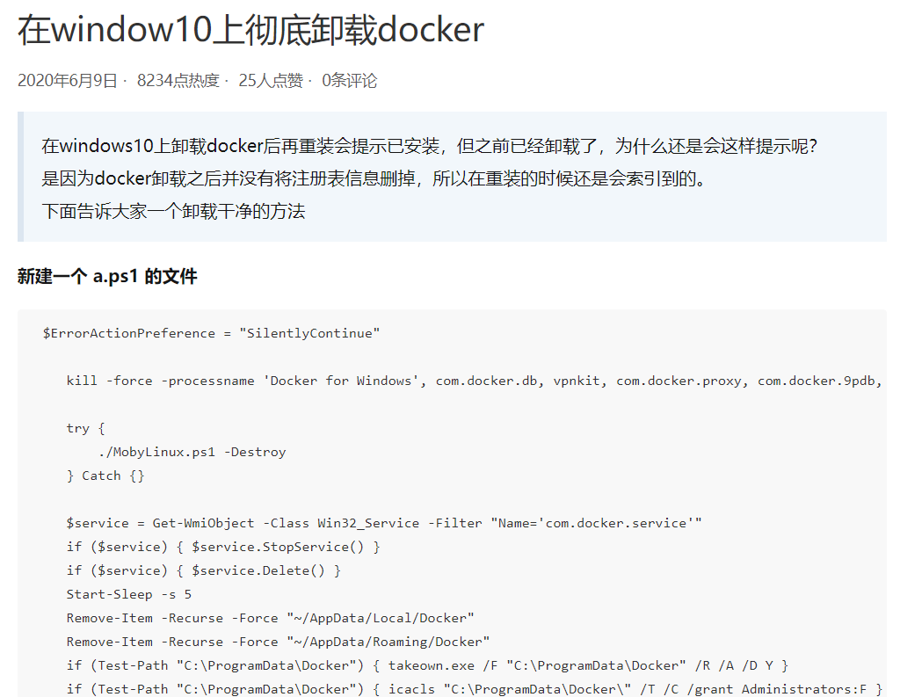

## docker 常用命令

https://www.runoob.com/docker/docker-container-usage.html 容器相关  
https://www.runoob.com/docker/docker-image-usage.html 镜像相关

docker image ls 显示所有 image
docker container ls 显示所有 container
docker rmi id 移除 image  
docker rm id 移除 container  
docker ps 显示正在运行的容器  
docker container ls 显示正在运行的容器 （更新的方法）
docker ps -a 显示所有容器  
docker container ls 显示正在运行的容器
docker logs id 查看容器输出内容  
docker pull \*\*\* 获取 image

以下命令使用 ubuntu 镜像启动一个容器，参数为以命令行模式进入该容器：  
docker run -it ubuntu /bin/bash  
-i: 交互式操作。  
-t: 终端。  
ubuntu: ubuntu 镜像。  
/bin/bash：放在镜像名后的是命令，这里我们希望有个交互式 Shell，因此用的是 /bin/bash。  
要退出终端，直接输入 exit

docker start b750bbbcfd88 启动一个已停止的容器

docker run -itd --name ubuntu-test ubuntu /bin/bash 在大部分的场景下，我们希望 docker 的服务是在后台运行的，我们可以过 -d 指定容器的运行模式。加了 -d 参数默认不会进入容器，想要进入容器需要使用指令 docker exec （下面会介绍到）。

docker stop id 停止容器
docker restart <容器 ID> 停止的容器可以通过 docker restart 重启：

docker exec：推荐大家使用 docker exec 命令，因为此命令会退出容器终端，但不会导致容器的停止。  
docker exec -it 243c32535da7 /bin/bash 实例

## docker 里 Image 和 container 区别

Image 和 container 可以看作面向对象思想中的类和对象。container 是 Image 的实例化

## win10 上彻底删除 docker

https://www.pythonsky.cn/technical-talk/477.html




```
 $ErrorActionPreference = "SilentlyContinue"

    kill -force -processname 'Docker for Windows', com.docker.db, vpnkit, com.docker.proxy, com.docker.9pdb, moby-diag-dl, dockerd

    try {
        ./MobyLinux.ps1 -Destroy
    } Catch {}

    $service = Get-WmiObject -Class Win32_Service -Filter "Name='com.docker.service'"
    if ($service) { $service.StopService() }
    if ($service) { $service.Delete() }
    Start-Sleep -s 5
    Remove-Item -Recurse -Force "~/AppData/Local/Docker"
    Remove-Item -Recurse -Force "~/AppData/Roaming/Docker"
    if (Test-Path "C:\ProgramData\Docker") { takeown.exe /F "C:\ProgramData\Docker" /R /A /D Y }
    if (Test-Path "C:\ProgramData\Docker") { icacls "C:\ProgramData\Docker\" /T /C /grant Administrators:F }
    Remove-Item -Recurse -Force "C:\ProgramData\Docker"
    Remove-Item -Recurse -Force "C:\Program Files\Docker"
    Remove-Item -Recurse -Force "C:\ProgramData\Microsoft\Windows\Start Menu\Programs\Docker"
    Remove-Item -Force "C:\Users\Public\Desktop\Docker for Windows.lnk"
    Get-ChildItem HKLM:\software\microsoft\windows\currentversion\uninstall | % {Get-ItemProperty $_.PSPath}  | ? { $_.DisplayName -eq "Docker" } | Remove-Item -Recurse -Force
    Get-ChildItem HKLM:\software\classes\installer\products | % {Get-ItemProperty $_.pspath} | ? { $_.ProductName -eq "Docker" } | Remove-Item -Recurse -Force
    Get-Item 'HKLM:\software\Docker Inc.' | Remove-Item -Recurse -Force
    Get-ItemProperty HKCU:\software\microsoft\windows\currentversion\Run -name "Docker for Windows" | Remove-Item -Recurse -Force
    #Get-ItemProperty HKCU:\software\microsoft\windows\currentversion\UFH\SHC | ForEach-Object {Get-ItemProperty $_.PSPath} | Where-Object { $_.ToString().Contains("Docker for Windows.exe") } | Remove-Item -Recurse -Force $_.PSPath
    #Get-ItemProperty HKCU:\software\microsoft\windows\currentversion\UFH\SHC | Where-Object { $(Get-ItemPropertyValue $_) -Contains "Docker" }
```

## docker、docker-compose、docker swarm 和 k8s 的区别

  
https://www.jianshu.com/p/2a9ae69c337d

## ubuntu 安装 docker-compose，docker engine

https://docs.docker.com/compose/install/ 提示安装 docker-compose 时要先安装 docekr engine，所以找到此教程 https://docs.docker.com/engine/install/ubuntu/

先 sudo apt-get remove docker docker-engine docker.io containerd runc 删掉可能安装的旧版本

然后 Set up the repository https://docs.docker.com/engine/install/ubuntu/#install-using-the-repository (注意 Install Docker Engine 这一节只做第一步就已经完成安装 docker engine，之后再根据https://docs.docker.com/compose/install/ 即可安装 docker-compose)
