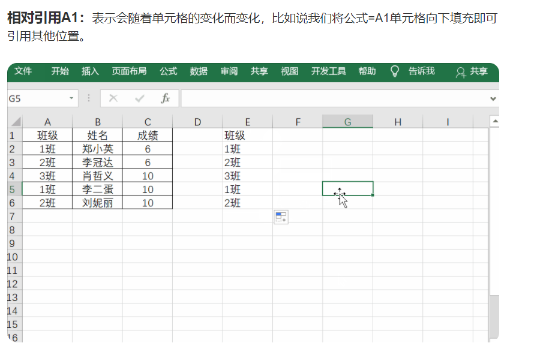
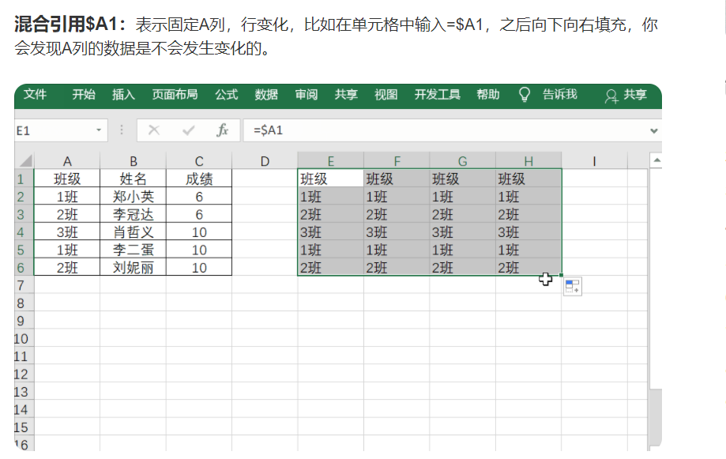
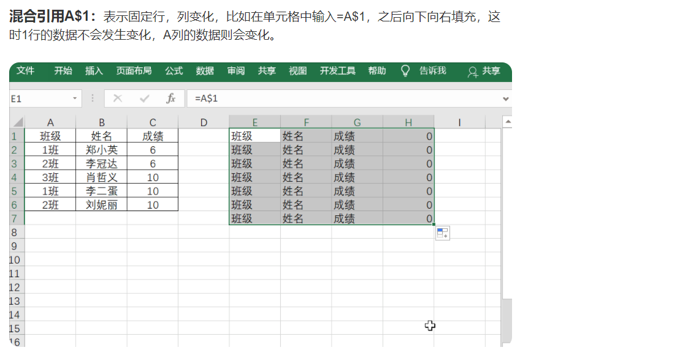
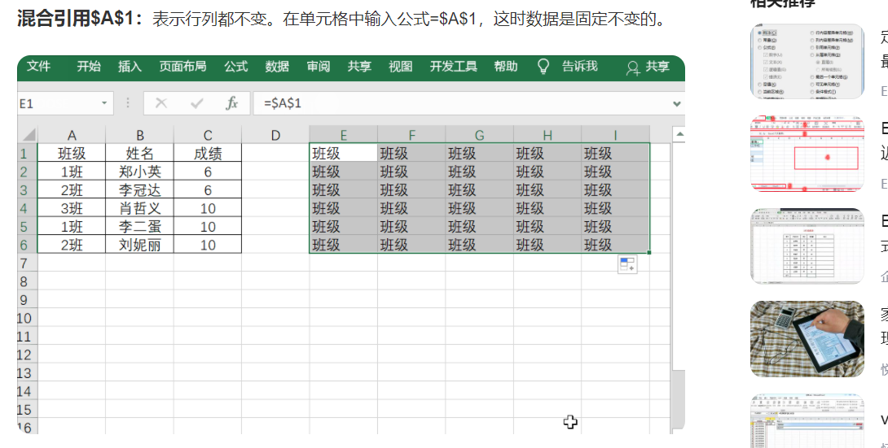

## $符号的意思，各种引用

  
  

https://baijiahao.baidu.com/s?id=1660947286175591245&wfr=spider&for=pc

---

## 230530 在 xlsx 文件中，怎么在一列中的每行依次写上 2023-05-01，2023-05-02 直到 2023-06-30

在 Microsoft Excel 中，你可以使用以下步骤来完成你的需求：

在第一行（比如，A1 单元格）中输入起始日期，即 2023-05-01。

在下一行（比如，A2 单元格）中输入下一天的日期，即 2023-05-02。

然后选中这两个单元格（A1 和 A2）。你会看到选中区域的右下角有一个小方块（填充手柄）。

将鼠标放在这个小方块上，它会变成一个黑色的十字。按住鼠标左键，向下拖动，直到你需要的日期，例如 2023-06-30。

释放鼠标，Excel 会自动填充这一列中的每一行，从 2023-05-01 开始，到 2023-06-30 结束。

这种方法利用了 Excel 的自动填充功能，可以识别日期等序列模式，并可以根据这种模式填充其他单元格。

## excel 删除某行下面所有行

删除 Excel 中的某行以下的所有行的操作如下：

首先，点击你想要删除的那一行的行号，这会选中整行。
然后，按住 Shift 和 Ctrl 键，同时按下方向键 ↓，这会选中当前行以下的所有行。
最后，右键点击选中区域，从弹出的菜单中选择 删除，这将会删除选中的所有行。
需要注意的是，这个操作会删除所有数据和格式，如果你有需要保留的数据或格式，需要在执行删除操作之前做好备份。
