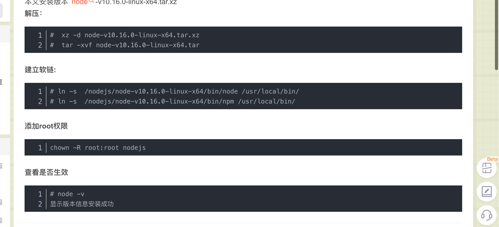
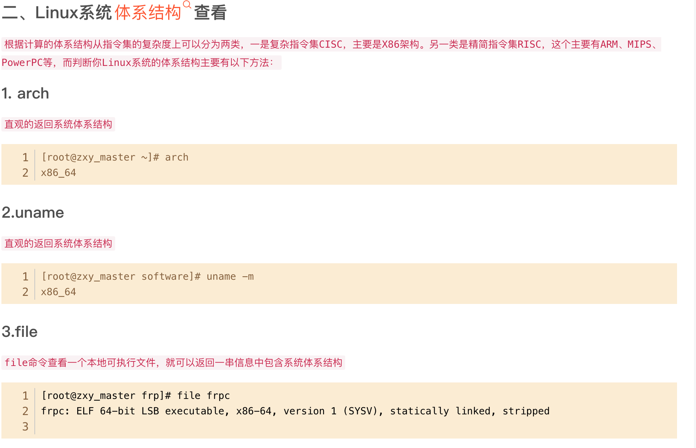
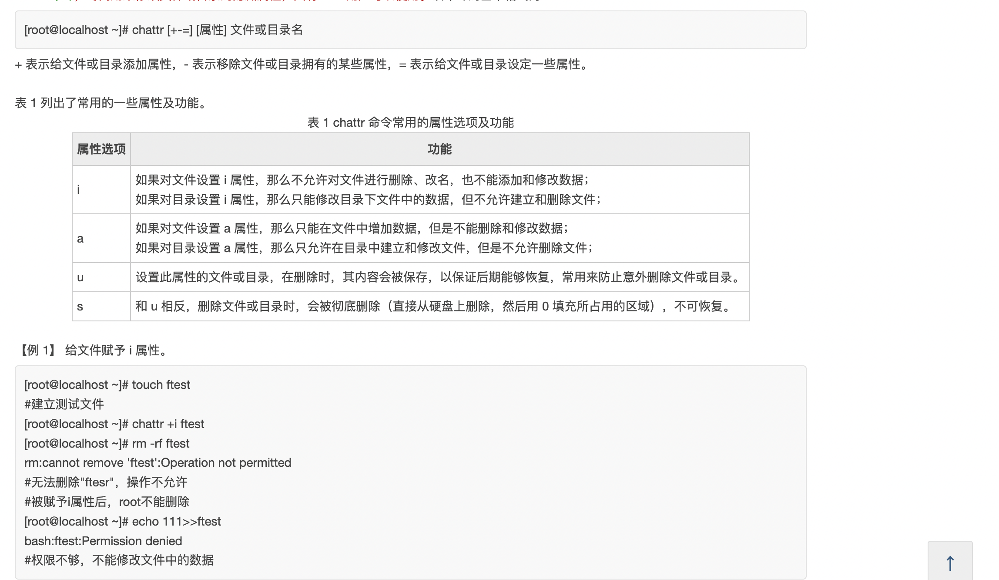
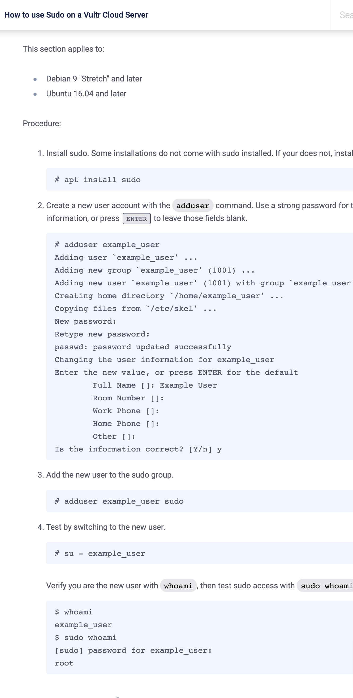

### ubuntu 安装 nodejs 和 yarn

https://www.jianshu.com/p/c8929bea5fba

```
curl -sL https://deb.nodesource.com/setup_14.x | sudo -E bash -
curl -sL https://deb.nodesource.com/setup_16.x | sudo -E bash -
sudo apt-get install -y nodejs
npm install -g yarn
```

此方法有可能仍无法使用 yarn，有可能跟服务器已经安装宝塔，而宝塔自带 yarn，全局变量设置有问题。https://stackoverflow.com/questions/71902607/i-installed-yarn-globally-in-my-ubuntu20-vps-but-when-i-use-yarn-it-says-comma 但尝试后目前仍无法解决，换个服务器尝试。

#### add，以上方法可能出现问题。可以使用以下方法 (add，此方法安装后无法自动使用 yarn，需 npm install -g yarn)

https://nodejs.org/en/download/
找到下载地址

wget https://nodejs.org/dist/v16.16.0/node-v16.16.0-linux-x64.tar.xz  
linux wget 下载


https://blog.csdn.net/weixin_40294332/article/details/96178480  
之后参考此教程  
chown -R root:root nodejs 步骤暂省略

### sudo su 进入 root 模式

### ls -a 查看所有文件，包含隐藏文件

### 每个命令中间输入-y 可以省略安装中输入 Y 的步骤，未测试

### linux 架构选择

https://blog.csdn.net/m0_51197424/article/details/124926395

linux 安装软件时可能需要选择架构，输入 arch 就能知道当前 linux 架构

### Linux chattr 命令详解：修改文件系统的权限属性


http://c.biancheng.net/view/874.html

### linux 查询某文件夹内包含有某内容的文件

https://blog.csdn.net/u012507643/article/details/124799156

如下命令：
root@kor40:~/substrate-front-end-template# grep -r -l "127.0.0.1" ./src
./src/config/development.json
查找到了./src 目录下包含 127.0.0.1 的文件为./src/config/development.json

### 创建一个有 sudo 权限的新用户

</img>  
https://www.vultr.com/docs/how-to-use-sudo-on-a-vultr-cloud-server/

### ls -lh

自动调整合适的单位查看文件大小
