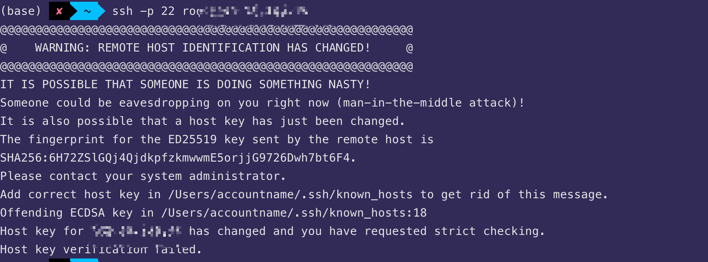

### 虚拟主机与云服务器的区别

https://zhuanlan.zhihu.com/p/444428820  
对外提供服务的计算机就可以统称为服务器，而虚拟主机、云服务器都属于服务器。  
虚拟主机是直接可用的网站专用服务器，是主机服务商已经部署好运行环境的专用服务器，用户购买后就可以快速启用，真正做到开箱即用的效果。用户直接上传开发好的网站代码即可上线网站，无需自己维护服务环境，省时省力，但是用户不能管理操作系统。其中市面上比较知名的虚拟主机包括硅云虚拟主机。

而云服务器则更加的原始，说原始不太正确，应该说是原生态。云服务器是一台只安装了操作系统的服务器，如果用户想要用来运行项目，那么还需要用户自己搭建配置运行环境，因此可以适配几乎所有的软件项目。

有了以上的解释，我们大概就能知道，虚拟主机的好处是针对 WEB 网站来说能提高效率、简单上线网站，而云服务器的好处是使用范围广泛，自定义程度高。市面上比较受欢迎的云服务器包括硅云 CVM 云服务器。

对于企业建站来说，选择虚拟主机也许更加符合需求，因为虚拟主机能提高建站效率。  
而对于需要使用更高的系统权限、自定义服务器运行环境的项目来说，只能选用云服务器。

### vultr vps 开放端口

点击 products，不点具体实例，点上方 firewall，加号 addfiregroup，加号，protocol 选 tcp，指定端口，左侧 link instance。最后也许还要在 vps 里 ufw allow 端口号。

### WARNING: REMOTE HOST IDENTIFICATION HAS CHANGED! IT IS POSSIBLE THAT SOMEONE IS DOING SOMETHING NASTY! Host key for ...... has changed and you have requested strict checking.

code ~/.ssh/known_hosts  
删掉对应的 ip

### 查看 vps cpu 内存占用率等

https://blog.csdn.net/aili2460/article/details/102316848
方法一似乎要下载 python，使用方法二：
wget -qO- bench.sh | bash

### iterm 传输本地文件到 vps

https://www.jianshu.com/p/c00c2bcb62e4

经测试方法二 scp 最好，示例如下：

本地到 vps  
scp -r ./filename root@67.78.79.556:/root #llv
可以这样给命令写注释的方法，以后 ctl r llv 直接找到 local 到 vps 的命令

vps 到本地  
scp -r root@67.78.79.556:/root/filename ./ #vvl

-r 代表可以传输目录，但只传输文件加上-r 也没问题

### iterm2 连接到 vps 最好单独开一个 window，如果是 tab 的话，上下滚动屏幕会变为返回之前命令

### 让本机输入的命令在 vps 里耶能执行，如本机命令连接上 vps 且直接到/root/trade 目录： ssh -t root@139.111.222.333 'cd /root/trade; exec bash'

### ### iTerm2 ssh 免密登陆 vps。

见 iTerm2.md
