### https://www.bilibili.com/video/BV1da4y1p7iZ

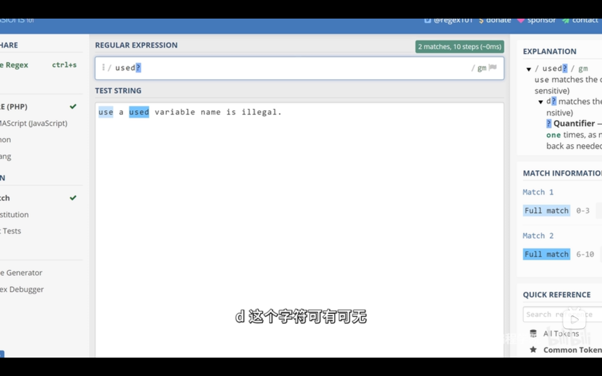  
问号代表前方的字符可有一次或一次都没有。

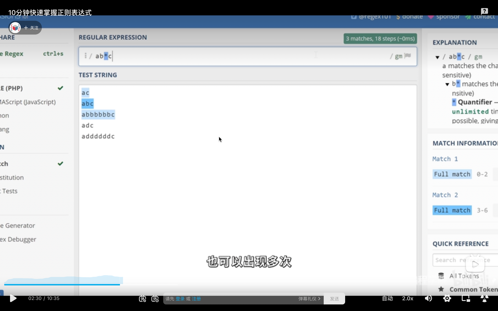  
星号代表前方的字符可有多次或一次都没有。注意这里 adc 没匹配到，因为 ac 中间不是 b 或者没有字符。  
如果星号变加号，则 ac 也匹配不上。因为加号代表 b 必须出现至少一次。

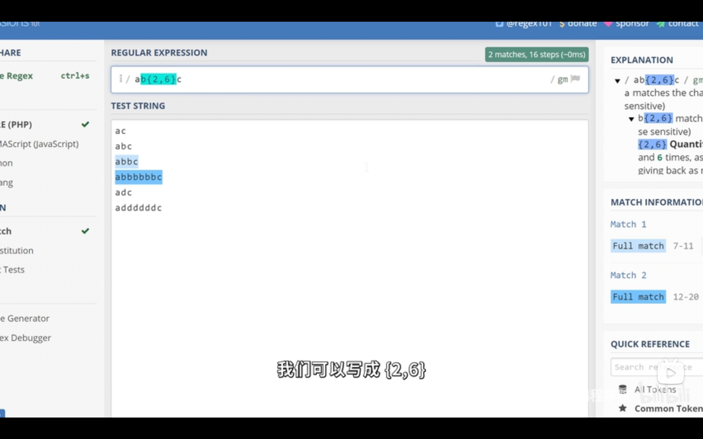  
希望 b 出现 2-6 次则写为{2,6}，如果 2 次以上，则写为{2,}，刚好 2 次则写为{2}

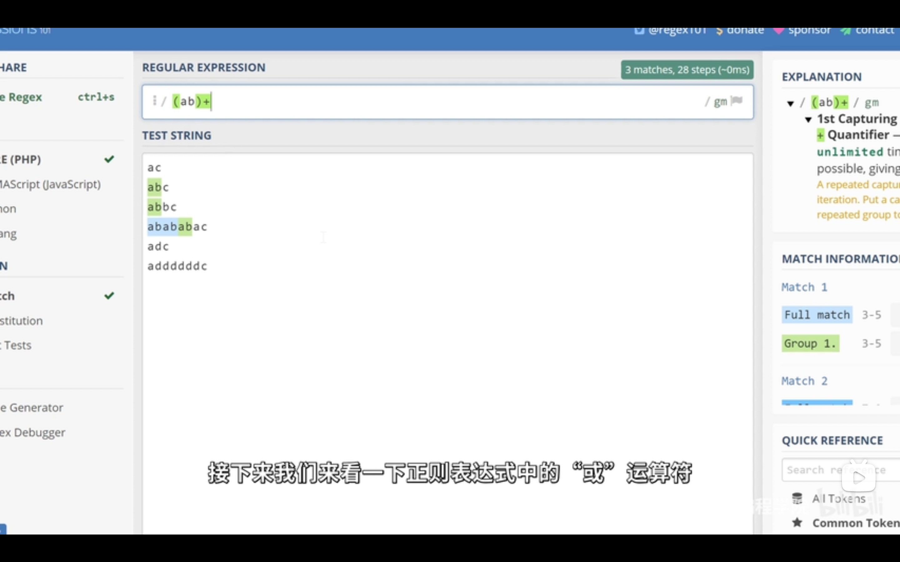  
之前是匹配一个字符，如果要匹配多个，则加上括号。

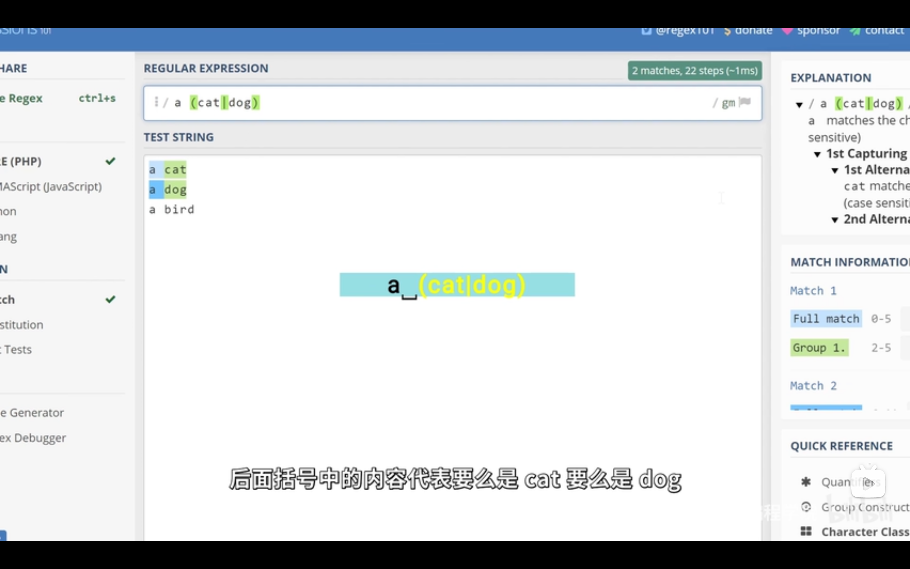  
或方法，括号里加竖线。如不加括号，则要么是 a cat，要么是 dog。

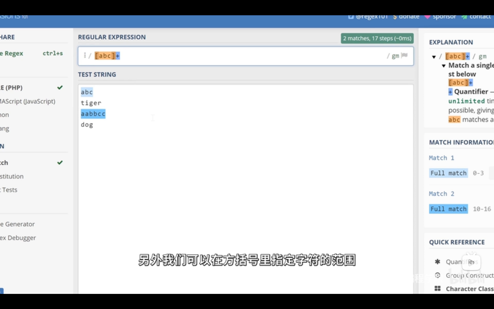
字符类，想匹配只有 abc 组成的，则写为[abc]+  
另外[a-z]+ 代表所有小写英文。[a-zA-Z]+代表所有英文字符。[a-zA-Z0-9]+代表所有英文和数字。

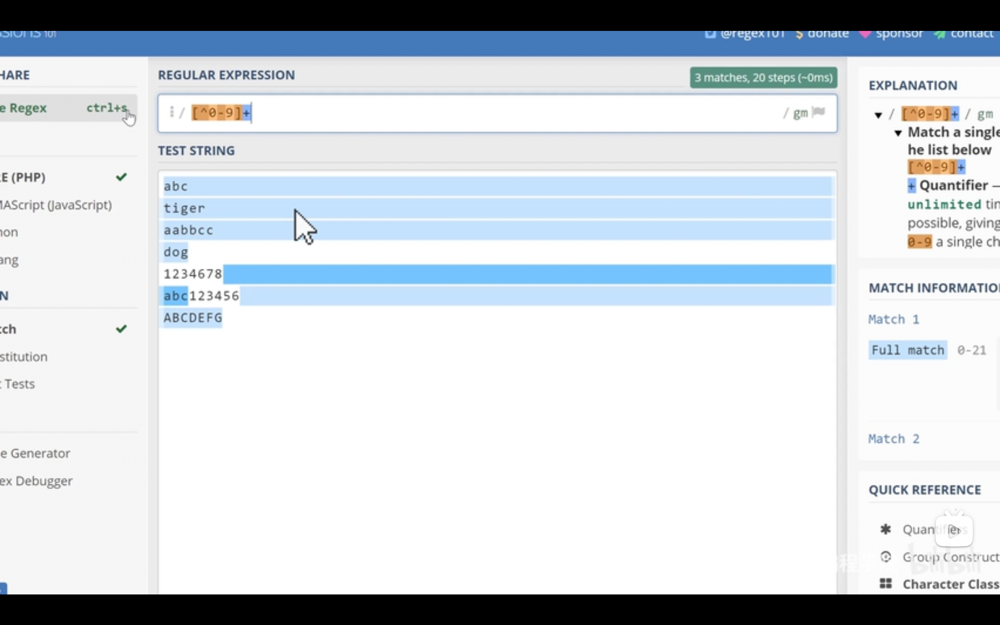  
加了^代表非，如[^0-9]代表所有非数字字符，包括换行符。

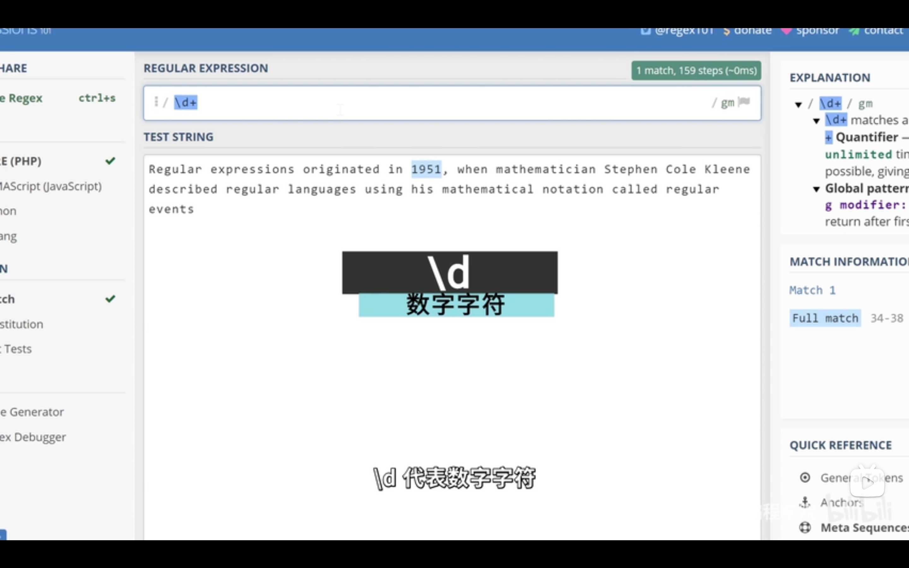
正则表达式预先定义好了一系列常用字符类型，被称为元字符。\d 代表数字字符。等于[0-9]。\w 代表单词字符，包括所有英文，数字，下划线。\s 代表空白符，同时包含 tab 和换行符。\D 代表非数字。\W 代表非\w 以此类推。

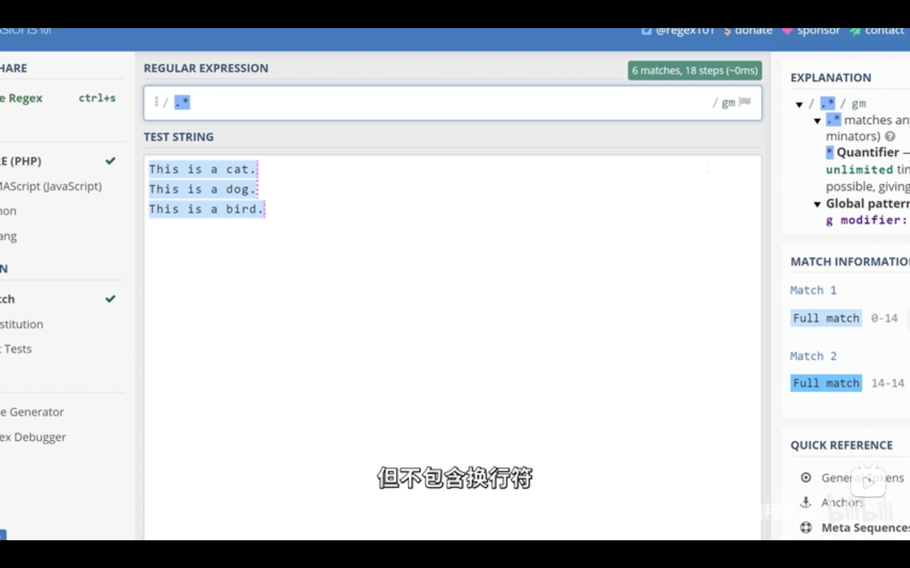
句号代表任意字符，但不包括换行符。

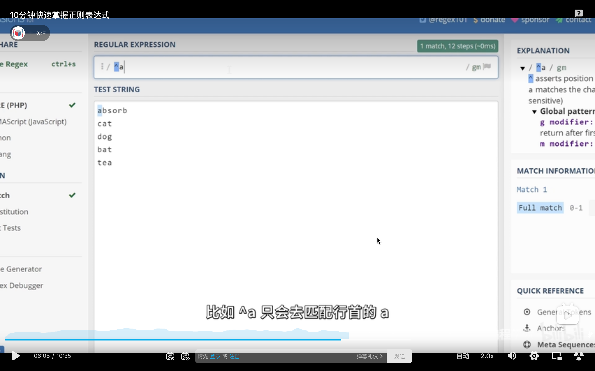
^a 匹配行首 a，a$匹配行尾 a。

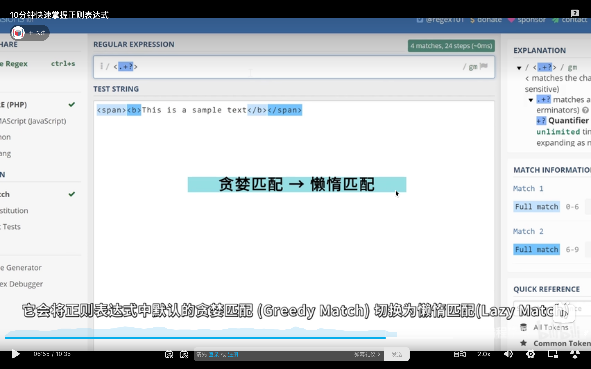  
问号将贪婪匹配转为懒惰匹配。

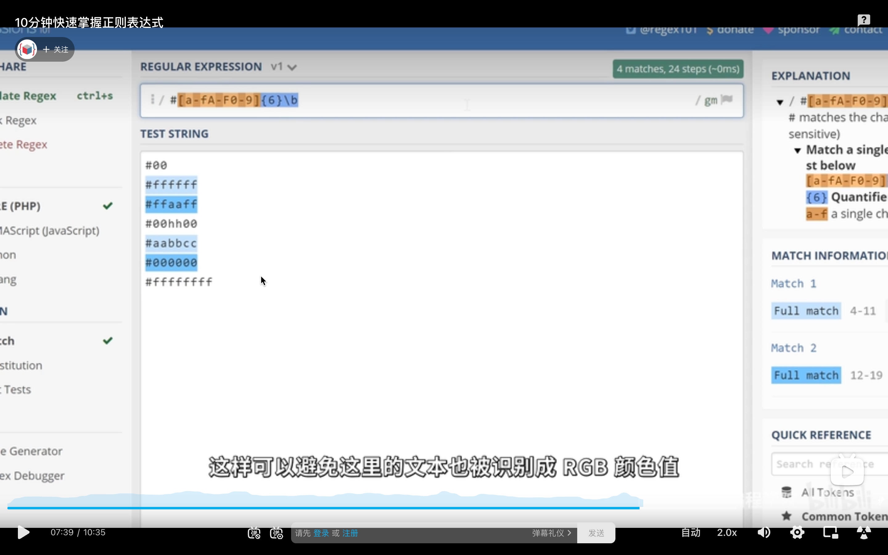  
匹配 rgb 颜色的实例，其中\b 代表单词字符边界，避免其它字符被认为 rgb 颜色值

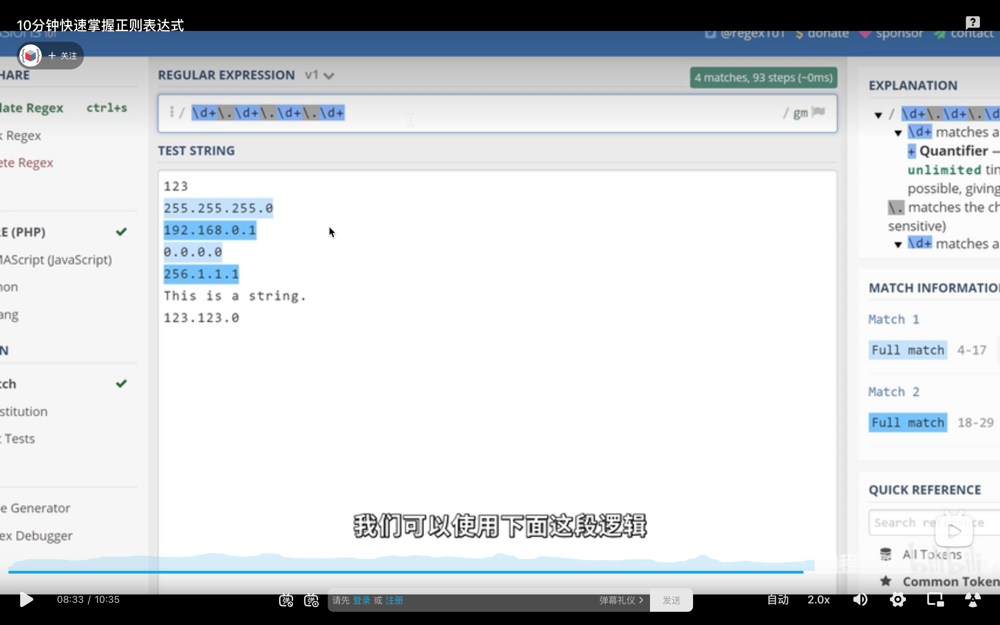  
匹配 ip 地址实例。因为句号是特殊符，所以要用\做转移。

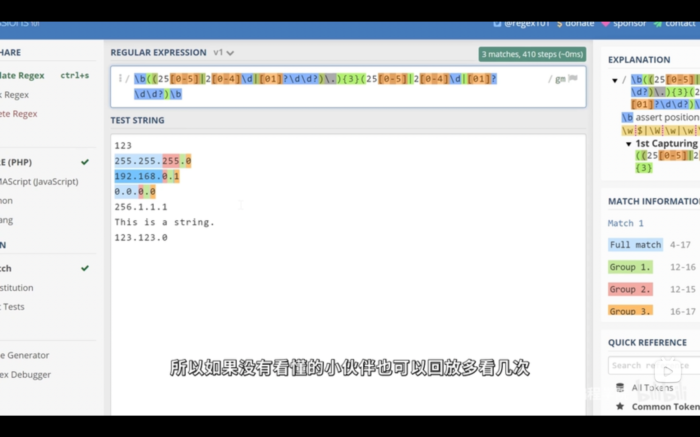  
更精准的匹配 ip 地址，较复杂，需要时再学。

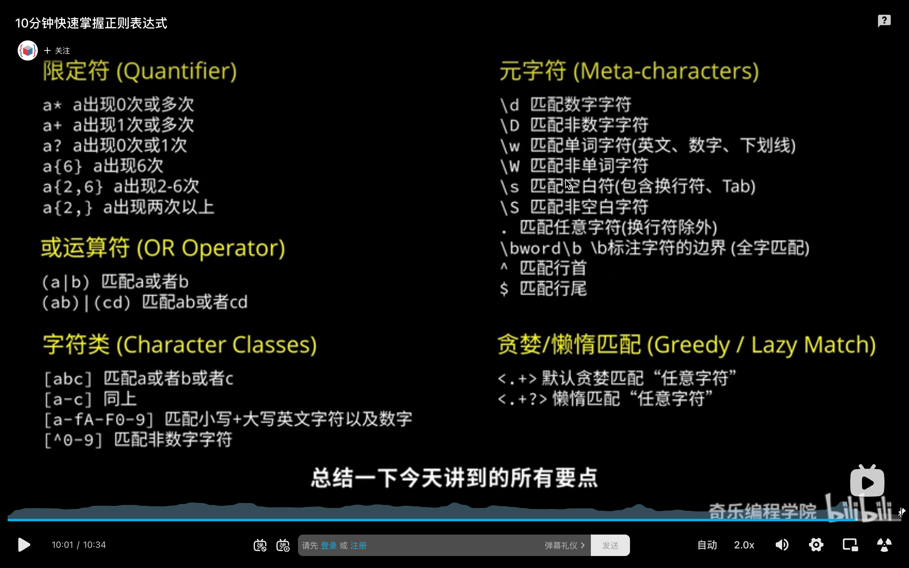  
总结。

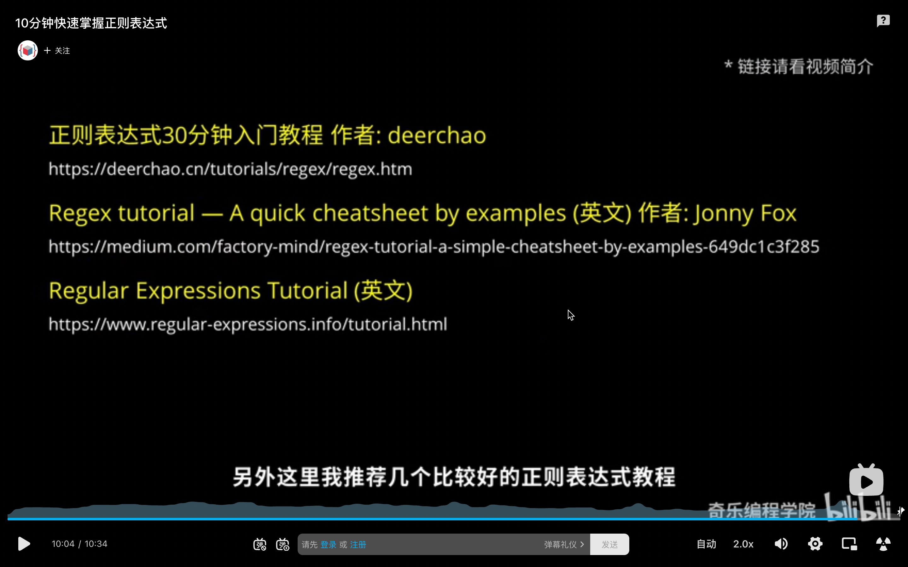  
其它较好教程。

add 220919

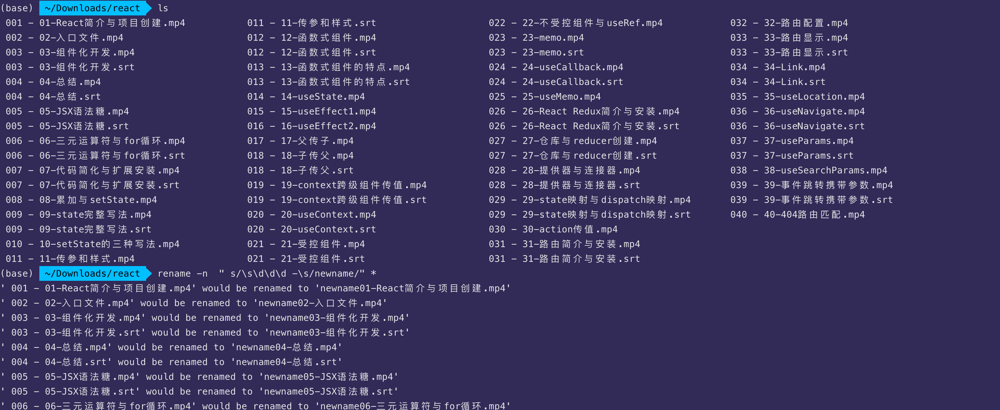  
正则表达式批量重命名实例  
rename -n " s/\s\d\d\d -\s/newname/" \*  
-n 只输出，不实际修改。\s 空格，\d 数字

  
https://oldtang.com/3001.html
rename 命令参考资料
主要就是 rename [options] "s/oldname/newname/" file，如想文件夹下全重命名则 file 替换为\*
