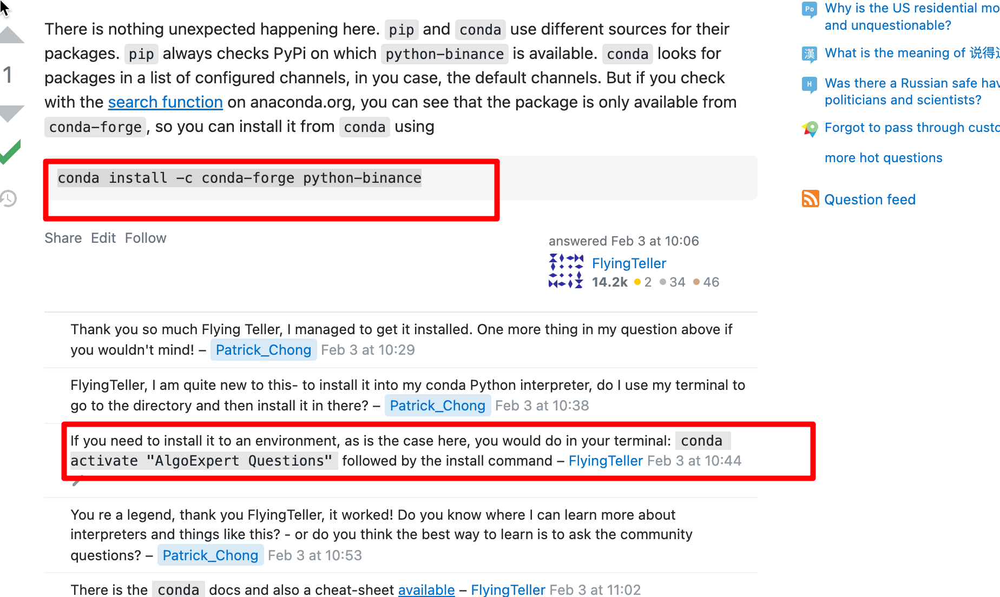
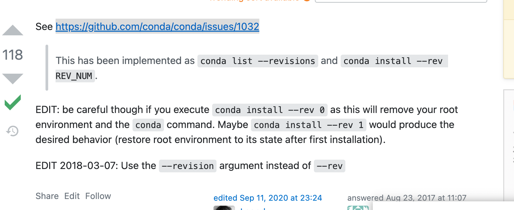
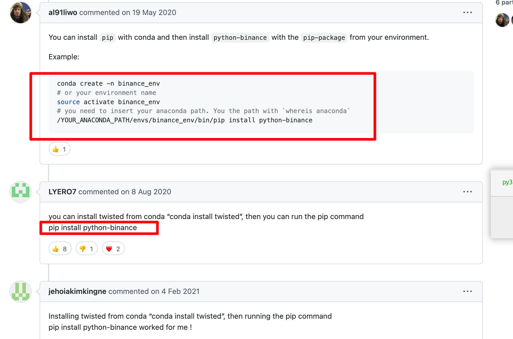
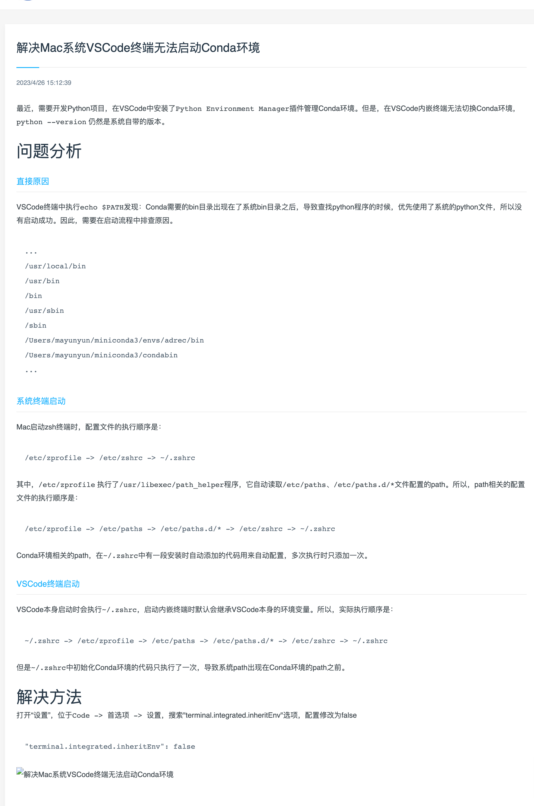

## conda 安装 binance(以及其它非主流依赖)，且安装到指定编译器分支

  
https://stackoverflow.com/questions/70957311/how-can-i-install-python-binance-package-in-pycahrm-i-am-using-the-conda-inter  
一些非主流依赖直接 conda install 不行，需现在这里搜索：https://anaconda.org/search?q=python-binance，知道来自conda-forge包，所以conda install -c conda-forge python-binance 或如 conda install -c rodgomesc pip-ccxt

## pycharm 新环境选择 base 分支

在 anaconda，envirment 中移到 base 处，显示其路径/opt/anaconda3。  
pycharm 新环境中 location 选择 /opt/anaconda3/bin/python3  
conda excute 默认选择 /opt/anaconda3/bin/conda

add，以上为安装 anaconda 时选择为所有用户安装时的路径，如安装时一直默认选项，即为单个用户安装，则路径不同。

## pycharm 选择 anaconda 中的虚拟环境。

file，new project，previously configured interpreter。三个点符号，conda envirment，conda executable 里填写 where conda 后输出的路径。interpreter 里填写鼠标放在 anaconda 环境时显示的路径并结尾加/bin/python3.??。或者 conda activate 转到指定环境后再 where python3 获取到路径并将最终 3 改为 3.？？（暂不确定是否选 3 就行还是需要 3.？？）

## 命令行切换到指定 anaconda 虚拟环境

conda activate ???

## anaconda 恢复到以前的版本



https://stackoverflow.com/questions/41914139/how-to-reset-anaconda-root-environment

conda list --revisions  
conda install --revision REV_NUM

## 创建并激活新虚拟环境

可以通过 anaconda 桌面创建，但最好用下面命令行事：  
conda create --name py10 python=3.10  
conda activate py10

## python3.10 环境安装不了 python-binance 的解决方法

常规安装方法：conda install -c conda-forge python-binance 可能遇到报错

```
conda install -c conda-forge python-binance
Collecting package metadata (current_repodata.json): done
Solving environment: failed with initial frozen solve. Retrying with flexible solve.
Solving environment: failed with repodata from current_repodata.json, will retry with next repodata source.
Collecting package metadata (repodata.json): done
Solving environment: failed with initial frozen solve. Retrying with flexible solve.
Solving environment: |
Found conflicts! Looking for incompatible packages.
This can take several minutes.  Press CTRL-C to abort.
failed

UnsatisfiableError: The following specifications were found to be incompatible with each other:

Output in format: Requested package -> Available versions

```

尝试这些方法都无法解决：https://exerror.com/solving-environment-failed-with-initial-frozen-solve-retrying-with-flexible-solve/

最后使用此理解方法有效：https://github.com/sammchardy/python-binance/issues/508  



add，可能是因为 python-binance，不支持 3.10，只支持 5，6，7

add，用 3.7 又会出现 numpy 错误，而且即使用 3.7 登陆 jupyter，sys.version 仍显示 3.10，可能是因为 3.7 时 jupyter 还未支持的原因。太复杂，暂停使用 jupyter，尝试 pycharm

## jupyter 使用 anaconda 指定环境流程

见 jupyter.md

## conda activate envirName 报错：Your shell has not been properly configured to use 'conda activate'.

https://blog.csdn.net/qq_35203425/article/details/103223892

vps ubuntu 安装 anaconda 后命令行未显示 base，就使用 conda activate envirName 会报错：Your shell has not been properly configured to use 'conda activate'，
此时需要闲 source activate 或 conda activate 显示了 base 后，才能执行 conda activate envirName。而不是按错误提示 conda init shellName(因不知道 shellname 是什么，所以没测试此方法)。

## vps ubuntu 装 anaconda，并让本地电脑访问 jupyter

wget https://repo.anaconda.com/archive/Anaconda3-2022.05-Linux-x86_64.sh
https://repo.anaconda.com/archive 可在这里找具体版本，arch 命令找当前 vps 架构如 x86_64 等。

bash Anaconda3-2022.05-Linux-x86_64.sh

q，退出许可证，yes，yes。

source ~/.bashrc，之后如果 conda command not found。则在~/.bashrc 里添加 export PATH=$PATH:/root/anaconda3/bin 或 export PATH=$PATH:/home/ubuntu/anaconda3/bin 再 source ~/.bashrc，再 source activate 激活 base 环境

conda update -n base -c defaults conda
可通过此命令升级到最新版

jupyter notebook --generate-config 可以得知 config 文件保存路径，修改此文件

c.NotebookApp.ip = 'localhost' 为 c.NotebookApp.ip = '0.0.0.0'，注意另起一行，且无缩进

开启 vps 端口，具体见 vps.md。之后即可通过本地电脑访问 vpsip:port 访问 jupyter

## 2301 anaconda 更新

win 中需要打开 anaconda promot  
mac 中直接在有如（base）的命令行输入：  
conda update conda  
conda update anaconda  
conda update python

重启 anaconda，点击确认更新

## anaconda 怎么卸载虚拟环境

```
conda env remove --name envname
```

## conda install 和 pip install 区别

```
conda install xxx：这种方式安装的库都会放在anaconda3/pkgs目录下，这样的好处就是，当在某个环境下已经下载好了某个库，再在另一个环境中还需要这个库时，就可以直接从pkgs目录下将该库复制至新环境而不用重复下载。
pip install xxx：分两种情况，一种情况就是当前conda环境的python是conda安装的，和系统的不一样，那么xxx会被安装到anaconda3/envs/current_env/lib/python3.x/site-packages文件夹中，如果当前conda环境用的是系统的python，那么xxx会通常会被安装到~/.local/lib/python3.x/site-packages文件夹中

import xxx时，先找的是anaconda3/pkgs目录，所以conda安装的包会被import进来
```

所以为了避免干扰，用 pip install 而不用 conda install  
此外 conda uninstall 和 pip uninstall 一样。要清空这个 pkgs 下的已下载库，可以通过命令 conda clean -h （conda clean -a）进行实现。

## 设置 conda-forge 为优先级

https://zhuanlan.zhihu.com/p/508506160

1.3 conda-forge
默认的 conda channel 是 defaults，但这个 channel 的 package 不全，这时候可以选择使用 conda-forge，先看一下官网对它的介绍（https://conda-forge.org/docs/user/introduction.html ）：

Conda-forge is a community effort that provides conda packages for a wide range of software.
可见 conda-forge 是一个 community，它所提供的 package 都放在同名的 conda-forge 这个 channel 里，建议使用这个 channel，并设置严格优先使用 conda-forge，因为不同 channel 的 package 不一定完全兼容，下面是配置方法：

conda config --add channels conda-forge
conda config --set channel_priority strict
如果在用户根目录没有.condarc 这个文件，上面命令会创建这个文件，设置完之后可以通过下面命令查看 channel 状态和优先级：

conda config --get channels
这条命令可能会得到类似如下的显示：

--add channels 'defaults' # lowest priority
--add channels 'conda-forge' # highest priority
这时~/.condarc 的内容如下：

channels:

- conda-forge
- defaults

## 解决 Mac 系统 VSCode 终端无法启动 Conda 环境

</img>

https://betheme.net/yidongkaifa/101669.html

解决方法
打开“设置”，位于 Code -> 首选项 -> 设置，搜索"terminal.integrated.inheritEnv"选项，配置修改为 false

"terminal.integrated.inheritEnv": false

## 230525 我在本地 mac 电脑上有个 anaconda 环境 a，请问有没有什么方法把这个环境 a 移植到 vps ubuntu 系统的 anaconda 中去？

总结，有方法移植环境，但是最好同系统移植

```
可以通过以下步骤将你的本地Mac上的Anaconda环境迁移到Ubuntu VPS中：

在你的Mac上，使用conda env export > environment.yml命令导出你的环境。这将创建一个名为environment.yml的文件，其中包含了环境的详细信息，包括所有的库和版本信息。

将environment.yml文件传输到你的Ubuntu VPS。你可以使用scp或者其他文件传输工具来完成这一步。

在你的Ubuntu VPS上，确保已经安装了Anaconda。

使用conda env create -f environment.yml命令在Ubuntu VPS上创建新环境。这将使用你之前导出的environment.yml文件来创建一个完全一样的环境。

以上步骤应该能够帮助你迁移你的Anaconda环境。然而，这种方法可能会因为两个操作系统之间的差异而遇到一些问题。例如，某些Python库可能在Mac和Ubuntu上有不同的依赖项。如果遇到这种情况，你可能需要手动解决这些问题。
```
