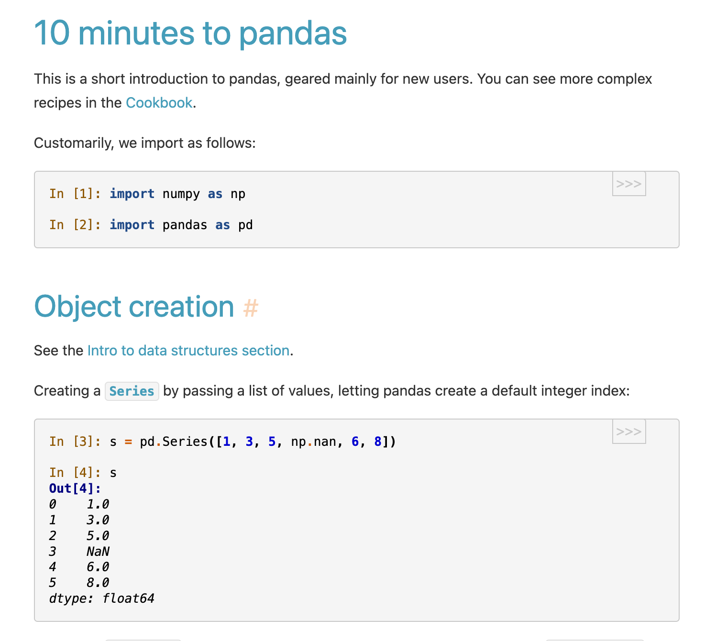
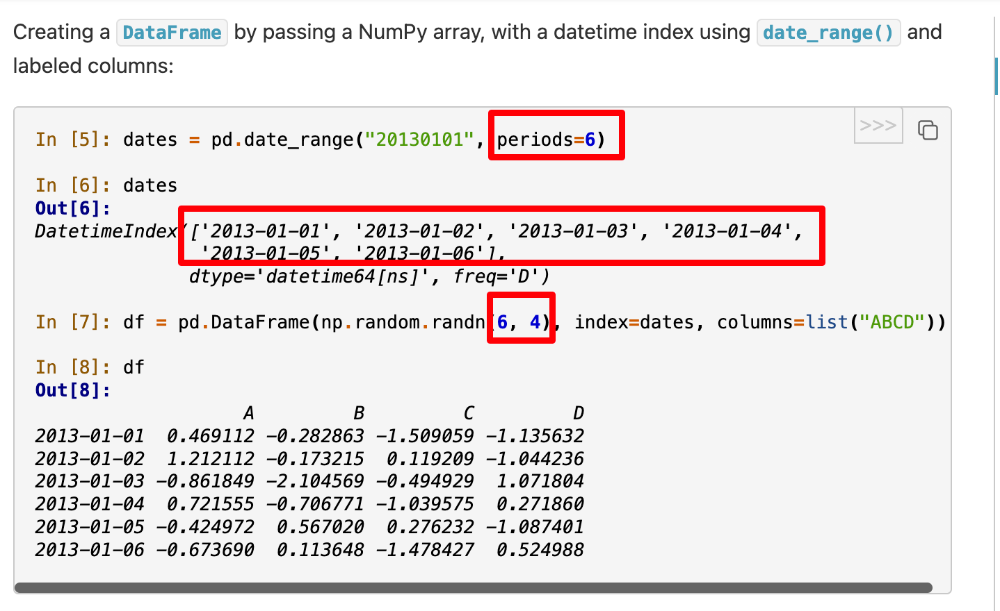
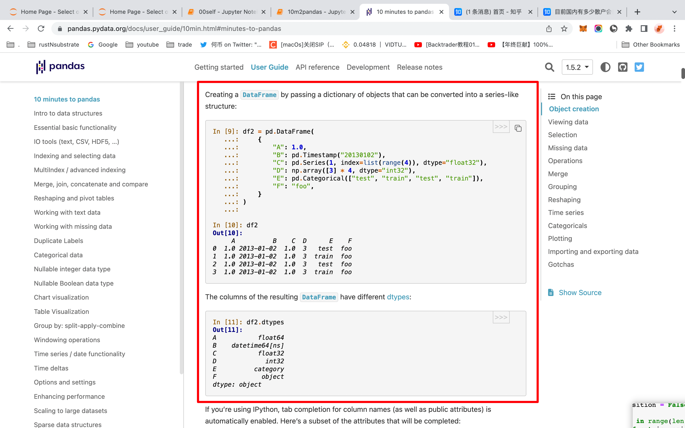
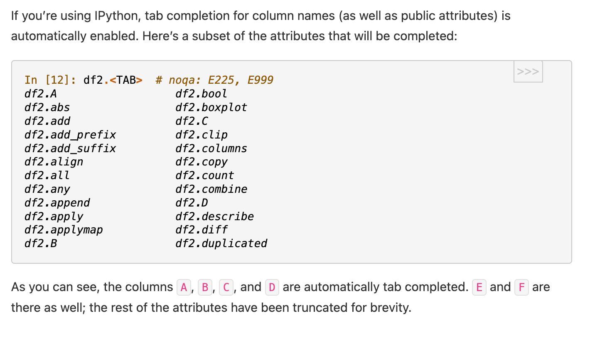
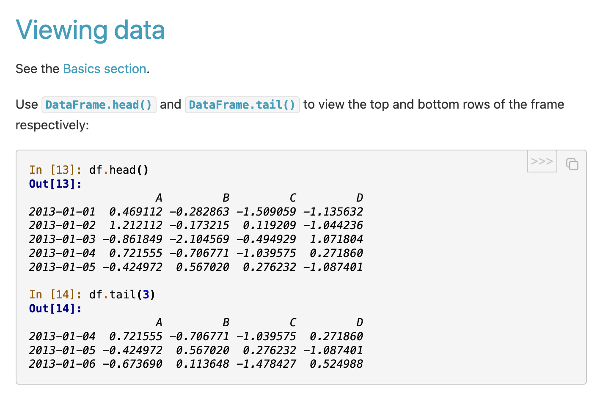
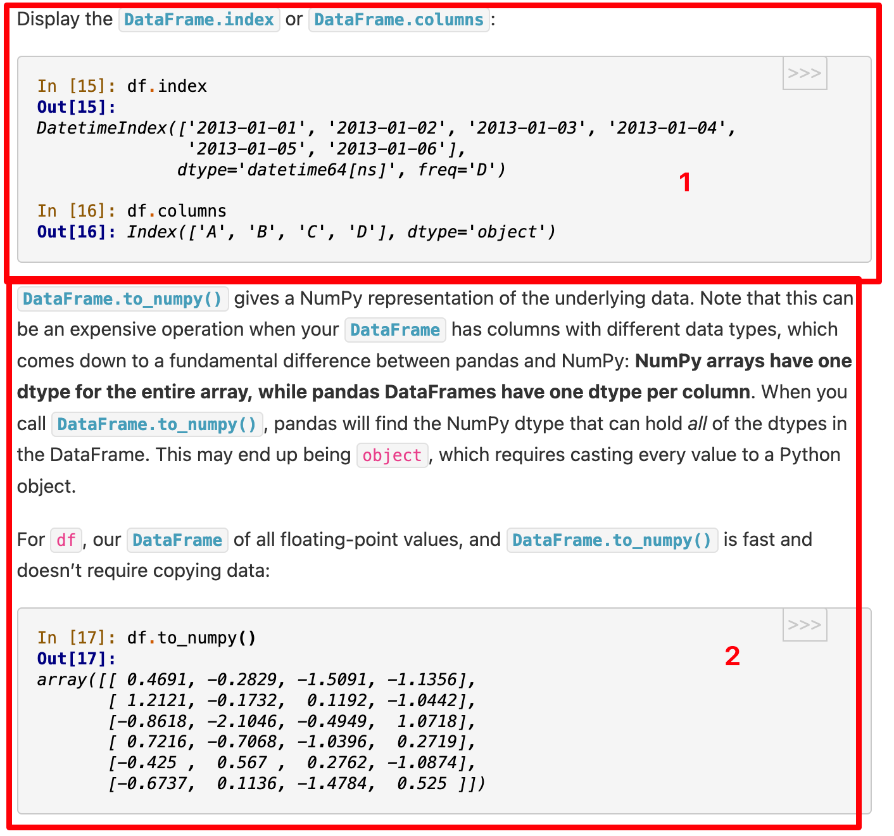
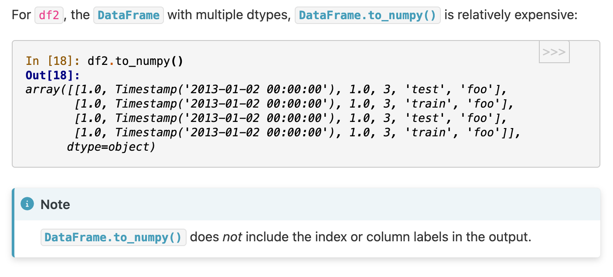
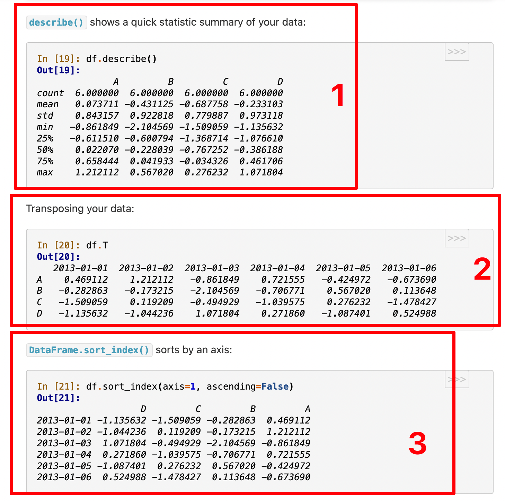
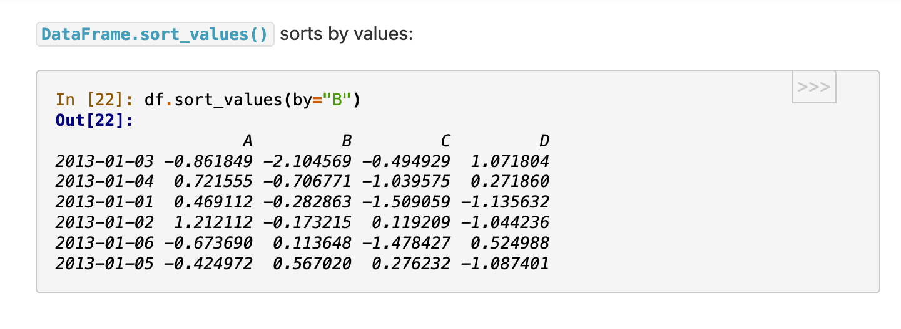
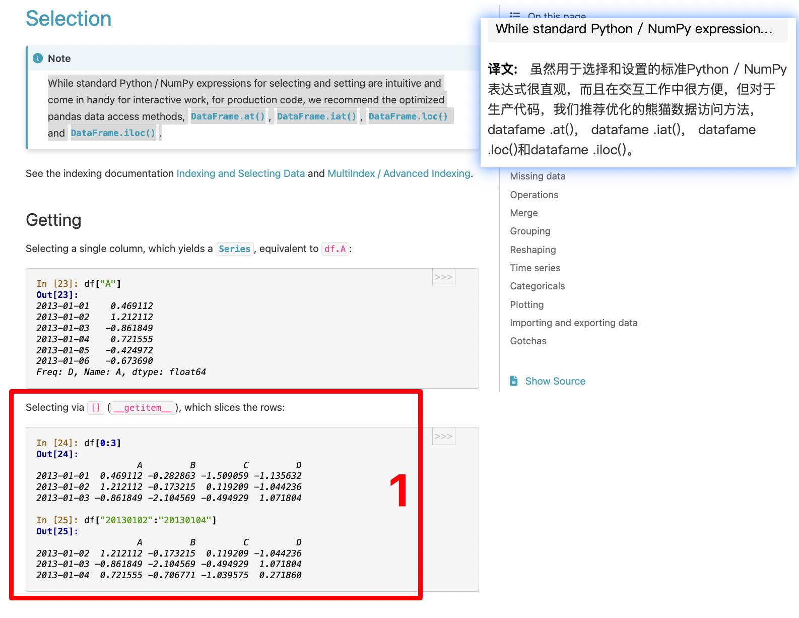

##

</img>  
series 有一系列（事件）的意思

</img>  
根据 period 自动生成日期  
下面的 6 应该是行数，4 应该是列数，index 不计算在内

</img>  
字典方式生产 DF

</img>  
ipython 状态下可以用 tab 自动补全列名？

</img>  
看 DF 的头和尾的方法

</img>  
1，显示 index 和 clms
2，较复杂，大概是 NumPy arrays have one dtype for the entire array, while pandas DataFrames have one dtype per column. to_numpy 更快，花销更少。

</img>  
大概是当数据本来就很多类型时，用 DataFrame.to_numpy() is relatively expensive？

</img>  
1，describe() shows a quick statistic summary of your data  
2，Transposing your data，行列交换。  
3，DataFrame.sort_index() sorts by an axis，按对称轴交换？axis 有轴，对称轴的意思。

</img>  
这个没看懂

</img>  
1，以此方式获取指定部分

