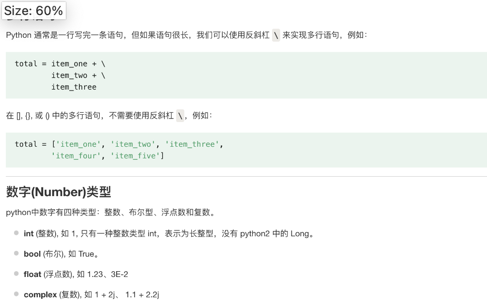
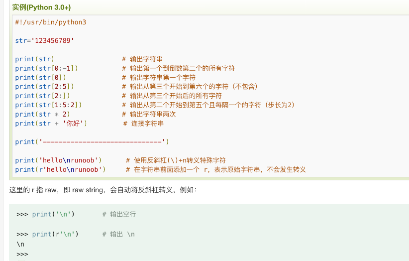

## 0730

### 01 教程

Python 的 3.0 版本，常被称为 Python 3000，或简称 Py3k。相对于 Python 的早期版本，这是一个较大的升级。为了不带入过多的累赘，Python 3.0 在设计的时候没有考虑向下兼容。本教程主要针对 Python 3.x 版本的学习

### 02 简介

https://www.runoob.com/python3/python3-intro.html

### 03 环境搭建

https://www.runoob.com/python3/python3-install.html

### 04 vscode

https://www.runoob.com/python3/python-vscode-setup.html

### 05 基础语法

默认情况下，Python 3 源码文件以 UTF-8 编码，所有字符串都是 unicode 字符串。 当然你也可以为源码文件指定不同的编码

</img>

</img>

```

在 python 用 import 或者 from...import 来导入相应的模块。

将整个模块(somemodule)导入，格式为： import somemodule

从某个模块中导入某个函数,格式为： from somemodule import somefunction

从某个模块中导入多个函数,格式为： from somemodule import firstfunc, secondfunc, thirdfunc

将某个模块中的全部函数导入，格式为： from somemodule import *
```
