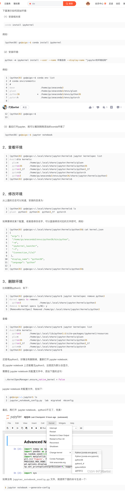
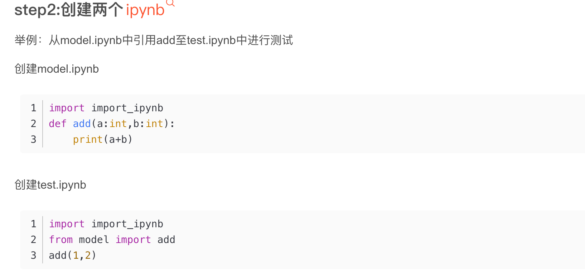

## python 数据分析神器 Jupyter notebook 快速入门 https://www.bilibili.com/video/BV1Q4411H7fJ

基于代码区块，可以和文档混写，查看中间变量，调用魔法函数等优点。对于数据分析等是最好的 ide。

内核为 ipython，所以显示 In []

  
绿色模式，编辑模式。 shift enter 运行当前代码。 按 esc 到命令模式
还有蓝色模式，命令模式，按 x 剪切命令，z 恢复命令。 按回车到编辑模式。  
在左侧按 m 还能进入 markdown 模式。  
按 h 可以看到所有快捷键。  
选中？，按 b 在当前代码块下方创建代码块，  
a，在当前代码块上方创建代码块  
ctl enter 只运行当前代码块。  
clt enter（opt enter）运行当前并跳到下一个。  
d，删除掉当前代码块  
shift v，粘贴到上方  
v，粘贴到当前。  
l 给代码标行数。  
c，复制。

## Jupyter 使用详解 https://zhuanlan.zhihu.com/p/441668517

便捷获取配置文件所在路径的命令：jupyter notebook --generate-config

修改默认启动文件夹：code /Users/accountname/.jupyter/jupyter_notebook_config.py，然后 c.NotebookApp.notebook_dir = '' 引号里输入路径。

## 清空输出

内核，重启&&清空输出

<!-- ## jupyter 使用 anaconda 指定环境流程

有很多种途径，但是只有以下途径未遇到 bug
conda create -n test37 python=3.7
anconda 桌面 home install jupyter，并从桌面 launch jupyter
之后依赖从桌面安装，如安装不成功则从 jupyter 页面里 pip install 安装 或类似 pip install --upgrade dateparser==1.1.1 更新 -->

## How To Set Up a JupyterLab Environment on Ubuntu 22.04

</img>

https://www.vultr.com/docs/how-to-set-up-a-jupyterlab-environment-on-ubuntu-22-04/

看起来很复杂，但可以省去申请域名，设置密码等步骤，所以做到步骤 5 就行了  
但是需要创建一个非 root 等 sudo 账户，教程记在了 vps.md 中

add221111  
注意下次登录时可能会登陆到 root 账户。需要 cat /etc/passwd 找到 jupyter 的用户名，再用此用户名登陆才能正常使用。

## 关闭 jupyter warning

```

在 jupyter 第一个 cell 单独加入
import warnings
warnings.filterwarnings('ignore')
warnings.simplefilter('ignore')

```

## vscode 自动格式化 jupyter-notebook ipynb 文件

```
As Kyle Carow stated in their answer to Ian Huff: Formatting of notebooks is available by now.

MacOS: Option+Shift+F
Windows: Alt+Shift+F
Pressing these keys will either trigger a formatting of the active cell or the notebook as a whole if no cell is active.
```

但似乎只能解决空行过多的简单问题，缩进错误等问题无法解决

## vscode 中选择 jupyter notebook 内核

打开一个 ipynb 文件，右上角笔记本形状图表选择

ssh -i "/Users/accountname/Desktop/01workspace/keys/aws-mumbai-keypair.pem" ubuntu@ec2-13-233-124-187.ap-south-1.compute.amazonaws.com

## 2303

### jupyter 指定 conda 虚拟环境，以及其它相应设置

</img>

```
conda install ipykernel

python -m ipykernel install --user --name envName --display-name "jupyter-envNAme"

```

然后网页里还需要手动选择下。

### ipynb 引入 ipynb

</img>

被引入的其实不用加 import import_ipynb  
如报错，则试试重启

### 我用本地电脑连接到了 vps 中的 Jupyter notebook，并运行了其中一个 ipynb 程序，这个程序需要运行很长时间，我中途必须得关掉连接此程序的网页，请问有什么办法让我关闭网页后仍然让程序继续运行？

add:  
1，需要先进入拥有此 jupyter notebook 的 conda 虚拟环境  
2，如是连接 vps 上的 jupyter notebook，则需加入除 jupyter notebook 额外的命令。跟正常情况 vps 开启 jupyter notebook 的命令一样

```

可以使用 nohup 命令在后台运行 Jupyter Notebook 以保持程序在远程服务器上运行，即使你关闭了终端窗口或者网络连接断开。具体步骤如下：

在服务器上打开终端并启动 Jupyter Notebook：

ruby
Copy code
$ jupyter notebook
使用 nohup 命令在后台运行 Jupyter Notebook：

shell
Copy code
$ nohup jupyter notebook &
nohup 命令用于运行一个命令，并忽略所有的挂起信号，即使你关闭了终端窗口或网络连接断开，程序也可以在后台持续运行。

记录 Jupyter Notebook 进程的进程号：

ruby
Copy code
$ echo $!
echo $! 命令用于输出上一个在后台运行的进程的进程号，这个进程号可以用于后续的操作，例如杀死进程。

退出服务器终端，关闭连接。

现在你可以关闭远程服务器连接，程序仍将在后台运行。若需要再次连接远程服务器并恢复 Jupyter Notebook，可以通过以下命令重新启动：

css
Copy code
$ jupyter notebook --no-browser --port=<port-number>
其中 <port-number> 是你在运行 Jupyter Notebook 时指定的端口号，默认为 8888。如果想在本地浏览器中打开 Jupyter Notebook，可以使用 SSH 隧道或者浏览器插件，将远程服务器端口转发到本地。

```

### nohup jupyter notebook & 中 &起到的是什么作用

```
在Linux系统中，& 符号是用于将一个命令放入后台运行的符号，它会让命令在后台运行而不阻塞当前终端的输入输出，这个命令将会立即返回一个提示符，你可以继续输入其他命令。

当你在服务器上运行 jupyter notebook 命令时，通常情况下该命令会将一个Web服务器启动在终端的前台运行，直到你关闭终端或者退出登录，这样会导致Jupyter Notebook服务随之停止。而使用 & 符号可以让 jupyter notebook 命令在后台持续运行，即使你关闭了终端或者退出了登录，该命令也会一直运行下去。

当你在运行 nohup jupyter notebook & 命令时，nohup 命令用于让 jupyter notebook 命令忽略挂起信号，这样即使你关闭了终端或者退出了登录，该命令也会在后台持续运行。而 & 符号则将 nohup jupyter notebook 命令放入后台运行，同时返回一个提示符，让你可以继续输入其他命令。
```

### jupyter notebook 中怎么使用%%capture

add:  
1，似乎必须写在最上排  
2，关闭网页可能会显示 keyboard interrupt。直接断网而不关网页有效  
3，此方法只能获得正常输出，无法获得报错内容

```
在Jupyter Notebook中，%%capture是一个魔术命令，用于捕获输出并将其存储在一个变量中，而不是将其直接打印到屏幕上。

以下是一个示例，演示如何在Jupyter Notebook中使用%%capture：

python
Copy code
%%capture captured_output

# 这里是一些代码，产生一些输出
print('Hello, World!')
x = 2 + 2
print(x)

# 在这之后，所有的输出将会被捕获并保存在变量captured_output中
在这个示例中，captured_output将会包含print语句产生的输出以及计算结果。在执行完这个代码块后，如果我们想要查看这些输出，可以使用captured_output.show()方法：

scss
Copy code
captured_output.show()
这将会打印出print语句产生的输出以及计算结果。
```

### 撤销误删操作，history 命令

jn 撤销操作不太好，但可以用 history 命令找到最近执行了的代码，从而找回误删掉的代码

### 让一个 cell 做 for 循环，但其循环的内容是另一个 cell (未验证)

```
你可以使用Jupyter Notebook的魔术命令%%writefile将第二个cell中的代码写入到一个Python脚本文件中，然后在第一个cell中导入该脚本文件，并将其中的代码作为循环体。

具体步骤如下：

在第二个cell中编写要循环的代码，并使用%%writefile魔术命令将其写入到一个Python脚本文件中，例如：
python
Copy code
%%writefile mycode.py

for i in range(5):
    print(i)
此时，你会发现当前目录下多了一个名为mycode.py的文件，其中包含了第二个cell中的代码。

在第一个cell中导入mycode.py文件，并将其中的代码作为循环体，例如：
python
Copy code
from mycode import *

for i in range(5):
    mycode(i)
在此示例中，我们使用from mycode import *语句导入了mycode.py文件中的所有函数和变量，然后在for循环中调用mycode()函数，并将循环变量i作为参数传递给它。

这样，第一个cell中的for循环就可以使用第二个cell中的代码作为循环体了。

请注意，当你运行第一个cell时，Python会重新加载mycode.py文件中的代码，并执行for循环。因此，在第二个cell中修改代码后，你需要重新运行第二个cell才能使修改生效。
```

### vps 中的 jupyter 让本地可连接

nohup jupyter notebook --ip 0.0.0.0 --no-browser --allow-root &

### 本地登陆 vps 中的 jupyter，输入密码出现 Invalid credentials 报错

原因是新版 JN 默认使用 argon2 为密码编码，但可能出问题了无法解码。则输入密码显示错误，需要自己用 sha1 编码。

```
#
pip install notebook[password] （可能不需要这步，之后有问题再执行这步。）

# 生成sha1密码
python -c "from notebook.auth import passwd; print(passwd('密码 password', algorithm='sha1'))"

# 生成jupyter_notebook_config.py
jupyter notebook --generate-config

# 定位到jupyter_notebook_config.py，找到以下代码，解开注释，并将生成的sha1密码粘贴到此处
c.NotebookApp.password = ''

# 重启输入密码即可，注意登陆页面输入密码为编码前密码。编码后的密码是保存在文件中
```

注意登陆页面输入密码为编码前密码，编码后的密码是保存在文件中

注意在~/.jupyter 目录可能同时有 jupyter_notebook_config.py jupyter_notebook_config.json jupyter_server_config.json  
最好将 jupyter_notebook_config.json jupyter_server_config.json 删掉，只保留 jupyter_notebook_config.py  
因为 jupyter_notebook_config.py 优先级最低。  
且不要用 jupyter notebook password 或 jupyter server password 再生成密码，因为它们会默认用 argon2 生成密码且生成新的 jupyter_notebook_config.json jupyter_server_config.json 文件。覆盖掉 jupyter_notebook_config.py 的效果。

jupyter notebook password 或 jupyter server password 差不多。但使用 jupyter server password 后会发生一些迁移，启动 notebook 时会提示发生了迁移。似乎只能从 notebook 迁移到 server，而无法迁移回来。
