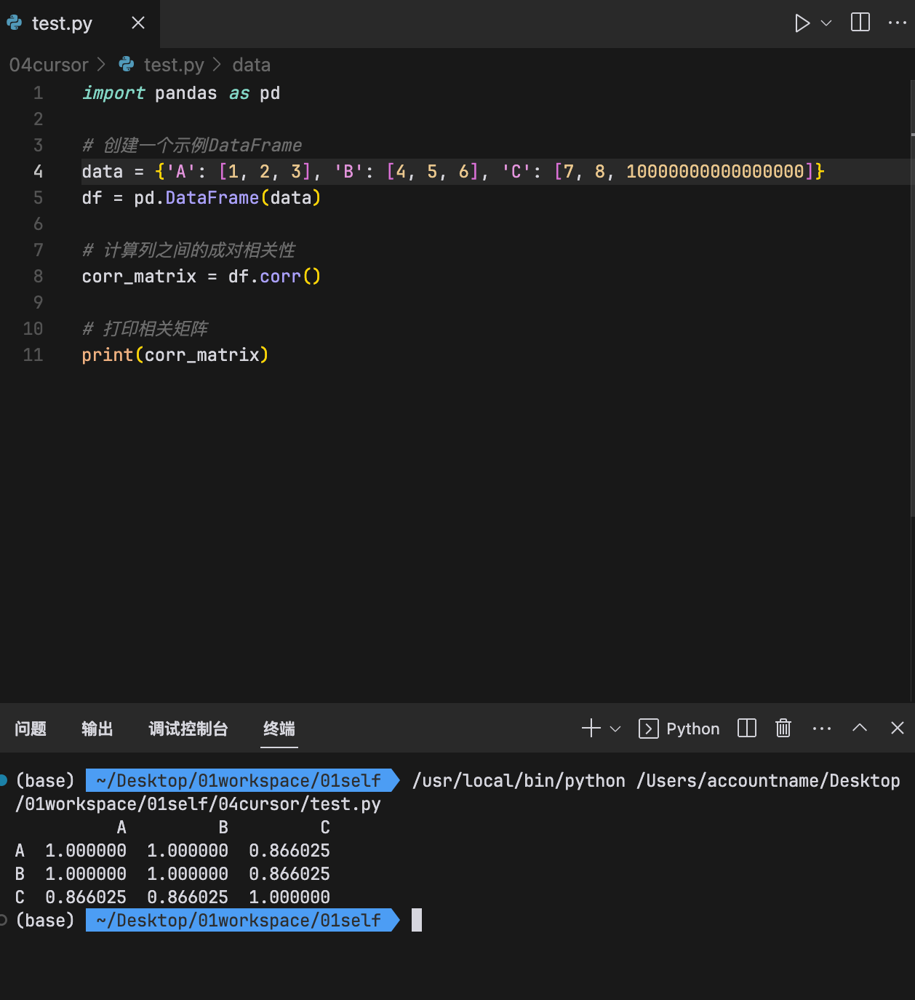

## Pycharm 中 pandas 输出结果省略解决方法

https://zhuanlan.zhihu.com/p/371065358

```
import pandas as pd
#显示所有列
pd.set_option('display.max_columns', None)
#显示所有行
pd.set_option('display.max_rows', None)
```

```
2.显示固定行列的数据。

import pandas as pd
#显示1000列
pd.set_option('display.max_columns', 1000)
 #显示1000行
<!-- pd.set_option('display.max_rows', 1000) -->
pd.set_option('display.min_rows', 1000)
#设置每一列中值的最大显示宽度
pd.set_option('display.max_colwidth',1000)
#设置浮点数的最多显示精度
pd.get_option('display.precision')  # 6
pd.Series(data = [1.23456789])
pd.set_option('display.precision',4)
pd.Series(data = [1.23456789236546])
```

## '<' not supported between instances of 'float' and 'method' 报错

</img>

因为 diff 是个固定方法，所以报错，所以取列名时尽量别选太通用的词。

## ValueError: The truth value of a Series is ambiguous. Use a.empty, a.bool(), a.item(), a.any() or a.all().

</img>  
--=  
</img>  
and 替换为&，且每项加上括号

## frame.iloc[:,0:5]

```
  frame = pd.DataFrame(client.get_historical_klines(symbol,
                                                     '30m',
                                                     '50 hours ago UTC'))
    frame = frame.iloc[:,0:5]
```

[a,b]大概是显示前 a 行，前 b 列。但:代表显示所有行，0:5 代表显示第 0-4 列。

## 230103

## dataframe 使用 sqlalchemy 写入 sql 数据库

</img>  
--=  
</img>

https://wenku.baidu.com/view/d5698fa3bad528ea81c758f5f61fb7360b4c2b18.html  
如是 sqlite 则省略 schema 字段

</img>  
上图为写入介绍，此图为自己写的写入和读取实例

## 按各种条件新增列

</img>

## 筛选出 df 中满足条件的行

</img>

## 取消科学计数法

</img>  
网上查到的很多方法如 np.set_printoptions(suppress=True) 等无效，用此方法转为 string 则有效  
示例：

```
a=1
b=10000000
f'{a/b:.20f}'
```

```
profits = [f'{(sell-buy)/buy:.20f}' for sell,buy in zip(sellprices, buyprices)]
profits
```

## 230105

### k 线单位

</img>  
1 分钟 k 线的一行数据是显示该行所示时间开始到下一行所示时间截止这个时间段的 k 线  
所以 5 分单位 k 线的 第 5 分钟 的 close 应该是跟 1 分单位 k 线的第 9 分钟而不是第 6 分钟的 close 相同

## 230111

### df 显示各列类型

df.dtypes

### df datetime 转时间戳

df['Time_ms_int'] = pd.to_datetime(df['Time']).apply(lambda x : x.value)/1000000
注：不除以任何数，类型为 int，除以任何数后类型变为 float，会以科学计数法显示。如想正常显示，则按以下方式转换回 int。

### df 类型转换

df['Time_ms_int']= df['Time_ms_int'].astype('int')

## 230118

### lambda 函数或者表达式。

```
import time

# 测试的Def函数
def square1(n):
    return n ** 2

# 测试的Lambda函数
square2 = lambda n: n ** 2

print(time.time())

# 使用Def函数
i = 0
while i < 1000000000:
    square1(100)
    i += 1

print(time.time())

# 使用lambda函数
i = 0
while i < 1000000000:
    square2(100)
    i += 1

print(time.time())

1413272496.27
1413272703.05 (Def   函数:207s)
1413272904.49 (Lambda函数:201s)
```

例子  
大概就是其它语言匿名函数的意思

## 230201 时间序列数据与 Tick 数据处理

https://www.zhihu.com/zvideo/1567062989219540992

### 新增星期列

df['dayofweek'] = df['Date'].dt.day_name()

### 查看 df 数据起止时间

df['date'].max() - df['date'].min()

### df 时间过滤器

</img>  
方法一

</img>  
方法一不太好，将 data 设置为 index 后即可如图更好的过滤数据

## aggregate/合计 大概意思是把更短的时间周期合并成更长的周期

</img>  
1，分隔符是\t，大概意思是源文件是 txt，需要指定分隔符  
2，parse date 的时候，0，1 两列作为 date，即高速程序，这两列都是时间  
3，有中文，所以用 gbk 方式  
4，跳过首尾行数据  
5，合并两列数据  
6，在原始数据上修改  
7，resample，5min 数据改为 30min

</img>  
获取 csv 数据做成 df

</img>  
resample，ohlc，agg 就能完成 tick/逐笔订单 转标准 df。（但未测试一些时间段内一笔都没有会出现什么情况）

## 筛选 loc df 中某个子时间段

newdf = df.loc[ (df.index > '2021-04-01 00:00:00') & (df.index < '2021-06-01 00:00:00') ]

loc 和 iloc 都是 pandas 工具中定位某一行的函数，loc 是 location 的意思，而 iloc 中的 i 指的是 Integer，二者的区别如下：

loc：通过行标签名称索引行数据  
iloc：通过行号索引行数据

### pandas dataframe 只显示指定列

```
# 创建示例数据帧
df = pd.DataFrame({'Name': ['Alice', 'Bob', 'Charlie'],
                   'Age': [25, 30, 35],
                   'Gender': ['Female', 'Male', 'Male']})

# 只显示 Name 和 Gender 列
df[['Name', 'Gender']]
```

### 自动定义多个列名

```
t_delay = [1, 3, 5, 7, 9, 12]
for t in t_delay: # 分别获得未来1,3,5,7,9,12个周期的收益率，并将其shift，作为target
    data_15mins['y_{}'.format(t)] = data_15mins['close'].shift(-t) / data_15mins['close'] - 1
# 注意：需要理解format的用法，注意shift的用法，需要注意数据中出现的nan，inf，-inf等怎么处理？
print(data_15mins)
```

## 2303

### df 删除第一行数据

```
可以使用Pandas库中的drop()函数来删除DataFrame（df）中的第一行数据。具体操作如下：

假设DataFrame为df，要删除第一行数据，可以使用以下代码：

bash
Copy code
df = df.drop(df.index[0])
这里的df.index[0]表示第一行数据的索引，通过drop()函数删除这个索引所对应的行数据。

另外，也可以使用以下代码来删除第一行数据：

bash
Copy code
df = df.iloc[1:]
这里的iloc[1:]表示对DataFrame进行切片，从第1行开始（第一行的索引为0），一直切到最后一行，即只保留第2行以后的所有行数据。
```

## 230307

### df 格式化模版

```
            # 以下列名为原df列名。获得原df指定列
            df = df[['Date', 'Open', 'High', 'Low', 'Close', 'Volume']]
            # 重命名为以下新列名
            df.columns = ['date', 'open', 'high', 'low', 'close', 'vol']
            # to_datetime，格式化date，可能根据情况需要设置再后面加，unit='ns' 或 unit='ns'
            df['date'] = pd.to_datetime(df['date'])
            # 将 date 列设为index
            df.set_index('date', inplace=True)
            print(df)
```

## 230309

### 逐次连乘逐行收益率与用 出价/入价 - 1 计算收益率，按直觉得到的结果应该一样，但却不一样

</img>

```
做多
c1 c2 c3
na1 =1 +  (c3 - c1) / c1 = c3/c1
na2 = (1 +  (c2 - c1) / c1) * (1 +  (c3 - c2) / c2) = (c2/c1) * (c3/c2) = c3/c1
na1 = na2

做空
c1 c2 c3
na1 = 1 - (c3-c1) /c1 = 2 - c3/c1
na2 = (2 - c2/c1) * (2 - c3/c2) = 4 - 2 * (c2/c1 + c3/c2) + c3/c2
na1 != na2
```

在做多时没有问题，nav = nav\*(1+ret)，但做空时如果按 nav = nav\*(1-ret)就错了  
但具体做空时怎么写还不知道。

## 230311

### 同时 plot 多个列，且指定其中一列的颜色，粗细

```
from sklearn.preprocessing import MinMaxScaler

result_df = result_df[['aaa', 'bbb', 'ccc']   ]

# 将数据归一化到0-1的范围内
scaler = MinMaxScaler()
scaled_result_df = pd.DataFrame(scaler.fit_transform(result_df), columns=result_df.columns, index=result_df.index)


# 绘制折线图
# scaled_result_df.plot()
ax = scaled_result_df.plot(y='aaa', color='black', linewidth=5.5, figsize=(10, 6))
scaled_result_df.plot(ax=ax)
```

### 如图

</img>

要这样写因为  
如注释掉 1 则 AttributeError: Can only use .dt accessor with datetimelike values  
如注释掉 2 则无法删除原数据中时分秒数据  
如注释掉 3 则会因为 4 而报错 AttributeError: 'Index' object has no attribute 'year'

```
df_price['timestamp'] = pd.to_datetime(df_price['timestamp'])和
df_price['timestamp'] = df_price['timestamp'].dt.date 的区别

df_price['timestamp'] = pd.to_datetime(df_price['timestamp'])将df_price中的timestamp列转换为Pandas中的日期时间类型，使得我们可以使用各种日期时间相关的方法和函数。如果timestamp列中的值不是日期时间类型，那么pd.to_datetime()方法将会把这些值转换为日期时间类型。这对于对时间序列进行分析和可视化非常有用。

df_price['timestamp'] = df_price['timestamp'].dt.date将df_price中的timestamp列转换为日期类型（而不是日期时间类型）。这将会将时间戳中的时间部分去除，只保留日期部分。这在某些情况下可能会很有用，例如当您只需要考虑日期，而不需要考虑具体时间时。

总之，这两个操作的主要区别是转换后的数据类型不同：一个是日期时间类型，另一个是日期类型。这两个类型各自有其适用的场景和用途，您需要根据具体情况选择使用哪个。
```

### 检查文件夹是否存在，如不存在，则创建它

```
import os

def render():
    # 检查文件夹是否存在，如果不存在，则创建文件夹
    folder_path = '/path/to/folder'
    if not os.path.exists(folder_path):
        os.mkdir(folder_path)

    # 继续执行函数的其他部分
    ...

```

### 假设一个 df 的某列为，[0,0,1,0,0,0,-1,0,0]怎么将其快速变为[0,0,1,1,1,1,-1,-1,-1]

使用前向填充和后向填充方法填充 nan 值，以将每个 nan 值替换为最近的非 nan 值。

```
import numpy as np
import pandas as pd

# 创建示例数据框
df = pd.DataFrame({'col': [0, 0, 1, 0, 0, 0, -1, 0, 0]})

# 将值为0的元素替换为nan
df['col'].replace(0, np.nan, inplace=True)

# 使用前向和后向填充方法填充nan值
df['col'].fillna(method='ffill', inplace=True)
df['col'].fillna(method='bfill', inplace=True)

# 将-1替换为0
df['col'].replace(-1, 0, inplace=True)

# 转换为列表
result = df['col'].tolist()

```

### 怎么从 df 的所有列中，选出结尾是\_aaa 的列？

```
# 创建一个包含示例列的 DataFrame
import pandas as pd

data = {'col1_aaa': [1, 2, 3],
        'col2_bbb': [4, 5, 6],
        'col3_aaa': [7, 8, 9]}

df = pd.DataFrame(data)

# 使用 filter() 方法选出结尾是 '_aaa' 的列
filtered_cols = df.filter(regex='_aaa$')

print(filtered_cols)

```

在上面的代码中，filter() 方法的参数是一个正则表达式，用于匹配列名。在这个例子中，正则表达式是 \_aaa$，表示匹配以 \_aaa 结尾的列名。因此，filtered_cols 变量将是一个包含结尾为 \_aaa 的列的 DataFrame。

### 在 df 中，怎么新增一列，使得该列每行的值为其它列所有该行值之和

```
# 创建一个包含示例数据的 DataFrame
import pandas as pd

data = {'col1': [1, 2, 3],
        'col2': [4, 5, 6],
        'col3': [7, 8, 9]}

df = pd.DataFrame(data)

# 新增一列，该列为其它列所有该行值之和
df['sum'] = df.sum(axis=1)

print(df)

```

### 过滤一个 df，使得它只保留 aaa 列中行内内容为 bbb 的行。

```
# 使用布尔索引过滤DataFrame
df = df[df['aaa'] == 'bbb']
```

### df.set_index('timestamp', inplace=True)中 inplace=True 是什么作用

```
inplace=True 是一个参数，用于指定是否在原数据上进行操作，而不是创建一个新的副本并在副本上进行操作。

在 df.set_index('timestamp', inplace=True) 中，inplace=True 意味着在原始数据帧 df 上设置索引，而不是创建一个新的数据帧并将其返回。因此，如果将此参数设置为 True，则不需要将新的数据帧分配给一个新的变量，而是直接在原始数据帧上进行更改。

如果将 inplace=False 或不指定 inplace 参数，则 set_index 函数将返回一个新的数据帧，而原始数据帧将保持不变。
```

### 我有一个 df，里面有一列 aaa，怎么新增另一列 bbb，让其每行的值为当前行 aaa 列之前 5 行中为正数的个数（包括 aaa 列的当前行）。

```
import pandas as pd

# 创建一个示例DataFrame
df = pd.DataFrame({'aaa': [1, -2, 3, 4, -5, 6, -7, 8, 9]})

# 计算每行aaa列之前5行中为正数的个数
df['bbb'] = df['aaa'].rolling(window=5).apply(lambda x: sum([i > 0 for i in x]))

# 打印DataFrame
print(df)

```

### df.at

```
df = pd.DataFrame({'col_name': [1, 2, 3]})
value = df.at[0, 'col_name']
print(value) # Output: 1
```

### df.corr()是什么意思，请举例说明

df.corr()是 pandas 中的一个方法，用于计算 DataFrame 中列之间的成对相关性。它返回一个新的 DataFrame，其中包含所有列对之间的相关系数。

以下是如何使用 df.corr()的示例：

```
import pandas as pd

# 创建一个示例DataFrame
data = {'A': [1, 2, 3], 'B': [4, 5, 6], 'C': [7, 8, 9]}
df = pd.DataFrame(data)

# 计算列之间的成对相关性
corr_matrix = df.corr()

# 打印相关矩阵
print(corr_matrix)
```

这将输出：

```
     A    B    C
A  1.0  1.0  1.0
B  1.0  1.0  1.0
C  1.0  1.0  1.0
```

在这个例子中，我们创建了一个包含三列 A、B 和 C 的 DataFrame。然后，我们调用 df.corr()来计算这些列之间的成对相关性，这将导致一个新的 DataFramecorr_matrix。最后，我们使用 print(corr_matrix)打印相关矩阵。

</img>  
另一个例子，注意是横纵坐标两两对比来显示相关性，如二排二列代表 a 和 b 相关性为 1，二排三列代表 a 和 c 相关性为 0.866025

## 230426 fct_file = pd.read_csv(file_path, index_col=0) 中 index_col=0 的意思

index_col=0 是 pd.read_csv()函数的一个参数。它指定了读取 CSV 文件时要将哪一列作为索引列。在这个特定的代码中，它将 CSV 文件的第一列作为索引列。这意味着在读取 CSV 文件后，第一列的值将成为 DataFrame 的索引，而不是默认的从 0 开始的整数索引。这在处理数据时可能很有用，因为它可以让您更轻松地访问和操作数据。


