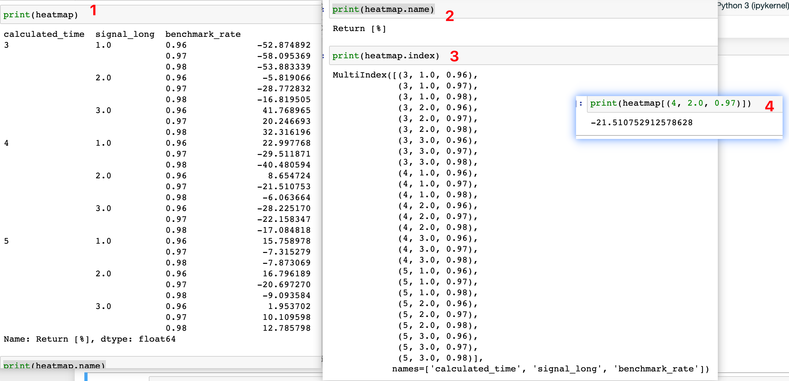

## 230207

### series 的各种操作

</img>  
实例  
Series 通过 index 查找值  
此外 heatmap.array 可以将值作为一个数组输出。

add230211

### heatmap.array 可能无法显示所有数据。不用 heatmap.array 而用 heatmap.values，再在之前加上 np.set_printoptions(threshold=np.inf)就行

原理是将 pandas.array 转换为了 numpy.ndarray，再用第二行精确到小数点后 5 位，第三行取消科学记数法  
np.set_printoptions(threshold=np.inf)  
np.set_printoptions(precision=5)  
np.set_printoptions(suppress=True)

add230213  
加入：  
pd.options.display.max_seq_items = None  
就能让 pandas arrary 不输出省略号，而输出完整数据
