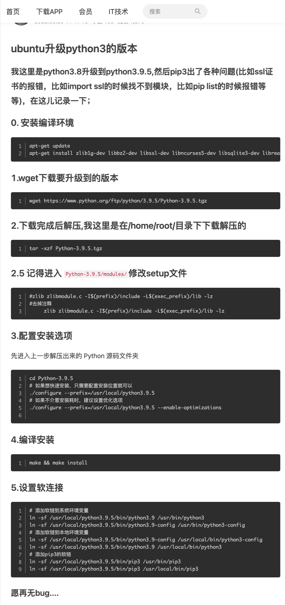
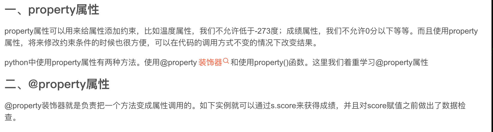

## 221207

### 数组相关

arr.sort()从小到大排序，注意并不是结果排序，而是使用此命令后 arr 本身自动排序  
arr.sort(reverse=True) 大到小排序

pop 按 index 移除数组元素  
remove 按值移除元素，未测试

## 230110

### ubuntu 升级 python3

</img>  
https://www.jianshu.com/p/e6850152e69a  
暂未测试是否有 bug  
但也可直接 ubunt22 而不是 ubunt20，22 自带 python3 为 3.10，20 为 3.6

### list 需要深拷贝，方法：import copy，ori_num_list = copy.deepcopy(num_list)

### 打印变量类型

name = "lili"
print(type(name))

## 230125

### Python·@property 属性

</img>

```
class Student(object):
    def __init__(self, score=0):
        self._score = score

    @property
    def score(self):
        print("getting score")
        return self._score

    @score.setter
    def score(self, value):
        print("setting score")
        if not isinstance(value, int):
            raise ValueError("score must be an integer!")
        if value < 0 or value > 100:
            raise ValueError('score must between 0 ~ 100!')
        self._score = value

s = Student(60)
s.score
print("=====================")
s.score = 88
s.score
```

简单来说，加了@property 就可以用 实例.方法 来调用，而不仅仅只能用 方法()

https://blog.csdn.net/qq_37865996/article/details/124205925
