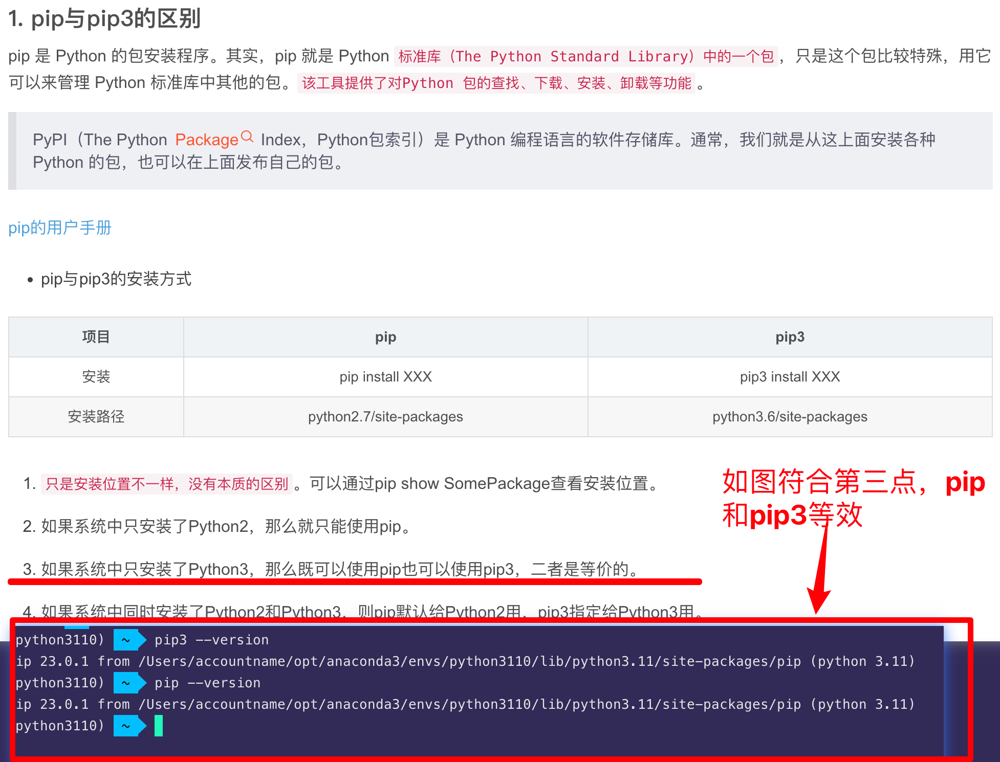

## 221207

### 数组相关

arr.sort()从小到大排序，注意并不是结果排序，而是使用此命令后 arr 本身自动排序  
arr.sort(reverse=True) 大到小排序

pop 按 index 移除数组元素  
remove 按值移除元素，未测试

## 230110

### ubuntu 升级 python3

</img>  
https://www.jianshu.com/p/e6850152e69a  
暂未测试是否有 bug  
但也可直接 ubunt22 而不是 ubunt20，22 自带 python3 为 3.10，20 为 3.6

### list 需要深拷贝，方法：import copy，ori_num_list = copy.deepcopy(num_list)

### 打印变量类型

name = "lili"
print(type(name))

## 230125

### Python·@property 属性

</img>

```
class Student(object):
    def __init__(self, score=0):
        self._score = score

    @property
    def score(self):
        print("getting score")
        return self._score

    @score.setter
    def score(self, value):
        print("setting score")
        if not isinstance(value, int):
            raise ValueError("score must be an integer!")
        if value < 0 or value > 100:
            raise ValueError('score must between 0 ~ 100!')
        self._score = value

s = Student(60)
s.score
print("=====================")
s.score = 88
s.score
```

简单来说，加了@property 就可以用 实例.方法 来调用，而不仅仅只能用 方法()

https://blog.csdn.net/qq_37865996/article/details/124205925

### pip 和 pip3 区别

</img>

### AttributeError: 'OptionEngine' object has no attribute 'execute'

sqlalchemy 升级到了 2.0，用法有些改变

```
### 原code，会报错
import numpy as np
from sqlalchemy import create_engine
import pandas as pd
import pandas_ta as ta

engine = create_engine('sqlite:///./binance-futures-220203-230204-1min/DOTUSDT.db')
df = pd.read_sql('tablename',engine)
df.Date = pd.to_datetime(df.Date, unit='ms')
df.set_index('Date', inplace=True)
```

```
### 方式1，注意 df.Date = pd.to_datetime(df.Date, unit='ms')，中的ms需改为ns
from sqlalchemy import create_engine, text as sql_text
import pandas as pd
import pandas_ta as ta
connection = create_engine('sqlite:///../binance-futures-220203-230204-1min/DOTUSDT.db')
query = "SELECT * FROM tablename"
df = pd.read_sql_query(con=connection.connect(),
                            sql=sql_text(query))
# df.Date = pd.to_datetime(df.Date, unit='ms')
df.set_index('Date', inplace=True)
```

```
### 方式2，注意 df.Date = pd.to_datetime(df.Date, unit='ms')，中的ms需改为ns
import numpy as np
from sqlalchemy import create_engine , text
import pandas as pd
import pandas_ta as ta
engine = create_engine('sqlite:///../binance-futures-220203-230204-1min/DOTUSDT.db')
with engine.begin() as conn:
    query = text("""SELECT * FROM tablename""")
    df = pd.read_sql_query(query, conn)
# df
# df.Date = pd.to_datetime(df.Date, unit='ms')
df.set_index('Date', inplace=True)
```

## 230227

### if **name** == '**main**':

简单来说，该语句用来当文件当作脚本运行时候，就执行代码；但是当文件被当做 Module 被 import 的时候，就不执行相关代码。

### python 里的代码 existing_excel_file = os.path.join(os.getcwd(), 'lession_1_data', '510050_d.xlsx') 是什么意思

这段 Python 代码的作用是创建一个字符串变量 existing_excel_file，其中包含一个文件的完整路径，这个文件名是 '510050_d.xlsx'，并且这个文件应该位于当前工作目录下的 'lession_1_data' 子目录中。

具体而言，os.getcwd() 函数返回当前 Python 解释器的工作目录，也就是当前正在运行的脚本所在的目录。然后，os.path.join() 函数将当前工作目录与子目录 'lession_1_data' 和文件名 '510050_d.xlsx' 连接起来，形成了一个完整的文件路径。最终，这个完整的文件路径被赋值给变量 existing_excel_file。

## 230228

### python 中：price=("%.1f" % float(float(mark_price)-0.3))是什么意思

```
这行代码是将一个字符串类型的变量mark_price转换成浮点型，然后从中减去0.3，最后将结果保留1位小数，并将结果赋值给变量price。

具体来说，这行代码中的float(mark_price)将字符串mark_price转换为浮点型，然后float(mark_price)-0.3从浮点型的mark_price中减去0.3得到一个新的浮点型数值。接着，"%.1f" %这一语法将这个浮点型数值格式化为保留1位小数的字符串。最后，price=将这个字符串赋值给变量price。
```

### python 中，判断某元素是否在某列表中

要判断一个元素是否在一个列表中，可以使用 Python 内置的 in 运算符。这个运算符返回一个布尔值，如果元素在列表中则为 True，否则为 False。

以下是一个简单的示例代码：

```
my_list = [1, 2, 3, 4, 5]

if 3 in my_list:
    print("3 is in the list")
else:
    print("3 is not in the list")

```

如果您想要检查多个元素是否在一个列表中，可以使用多个 in 运算符，或者将元素放入另一个列表中，然后使用 all()函数来检查它们是否全部在原始列表中。以下是一个使用 all()函数的示例：

```
my_list = [1, 2, 3, 4, 5]

check_list = [3, 4, 5]

if all(elem in my_list for elem in check_list):
    print("All elements are in the list")
else:
    print("At least one element is not in the list")

```

在此示例中，我们定义一个名为 check_list 的列表，其中包含 3、4 和 5。我们使用一个列表推导式和 all()函数来检查 check_list 中的所有元素是否都在 my_list 中。由于所有元素都在 my_list 中，因此代码将打印“All elements are in the list”。

### python 怎么在满足一定条件后终止程序并报错，不执行之后的代码

```
if some_condition:
    raise Exception("这里发生了一个错误，程序将终止执行。")

# 如果上面的条件不满足，则会执行以下代码。
print("这里是程序正常执行的代码。")

```

### python 中，怎么将一个脚本所有的 print 信息保存到一个单独的文件

```
import sys

sys.stdout = open('output.txt', 'w')

# 打印一些信息
print('Hello World')
print('This is a test')

sys.stdout.close()

```

```
"w"是Python内置的文件打开模式（file mode），它表示以写入模式（write mode）打开文件。如果文件不存在，则创建该文件。如果文件已存在，则覆盖原有内容。

除了"w"之外，还有其他文件打开模式可供选择，包括：

"r": 以只读模式（read mode）打开文件（默认模式）
"a": 以追加模式（append mode）打开文件，如果文件不存在，则创建该文件
"x": 以独占模式（exclusive creation mode）创建文件，如果文件已存在，则抛出FileExistsError异常
"b": 以二进制模式（binary mode）打开文件
"t": 以文本模式（text mode）打开文件（默认模式）
您可以根据需要选择适当的文件打开模式来打开文件。例如，如果您希望以追加模式打开文件，则可以将"w"替换为"a"，如下所示：
```

### 怎么改变下面的代码，能让 multiprocessing 加速这段代码：

add：
注意使用此方法请求网上数据时可能造成访问过频而被拒绝

for i in range(10000):
print(i\*2)

```
可以使用multiprocessing模块中的Pool类来加速这段代码。下面是一个使用Pool的示例：

python
Copy code
import multiprocessing

def print_double(i):
    print(i*2)

if __name__ == '__main__':
    with multiprocessing.Pool() as pool:
        pool.map(print_double, range(10000))
这个示例中，我们定义了一个名为print_double的函数，它接收一个参数i，并输出i*2的结果。然后，我们使用multiprocessing.Pool()来创建一个进程池，然后使用pool.map()方法将这个函数映射到一个包含10000个整数的列表上。这样，print_double函数将并行执行10000次，每次输出一个数字的2倍。由于这个操作被分配给多个进程执行，因此整个过程可以更快地完成。

需要注意的是，在使用multiprocessing时，必须在if __name__ == '__main__':语句中调用代码，以确保在主进程中运行。
```

### 怎么查看 python 的 sys 模块有哪些可执行函数

```
要查看 Python 的 sys 模块中的可执行函数，可以使用 Python 的内置函数 dir()。

dir() 可以列出指定模块中的所有属性和方法，包括变量、函数、类等等。例如，在 Python 中，要查看 sys 模块中的所有可执行函数，可以执行以下命令：

python
Copy code
import sys
print(dir(sys))
执行这段代码后，你将会看到所有 sys 模块中的可执行函数列表。

如果你只想查看 sys 模块中的函数，可以结合使用 callable() 函数来过滤掉非函数类型的属性和方法：

python
Copy code
import sys
functions = [attr for attr in dir(sys) if callable(getattr(sys, attr))]
print(functions)
这个代码将会输出 sys 模块中的所有可执行函数的名称列表。
```

## 230312

### python 文件怎么读取自身的文件名

```
要读取Python文件的文件名，您可以使用__file__变量。这个变量是一个字符串，包含当前模块的文件路径。您可以使用以下代码行访问它：

python
Copy code
import os
filename = os.path.basename(__file__)
print(filename)
这将打印出当前模块的文件名（包括扩展名）。os.path.basename()函数返回__file__变量的最后一个组成部分，即文件名部分。

请注意，当您在交互式解释器中使用时，__file__变量将不可用，因为交互式解释器没有与之关联的文件。
```

### 列表中每个元素乘以 100

arr = [i * 100 for i in arr]

### 打印一个 list 的前两个元素

```
my_list = [1, 2, 3, 4, 5]
print(my_list[:2])

# 语法是list[start:end]，其中start表示开始索引，end表示结束索引，但不包括end所在的元素。如果start不指定，默认为0，如果end不指定，默认为列表的长度。
```

### drop_duplicates 方法可能会遇到些问题，如 drop 掉非 NaN 值的行，此时可使用 groupby

df = df.groupby('date', as_index=False).max()
df = df.groupby('date', as_index=False).first()

first 为首个非 NaN 值

### 将一个 df 中所有 NaN 值换为 False

df.fillna(value=False, inplace=True)
