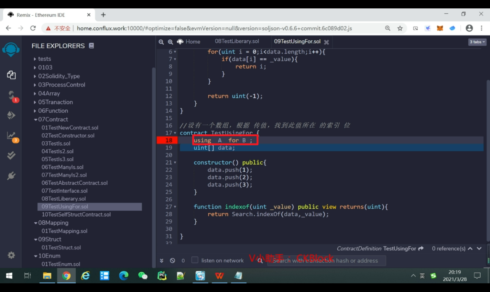
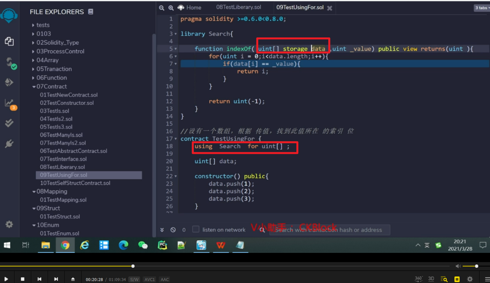
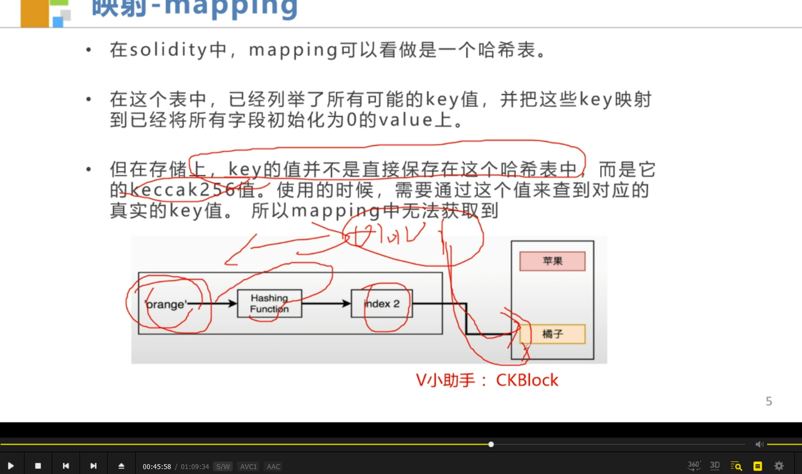
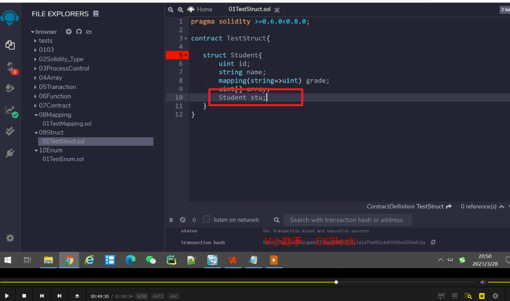
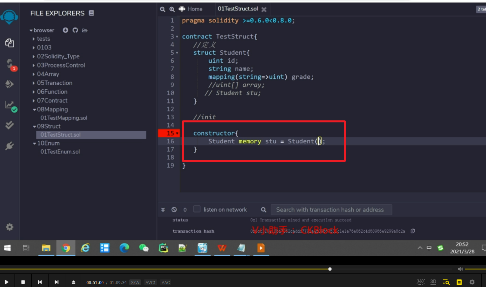
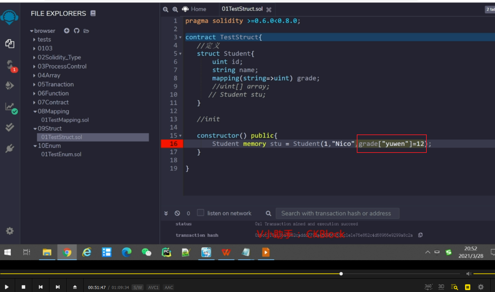
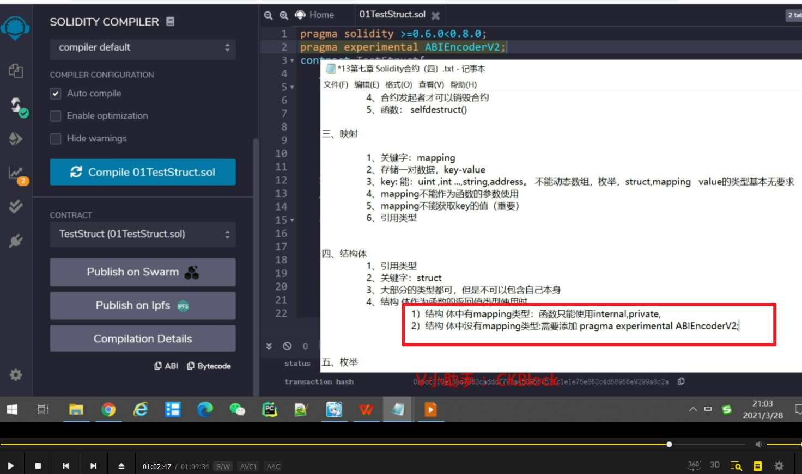
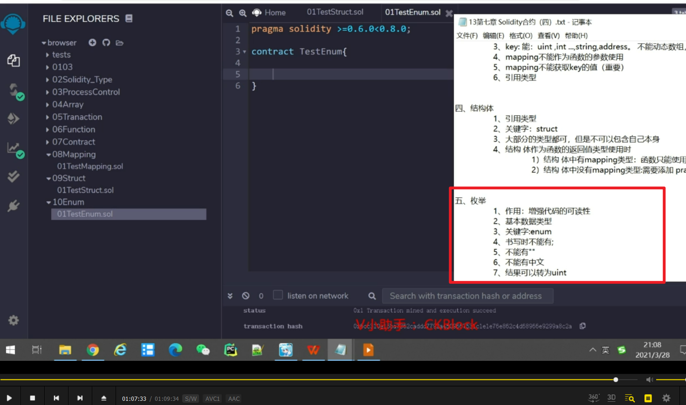

库简介。

数组根据传值找到索引位置的小范例。结果如果为-1则会有错误，这里先忽略。

把上个例子转换为库。

调用库。

更简单的写法。库当中的函数可以关联到某个类型中。A库可以关联到B类型去。

按上图方法处理后，search里的第一个参数就不用自己传。

按照惯例会改为self，不过不改也没问题。

      
写法可以这样修改。（前几图暂未理解，需要使用时再学习）

销毁合约，以及测试销毁合约是否生效，前部分。

销毁合约，以及测试销毁合约是否生效，后部分。

映射简介。

映射范例，注意左侧需要输入键才能得到值。

mapping getter函数的实际样子，key作为函数参数，value作为返回值参数。报错只是因为与隐藏的getter函数重复。

mapping作为值时较特殊，只有最后一个值作为返回参数。

映射类型不能作为函数的参数使用。eee，mapping不能获得key的值

mapping不能获得key的值，原因如图。orange并不直接对应橘子，而是先被转换为一段数字index2。

映射，结构体都是引用类型。

结构体定义，注意结构体里不能放它本身

结构体赋值，构造器方式，它是引用数据类型，所以作为函数的局部变量使用时要明确定义到底是memory还是storage。（如作为状态变量则不需要）

 
会报错，mapping类型不能用memory赋值。

所以给有mapping的结构体赋值时，目前只能这样。

也可像这样按名称赋值，之前是按顺序赋值

结构体中有mapping，所以不能返回（public或extranal时）。因为mapping不能作为形参使用。只能改为internal或private。

如果结构体中去掉mapping，用public也会报错，还需要在开头添加实验标注才行。

总结以上两点

枚举简介

枚举范例
