## 221014

</img>  
计算机的计算由算数逻辑单元，ALU 处理

</img>  
所有计算都需要 alu。

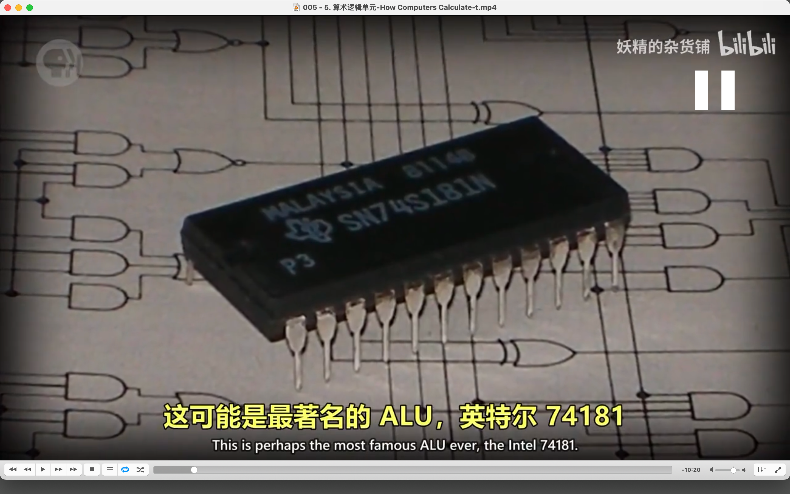</img>  
--=  
</img>  
第一个在单个芯片里的完整 alu

</img>  
aaap

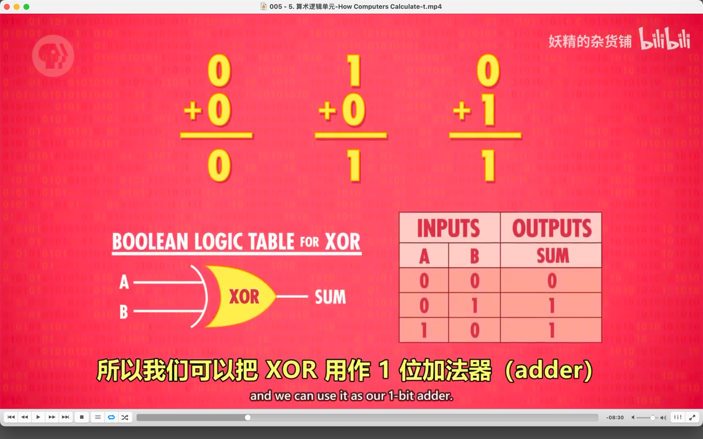</img>  
--=  
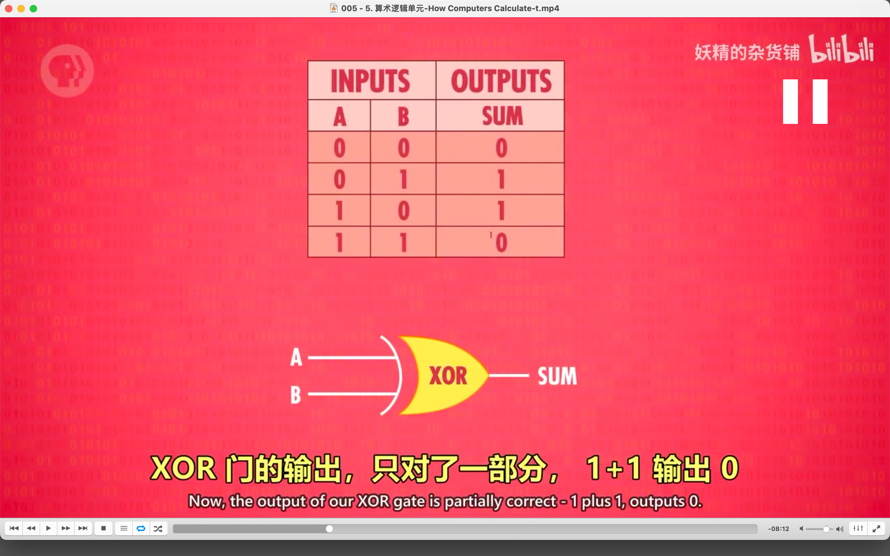</img>  
单个位的加法，跟 xor gate 一样，但遇到 1 加 1，xor gate 只对一半

</img>  
xor 用作 1 位加法器 1 bit adder

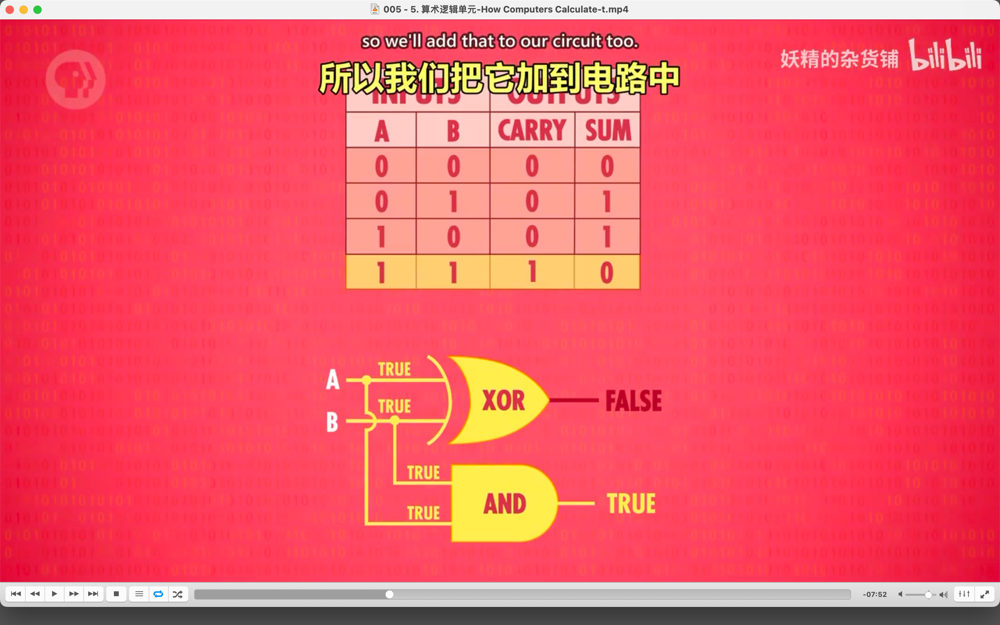</img>  
--=  
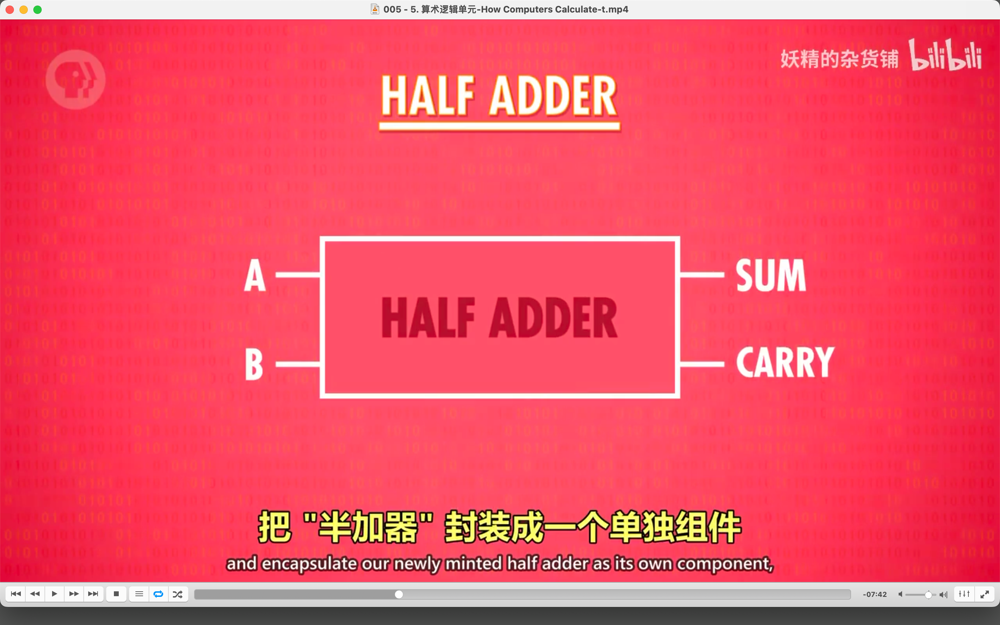</img>  
xor gate 加上 and gate，就实现了正确的加法，此电路叫做半加器 half adder

</img>  
--=  
</img>  
全加器，要处理 3 个 bit，而半家器是两个

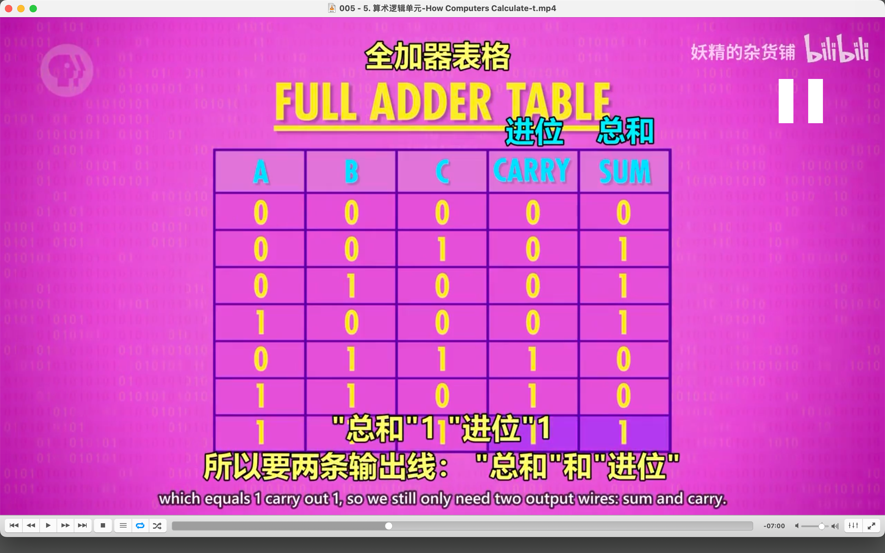</img>  
全加器需要三个输入（当前位的两个数相加以及从前一位上加到的结果要算一位），两个输出。dddi

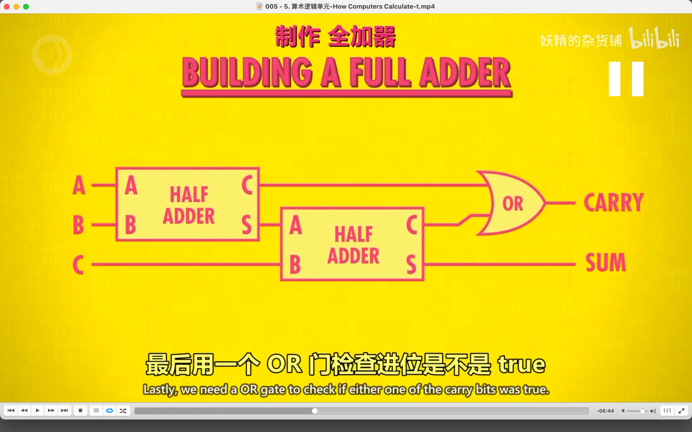</img>  
全加器原理  
举例，当 abc 都是 1，则第一个 half adder 的 c 为 1，s 为 0（即第二个 halfadder 的 a 为 0），第 2 个 half adder 的 c 为 0，s 为 1，即最终结果 carry 为 1，sum 为 1。  
注意 half adder 的 c 是 carry 的意思，跟初始的 c 不是一个概念。

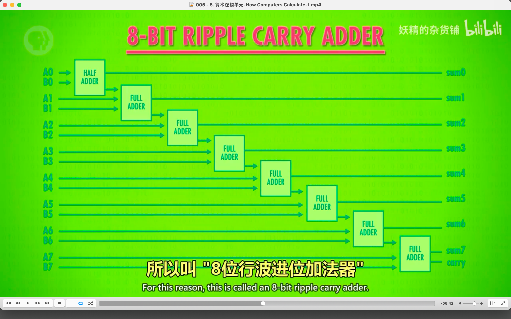</img>  
通过半加器和全加器让两个 8bit 数相加。

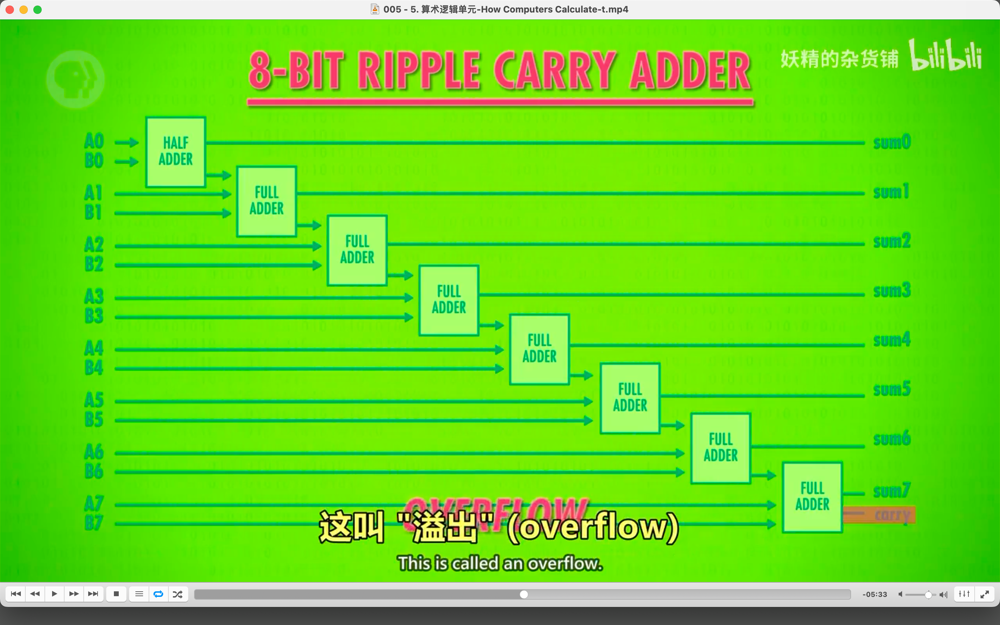</img>  
overflow

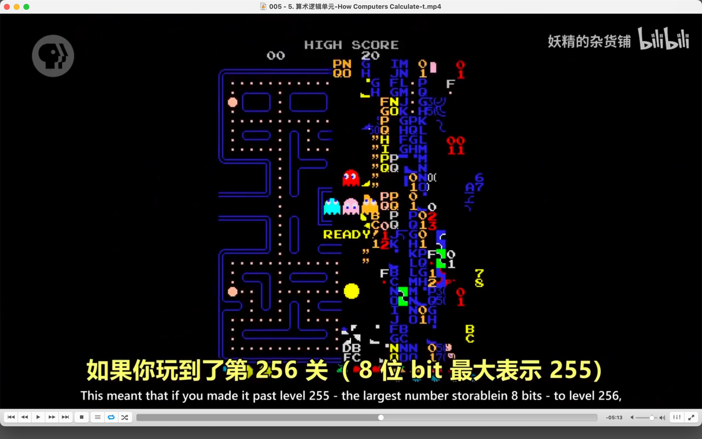</img>  
吃豆人游戏因为是 8 位，玩到第 256 关时，alu 就会溢出

</img>  
现代计算机跟以上介绍有点不同，但运行更快

</img>  
alu 算数单元，还能支持这 8 种运算

</img>  
alu 没有乘除法，只是重复相加这样

</img>  
这些东西的乘法都是这样实现的

</img>  
这些有专门的乘法单元，只是更多逻辑门

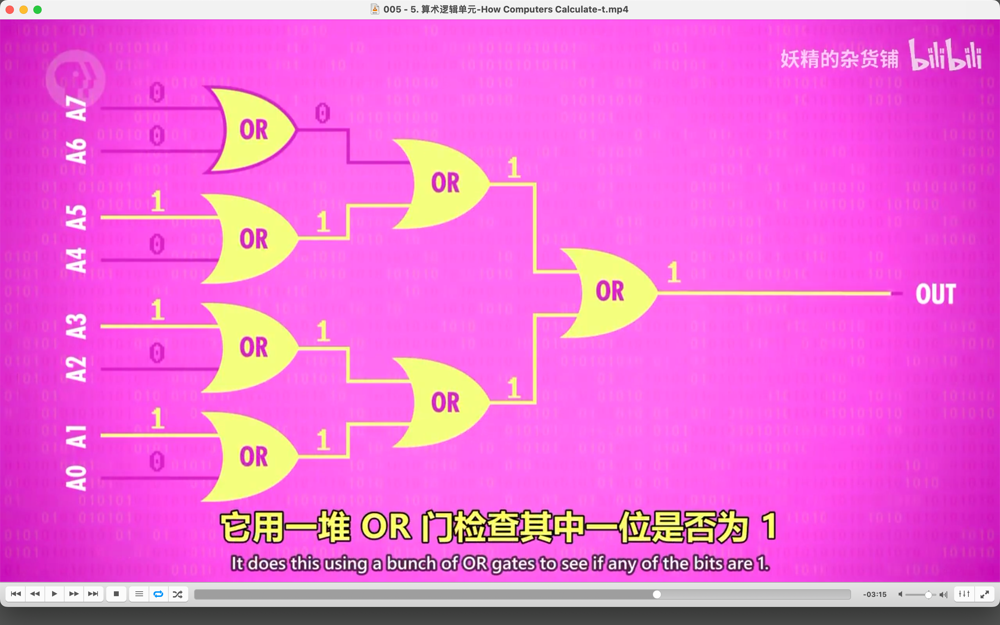</img>  
之前是算数单元，这个是逻辑单元

</img>  
这个符号代表 alu

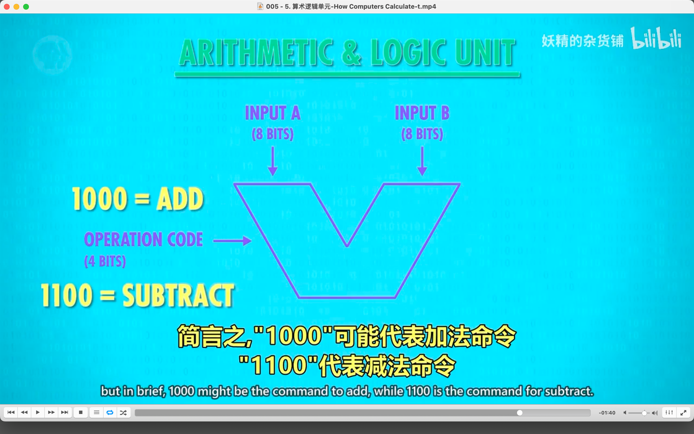</img>  
operation code

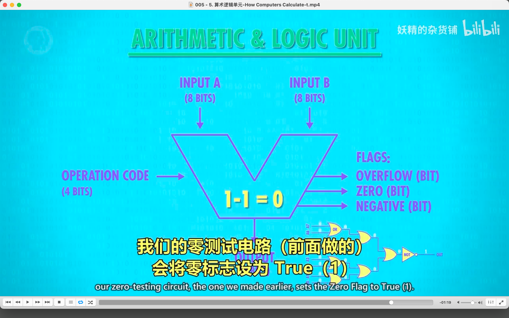</img>  
flags
