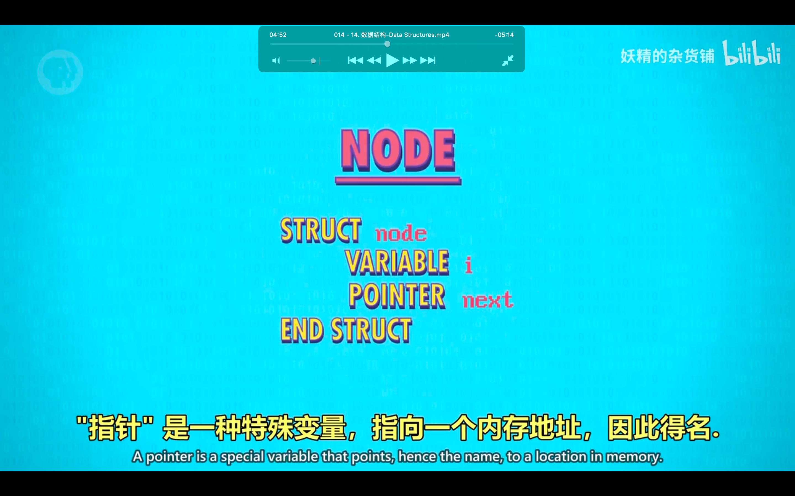
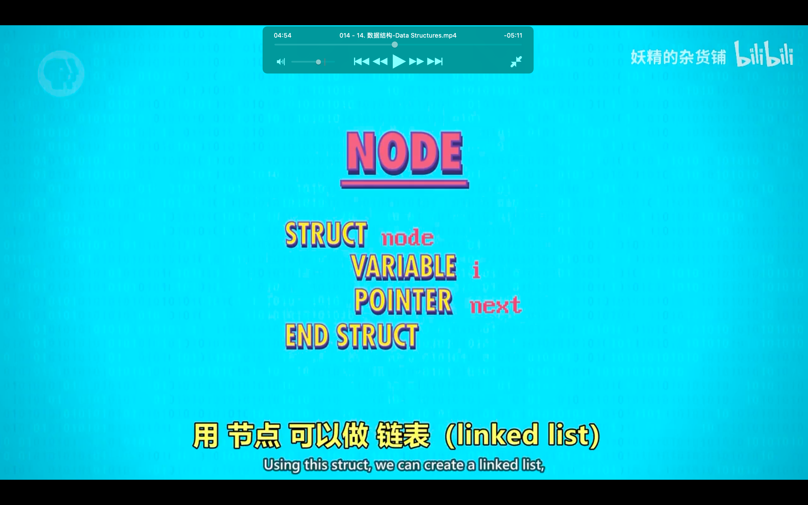
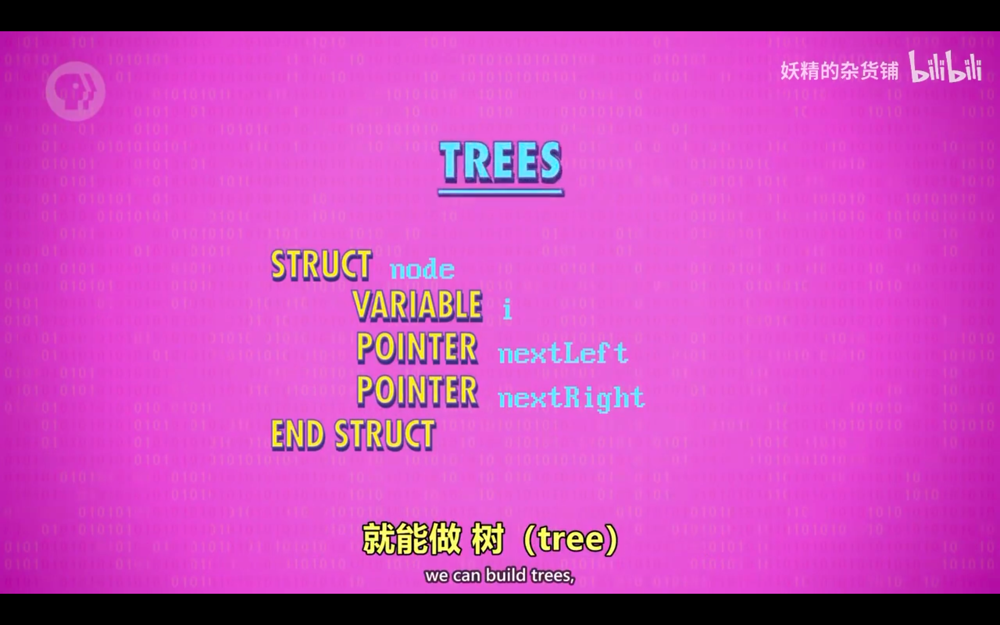

## 221020

</img>  
不希望数据杂乱，aaap,因此发明了数据结构

## 这节很多内容都已知，所以只记录未知内容

</img>  
aaap

</img>  
链表 linked list
aaav

</img>  
栈，链是先进先出，栈是先进后出
aaav

</img>  
两个 pointer 就从链表变成了 tree 了
aaav

</img>  
如果数据随意链接，如树的叶连到根，就是图
aaav

