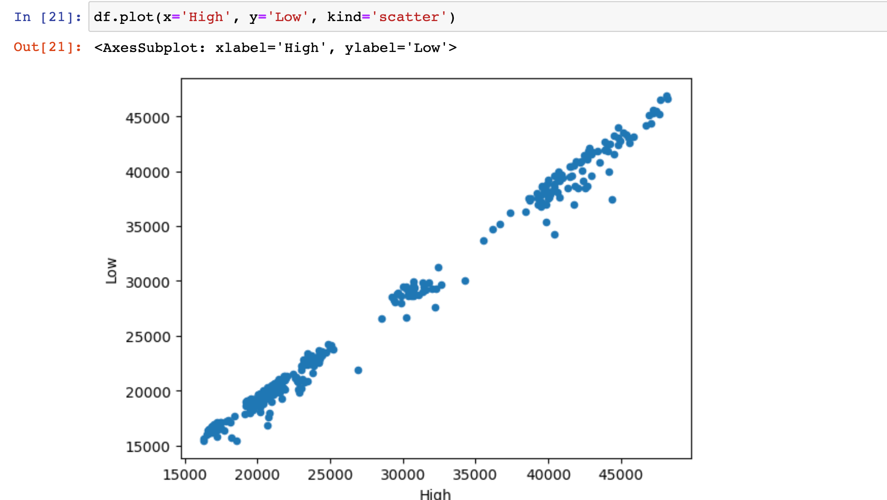
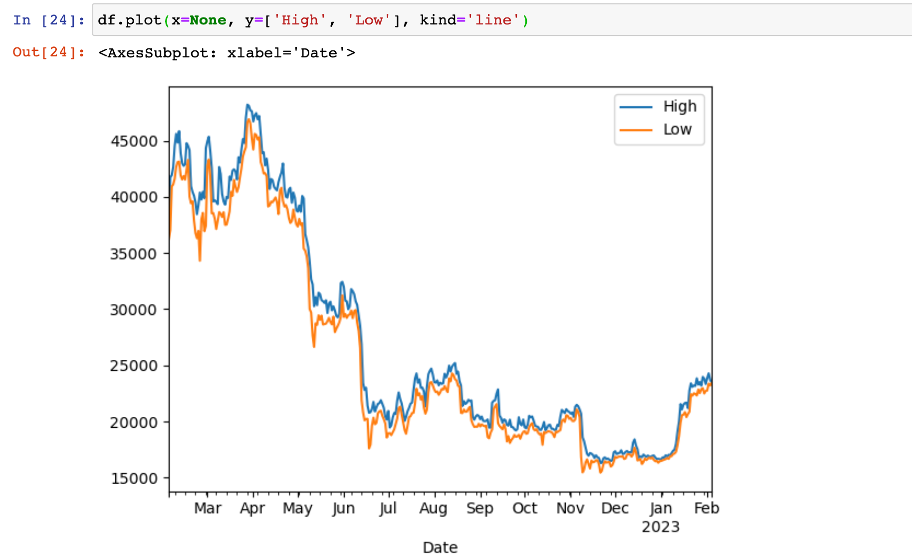

## 230215

#### 这个答案绘制了四个图形，但我只想要一个图形。只是此图形的 Open, High, Low, Close 使用相同的 x 轴和 y 轴。但 Volume 使用不同单位的 y 轴，好让它们都比较明显的出现在图形中

非常抱歉，我误解了你的问题。如果你只需要一个图形来展示 Open、High、Low、Close 和 Volume 五个变量，并且 Open、High、Low、Close 和 Volume 使用不同的单位和刻度，可以通过以下代码实现：

```
import matplotlib.pyplot as plt

# 设置图形大小
plt.figure(figsize=(12, 8))

# 绘制 Open、High、Low、Close
plt.plot(df.index, df['open'], label='Open')
plt.plot(df.index, df['high'], label='High')
plt.plot(df.index, df['low'], label='Low')
plt.plot(df.index, df['close'], label='Close')

# 设置 y 轴刻度
plt.gca().set_ylim(bottom=df['low'].min() - 0.1 * df['low'].max(), top=df['high'].max() + 0.1 * df['high'].max())

# 绘制 Volume
ax2 = plt.gca().twinx()
ax2.fill_between(df.index, 0, df['volume'], facecolor='gray', alpha=0.5, label='Volume')
ax2.set_ylim(bottom=0, top=df['volume'].max() + 0.1 * df['volume'].max())

# 设置图例和标题
plt.legend()
plt.title('Stock Price and Volume')

# 显示图形
plt.show()

```

在这个代码中，我们首先设置了图形的大小，然后使用 plt.plot() 函数分别绘制 Open、High、Low、Close 四列数据，并使用 label 参数设置图例标签。

接着，我们使用 plt.gca() 函数获取当前的 Axes 对象，并使用 set_ylim() 函数设置 y 轴刻度，使得它们适合 Open、High、Low、Close 四列数据。

然后，我们使用 plt.gca().twinx() 函数创建一个新的 Axes 对象，并使用 fill_between() 函数绘制 Volume 列的面积图，并使用 alpha 参数设置颜色透明度，使其更清晰地出现在图形中。同时，我们也使用 set_ylim() 函数设置 y 轴刻度，使其适合 Volume 列数据。

最后，我们使用 plt.legend() 函数添加图例，并使用 plt.title() 函数设置图形的标题。最终使用 plt.show() 函数显示图形。

这样，你就可以在同一个图形中同时展示 Open、High、Low、Close 和 Volume 五个变量，并使用不同的单位和刻度。

### df.plot()怎么才能指定特定的列？

```

在调用 df.plot() 绘制 DataFrame 的时候，你可以通过 x 和 y 参数指定想要绘制的列。其中，x 参数指定作为横轴的列，y 参数指定作为纵轴的列。

以下是一个例子，假设有一个 DataFrame df，包含三列：A，B，C。你可以通过以下代码绘制 A 列和 B 列的散点图：


df.plot(x='A', y='B', kind='scatter')


这将绘制一个以 A 列为横轴，以 B 列为纵轴的散点图。kind 参数指定图表的类型，这里设置为 scatter 表示散点图。你可以将 x 和 y 参数替换为你想要绘制的列名来绘制其他类型的图表。
```

</img>  
实际效果，画出散点图，未达到预期

</img>  
达到预期效果

df[['High','Low']].plot()  
或者这样也可以

### 跨市场套利

跨市场套利是指利用不同市场之间的价格差异，通过同时在多个市场进行买卖来获利的一种投资策略。这种策略通常适用于不同的市场具有高度相关性但价格有差异的情况，例如股票市场、商品期货市场、外汇市场等。

举个例子，假设在美国和日本的股票市场上，同一家公司的股票价格分别为 10 美元和 1000 日元，汇率为 1 美元=100 日元，那么如果投资者在美国市场上购买该公司的股票，然后在日本市场上卖出该公司的股票，就可以在汇率相同的情况下获得 10 美元-10 美元/1000 日元\*1000 日元=0 美元的风险无关利润。

跨市场套利需要对市场行情、汇率等进行准确预测和分析，需要投资者有较高的市场分析能力和风险控制能力。同时，由于不同市场之间的交易规则、税收政策等存在差异，跨市场套利还需要处理相关的法律和监管问题。
