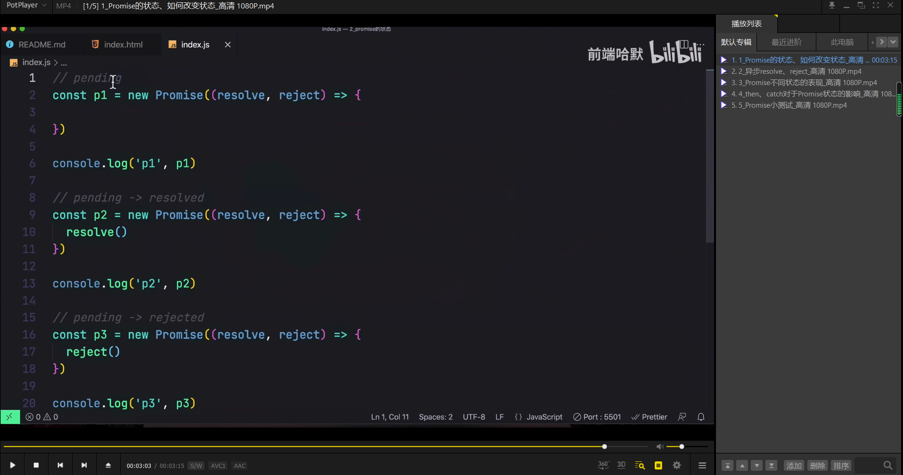  
promise 的三种状态，以及如何切换。pending，resolved（fulfilled），rejected

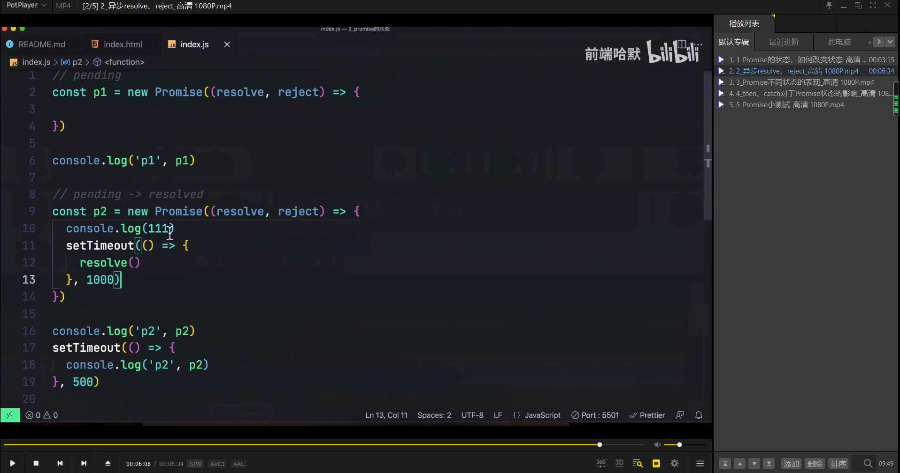  
执行完同步再执行异步。

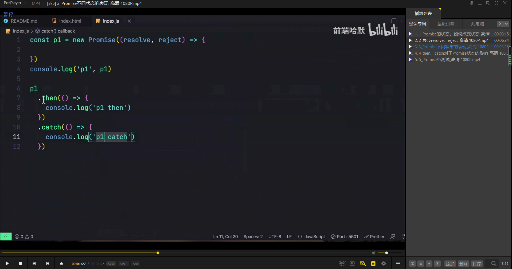  
pending 状态的 promise 不触发 then，catch。

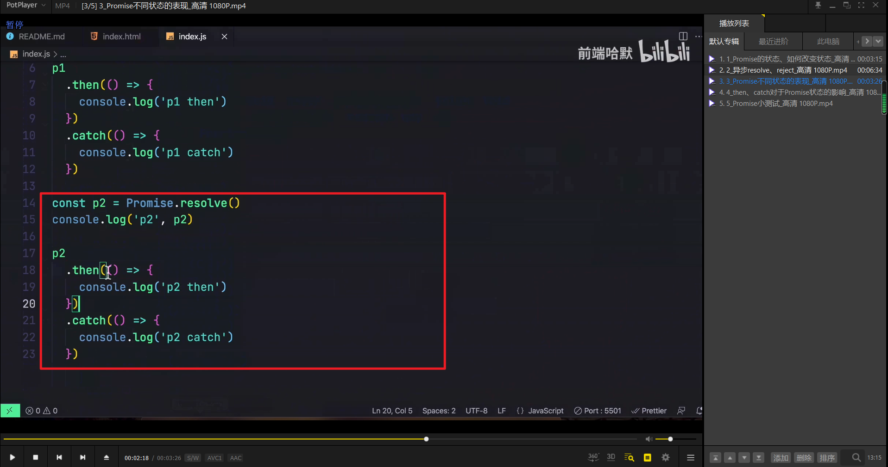  
resolved 的可以触发 then。

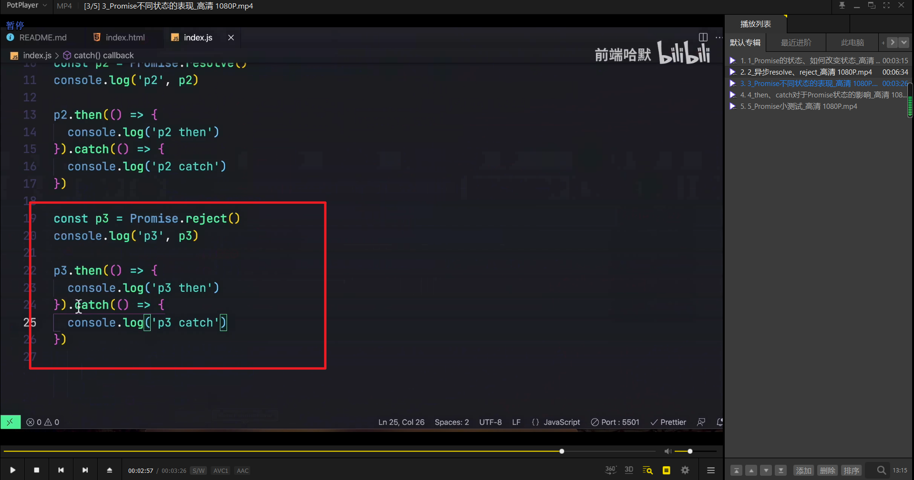  
rejected 的可以触发 catch。

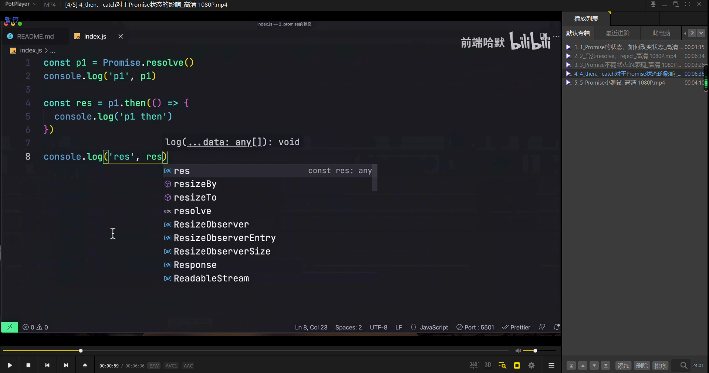  
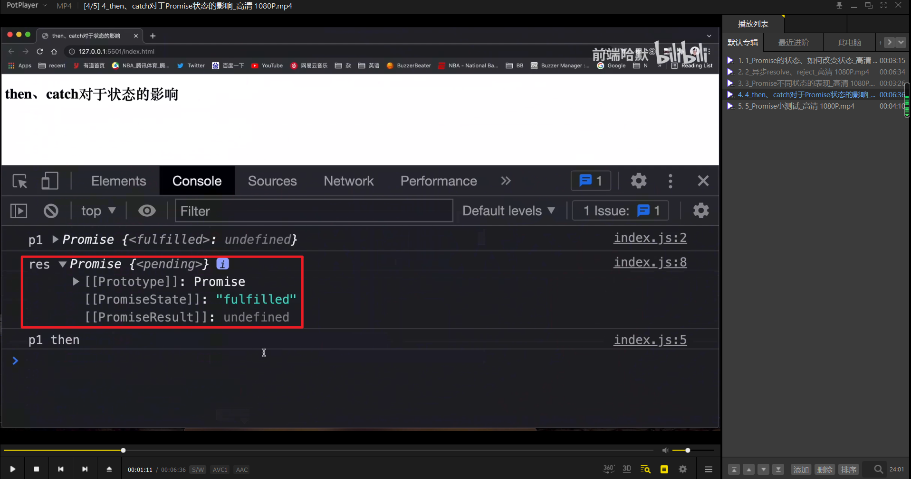  
p1.then 返回的仍是 promise。外面是 pending，打开是 resolved/fulfiled。

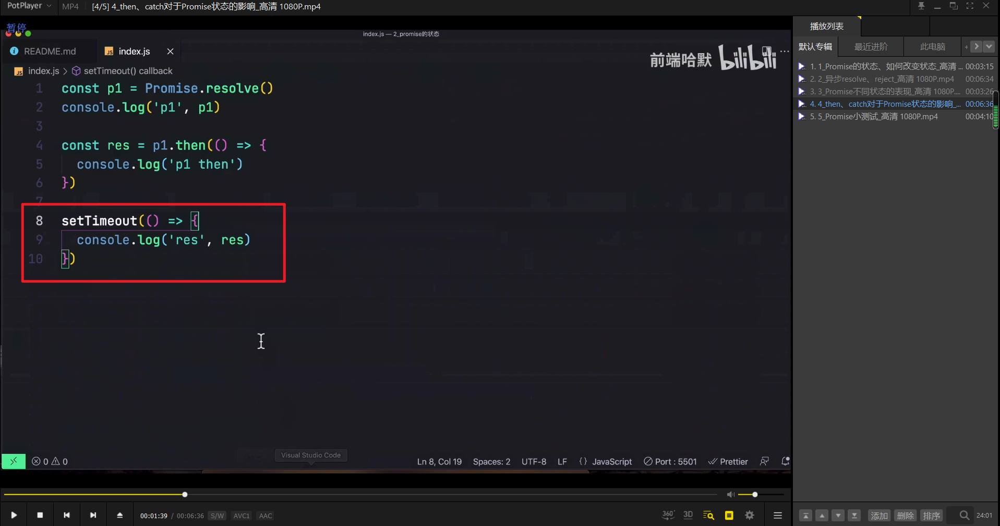  
加个定时器，则直接是 resolved。结论，promise.then 后不报错最后得到 resolved 的 promise。

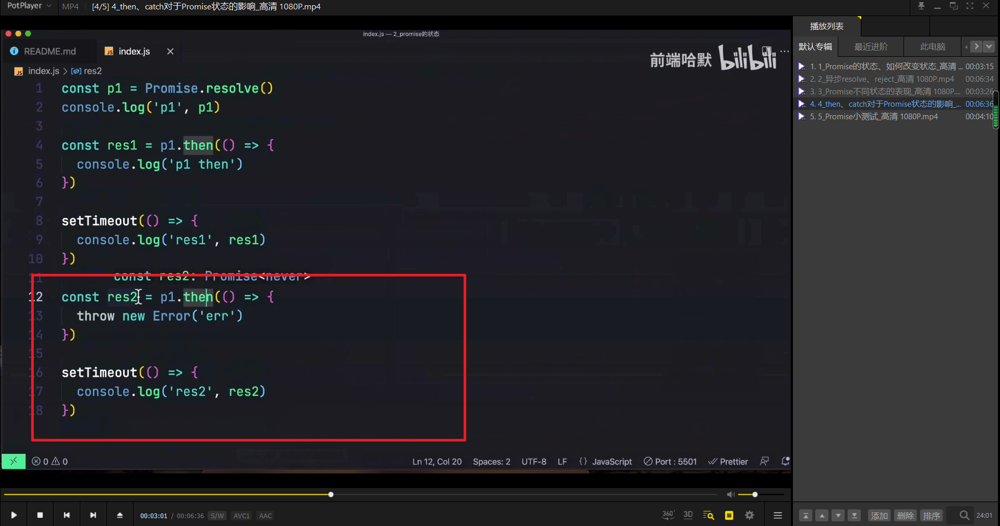  
如果报错，则返回 rejected。

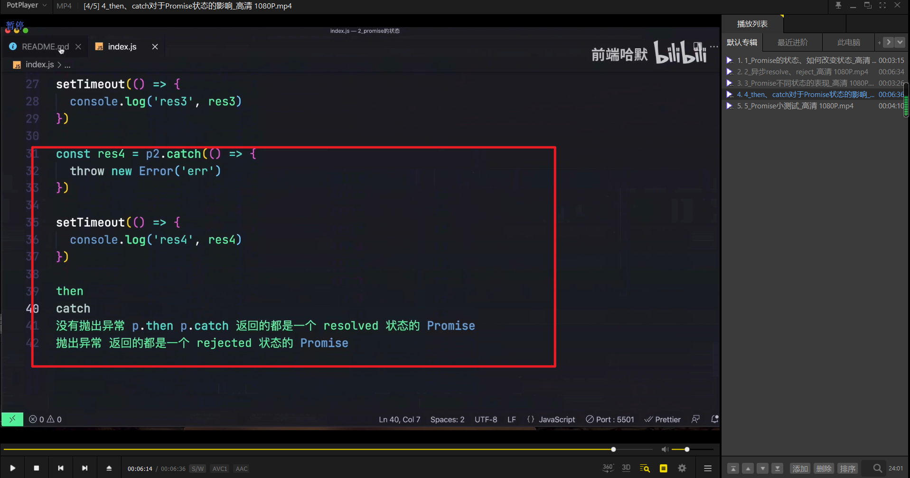  
结论。没有抛出异常，then，catch 都返回一个 resolved 状态的 promise。相反，则返回 promise。

### 小测试

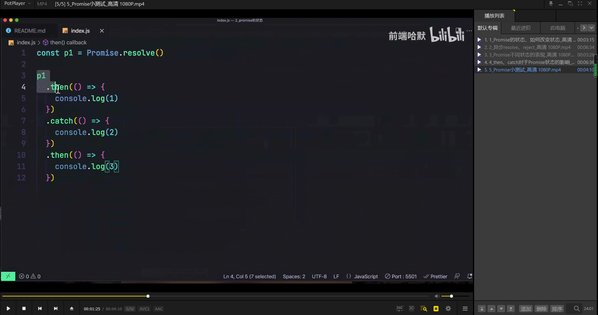  
此时打印出 1，3.

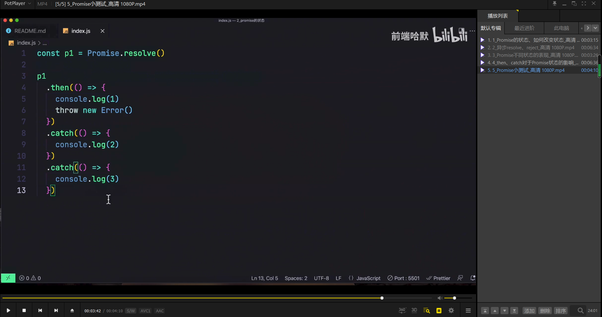  
此时打印出 1，2。因为第二个没有抛出异常，所以返回 resolved。而第三个 catch 无法在 resolved 后使用。
