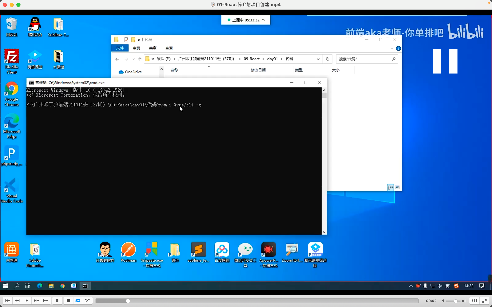
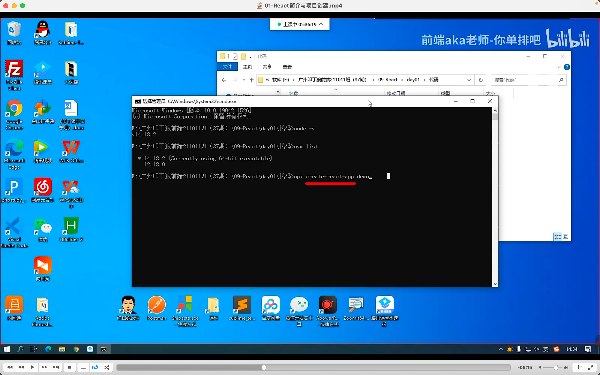
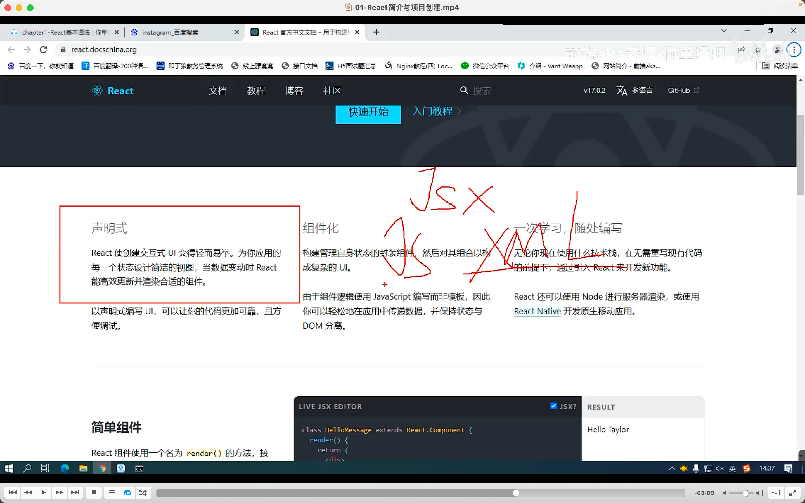
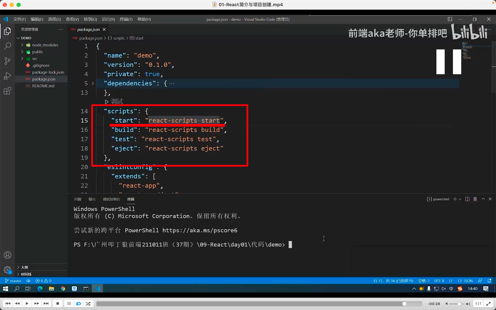

## 220919

https://www.bilibili.com/video/BV1tY411G7UP

  
vue 的安装方式存在一个问题，当前是 node14，但如果换到 node12，可能没有 vue 脚手架，就只能再装，很麻烦。

  
react 使用 npx 的方式，create-react-app 就是 react 的脚手架，用完后删掉，每次使用都从官网拉取最新版，更省事。

  
用到 jsx，就是 js + xml，类似 html。所以代码里又有 js 又有 html

  
npx create-react-app demo 结束后，打开 demo。看如图，知道 npm run start 启动项目，可简写为 npm start
