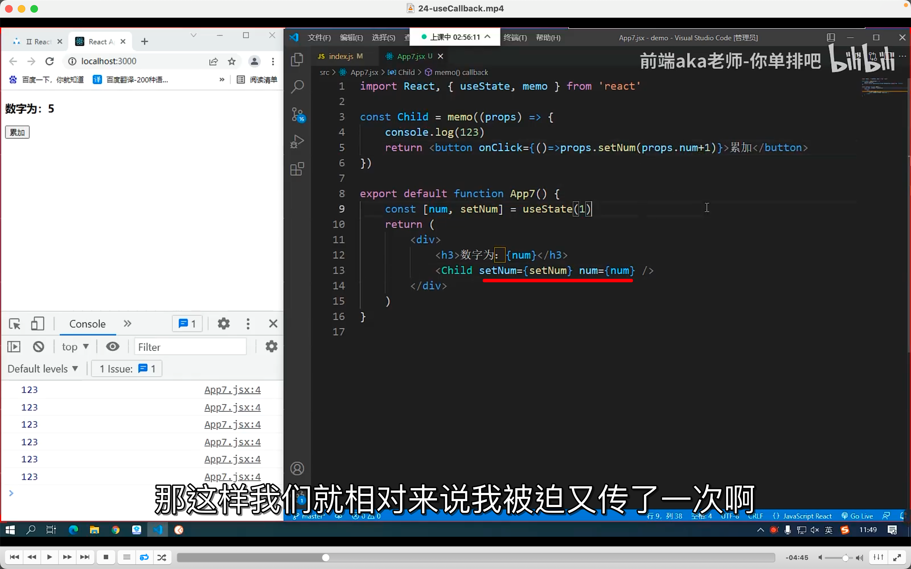
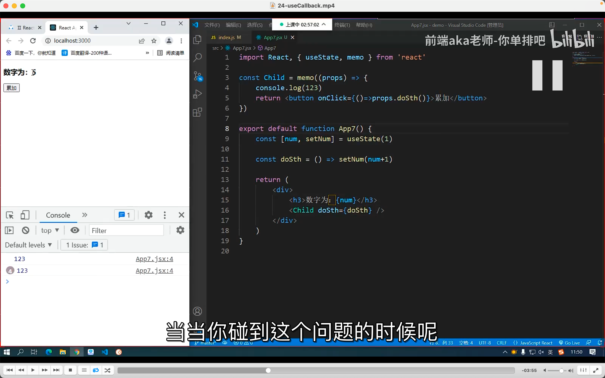
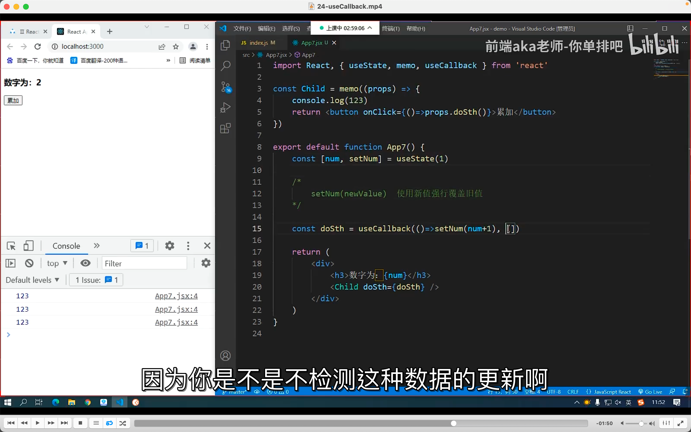
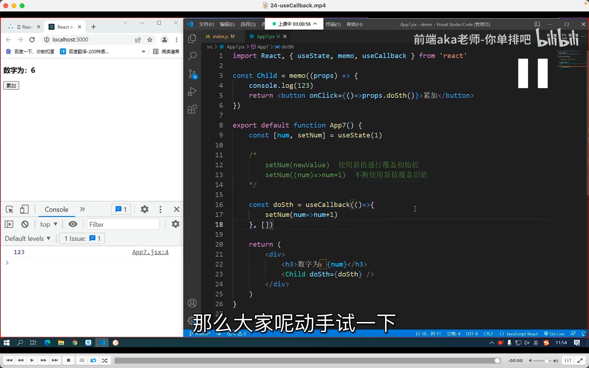

## 220921

  
一种父传子方法的实现，  
注意划线处引用 usestate 的变量时用了花括号？？？？

  
换一种写法，就可以少写个参数  
但是会再次触发上方 memo 里的 123  
这就是 memo 的缺点，纯静态（可能是纯 html）套个 memo 就行，而实际上（可能是用到 js 时）就不行了。

  
加了 usecallback，但还是有个问题 dddf

  
这样修改下就没问题了        

