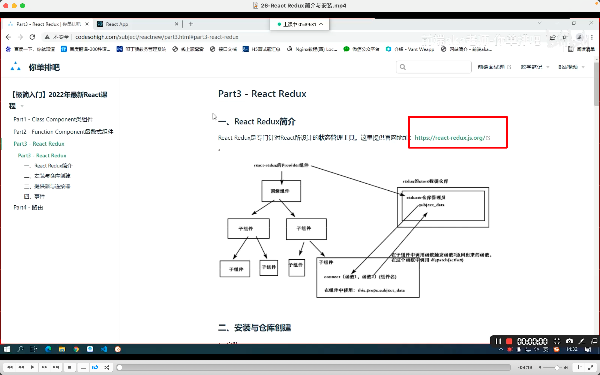
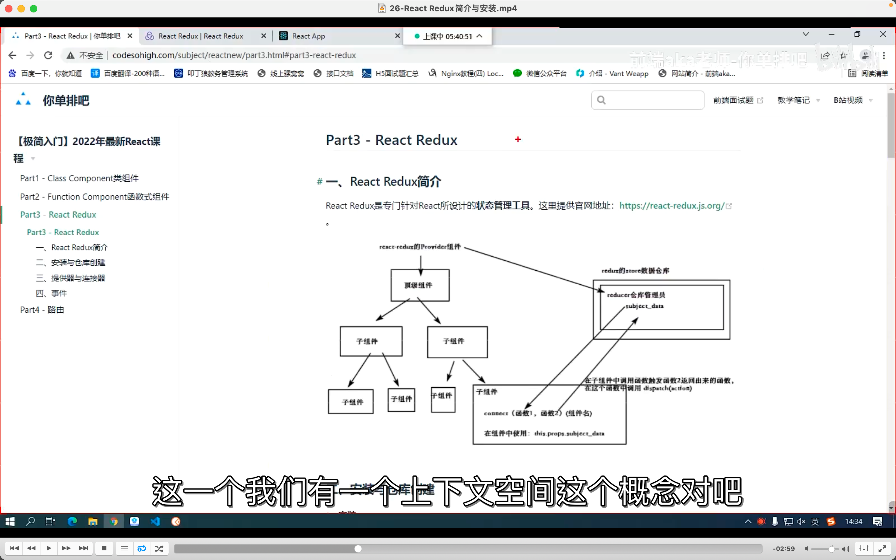
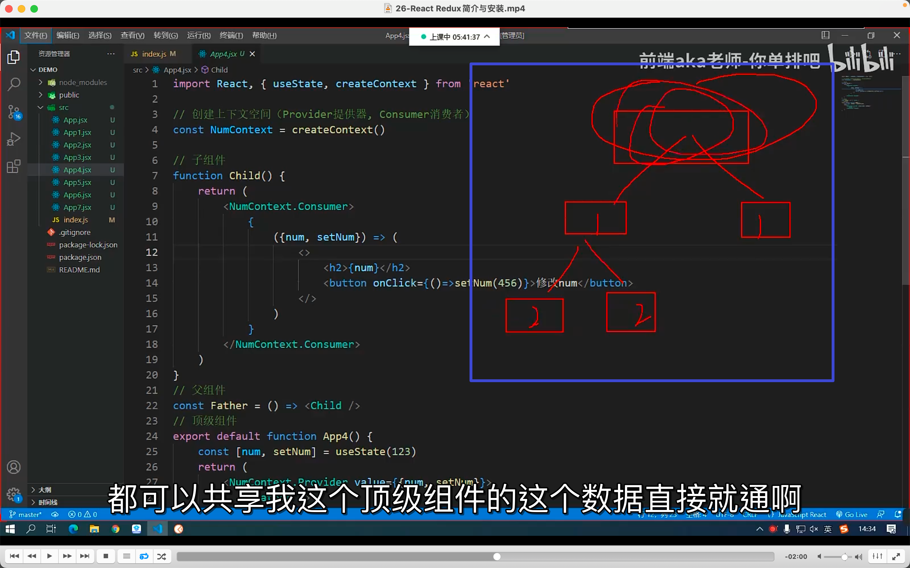
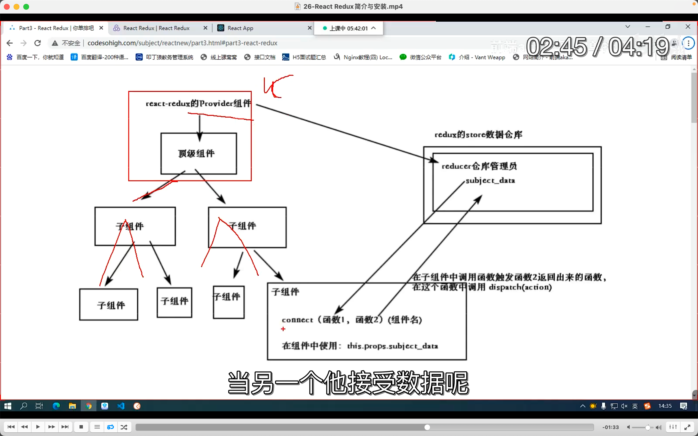
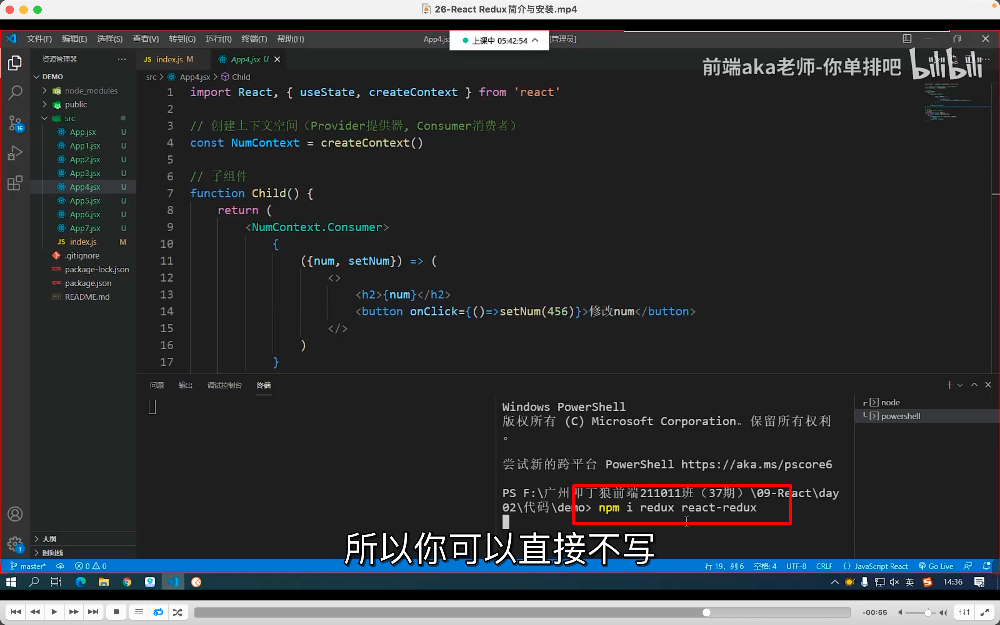
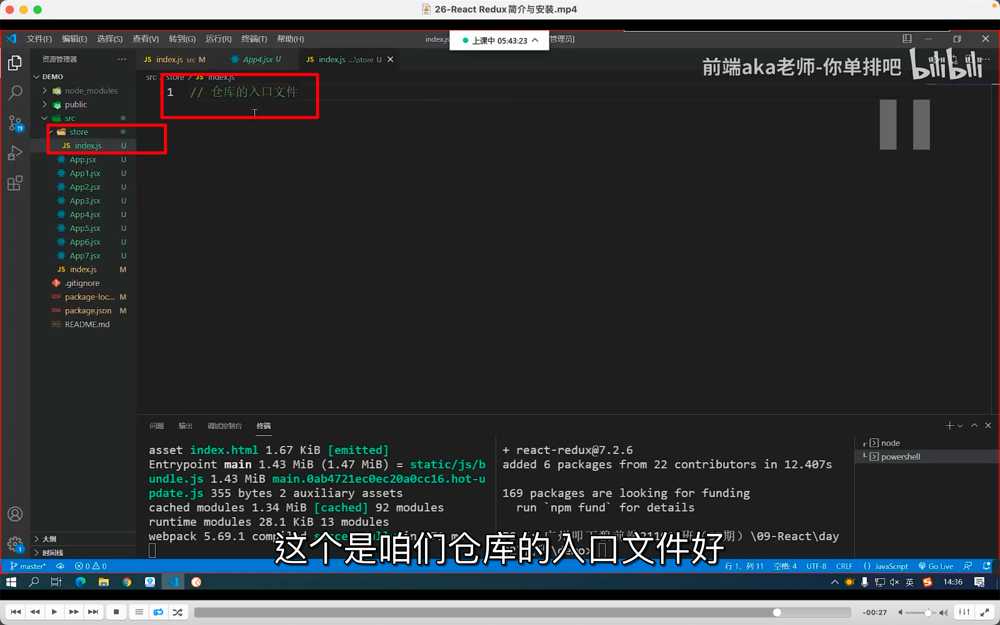
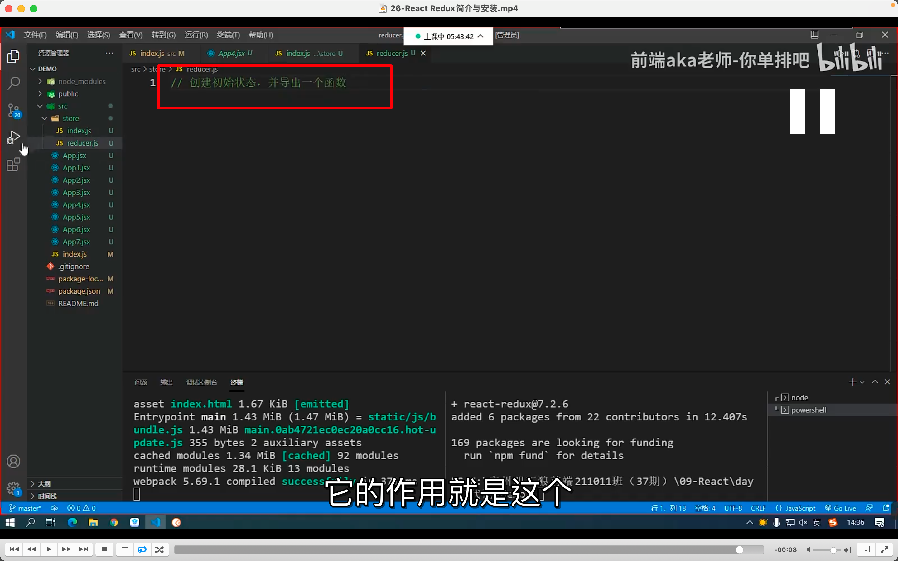

## 220921

  
react redux 官网

  
react redux 基于 redux，redux 是类似 vuex 的状态管理工具。可以直接使用，但较复杂，所以可以使用封装好的 react redux。

  
redux 思想类似之前说的上下文空间，从顶层注入数据，之后不管是第几层子集，都可以共享顶层数据，不需要中间层。

  
流程图

  
npm i redux react-redux 安装，不写--save 也默认--save。

      
--=     
      
新建 store 文件夹并新增 index.js 和 reducer.js      

