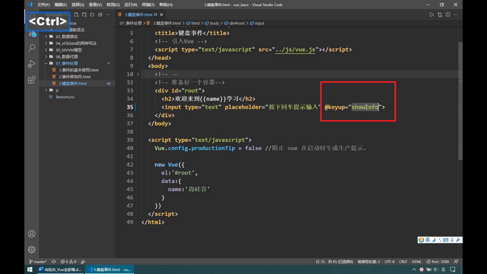
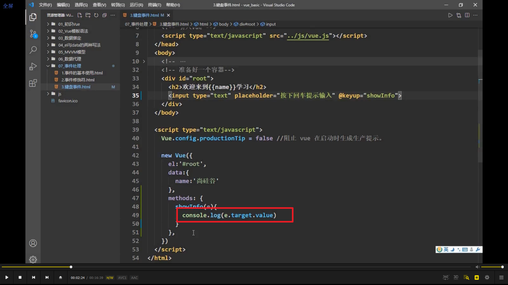
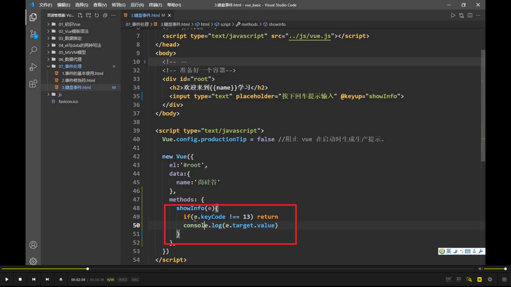
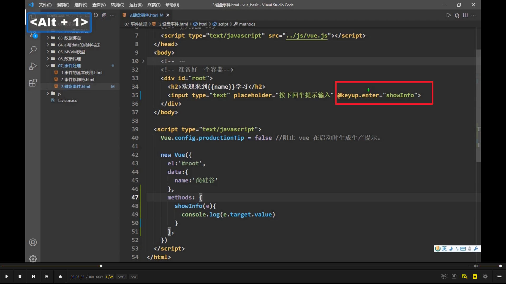
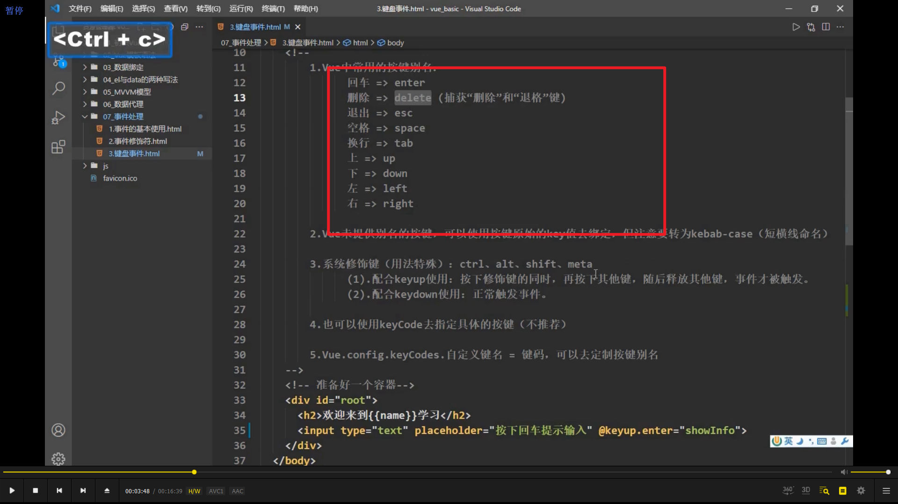
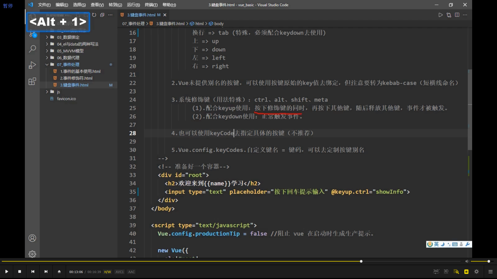
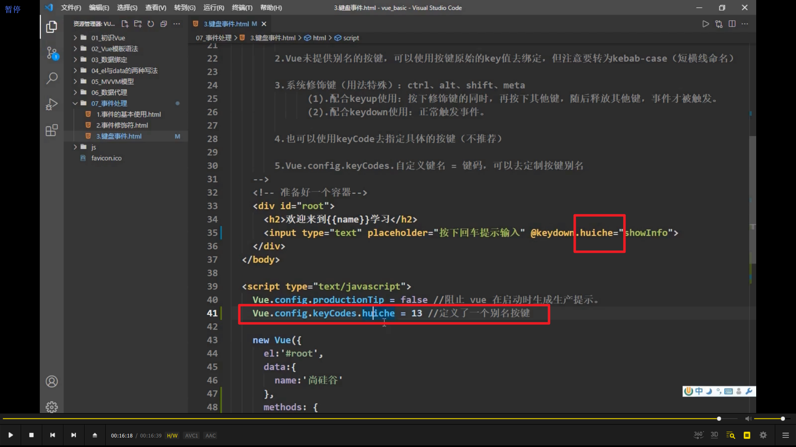

  
键盘事件有 keydown 和 keyup，一般用 keyup。

  
这样每按一个键都会 console.log。

  

这两种方法可以只在回车时才 console.log。

  
常用的按键别名。后续还介绍了其它按键的方法。tab 键要特殊处理。

  
其它 4 个需要特殊处理的键，meta 就是 win 键。       

      
可以自己定义别名按键。
