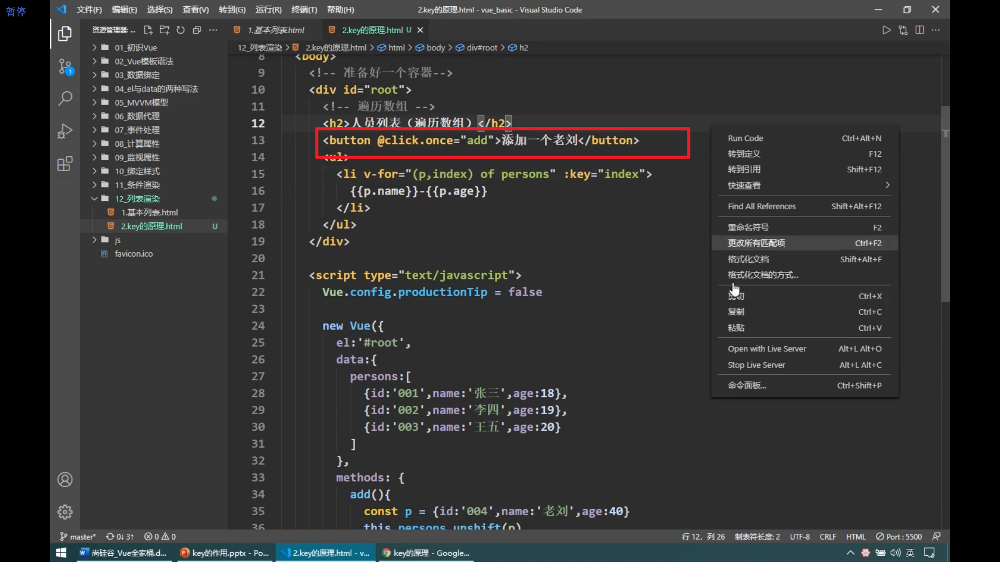
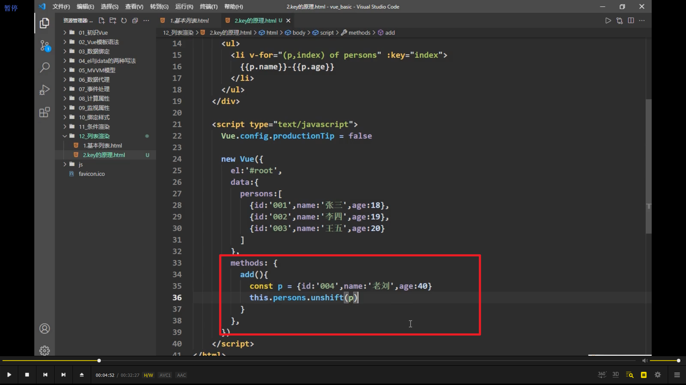
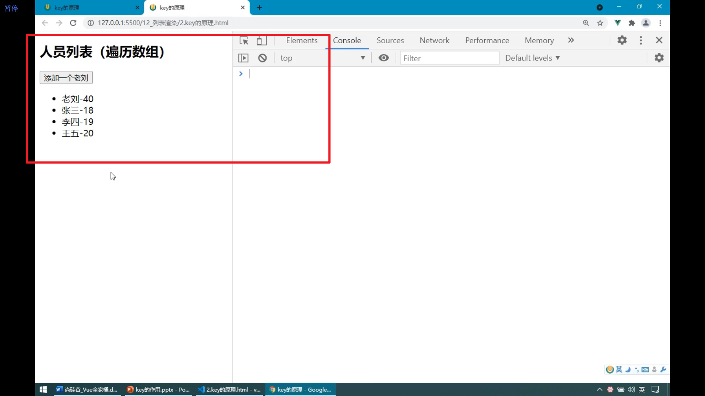
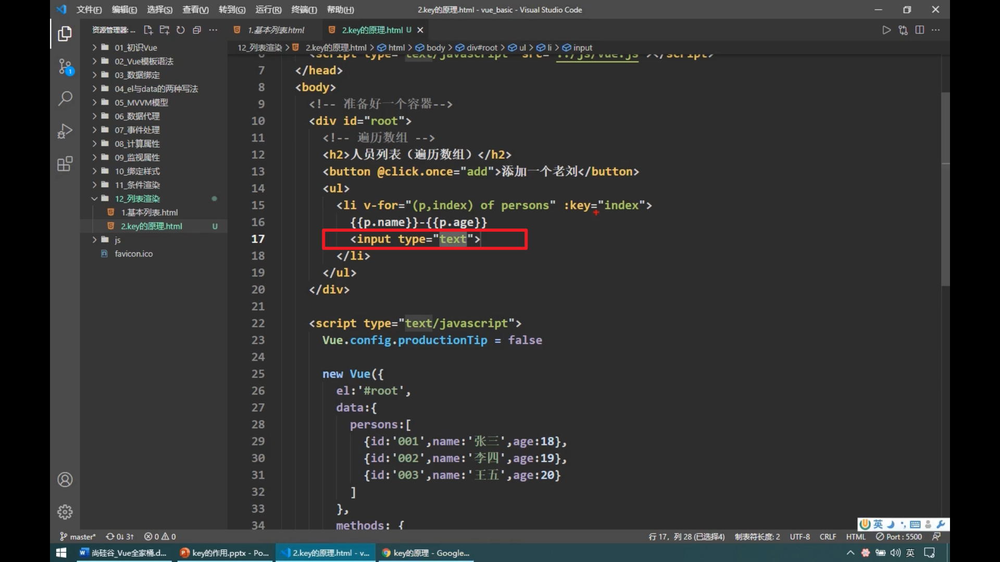
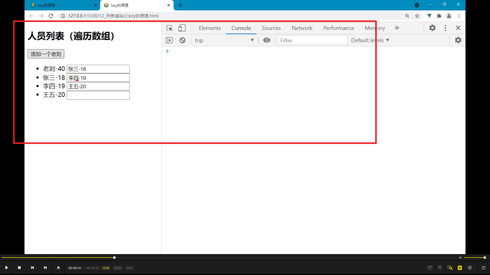
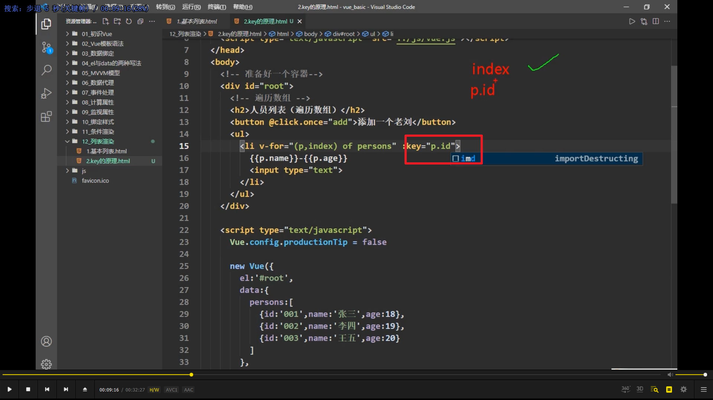
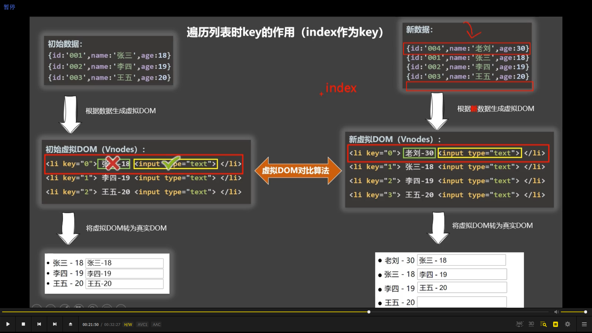
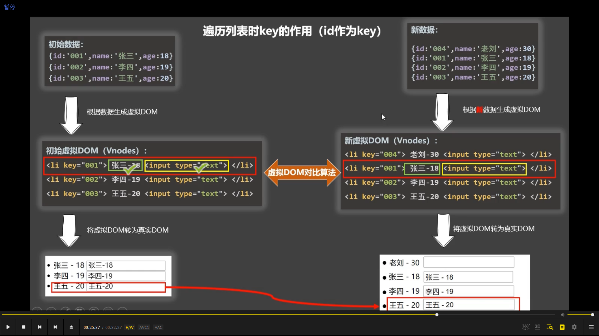
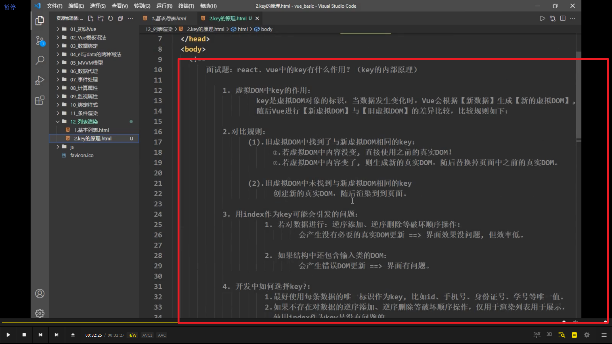

  
  
  
增加一个老刘，可以实现，但是效率低，还有以下问题

  
  
增加输入框后，出现错误。

  
改为 p.id 后就不会出错。

  
错误原因，初始虚拟 dom 和新增虚拟 dom 对比，张三，老刘不同，所以真实 dom 里，张三不复用。但 input 两者都相同，所以 input 复用，导致已经输入了内容的张三的输入框内容复制为老刘的。

  
id 作为 key 则没问题。

  
总结
