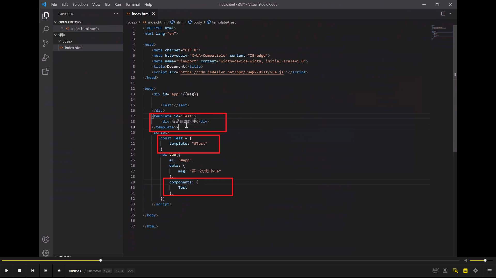
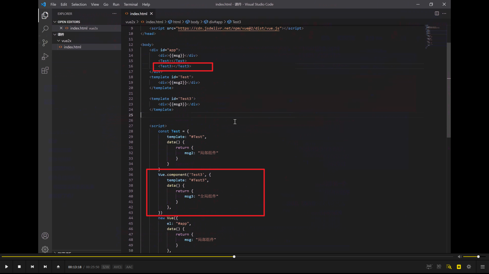
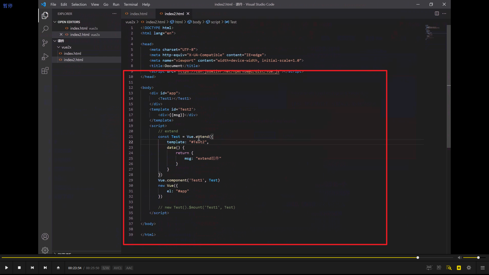
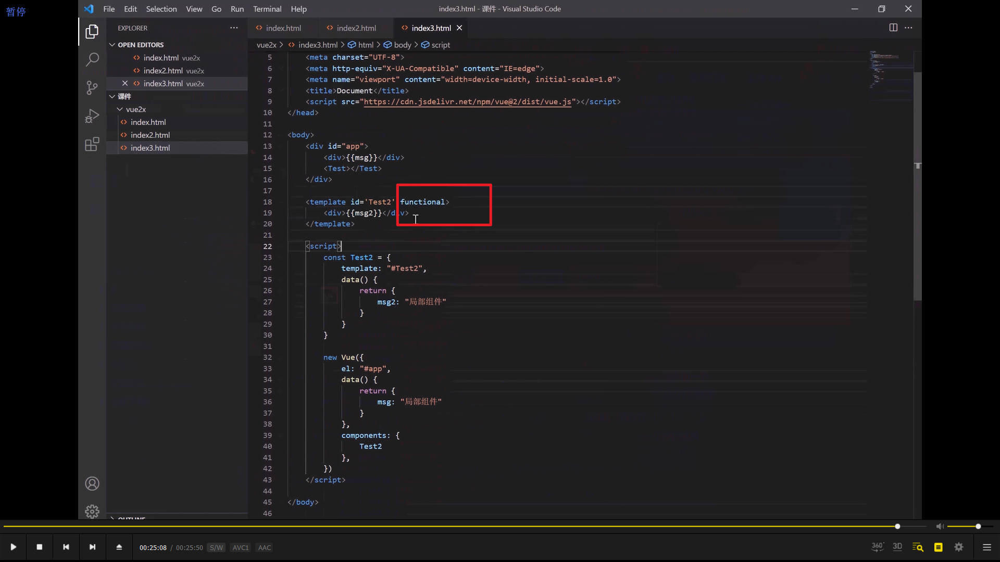

  
局部组件的第一个写法

  
局部组件里 data 用函数形式而 new vue 根组件里则既可以函数形式也可以对象形式。因为局部组件可以被调用多次，使用函数形式相当于每个组件里都单独有一份，不会各个组件互相影响。

  
Vue.component 创建全局组件。无需在 new vue 里引入，因为它就是全局的。

  
创建组件的另一种形式 extend，用得少。

  
函数式组件，functional，用得少。
