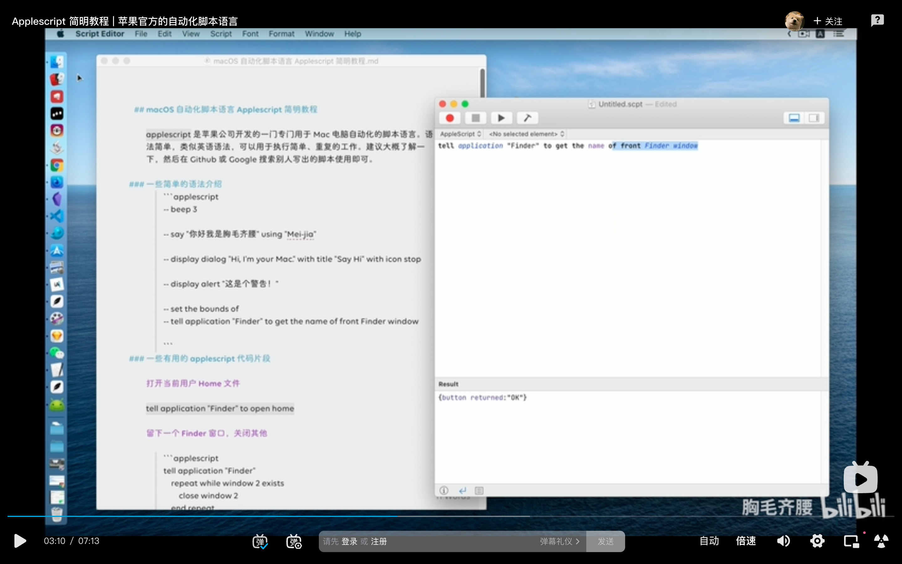
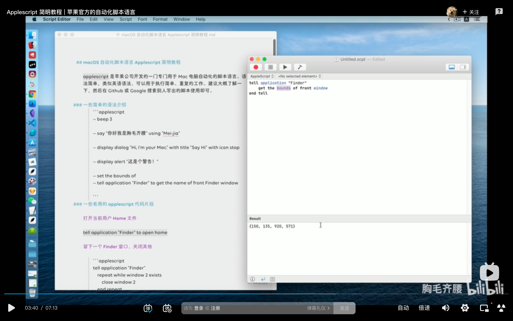
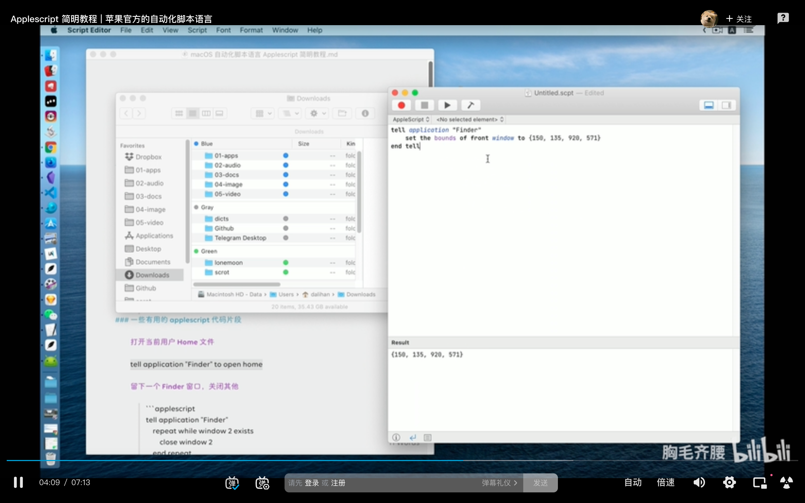

### 简略教程：https://www.bilibili.com/video/BV1NK4y1T7wA

  
获得最前面的访达窗口。

  
访达最前面窗口 4 个位置坐标。

  
set4 个坐标

### 快捷键打开 iterm2 并进入指定目录实例。

automator.app，新建文稿，快速操作，运行 applescript。粘贴以下代码。cmd 保存，键盘，快捷键，服务，通用，点选并配置快捷键即可。

```
--此段代码有bug
tell application "iTerm"
	activate
end tell

tell application "System Events"
	tell process "Iterm"
		delay 0.2
		keystroke "cd Desktop/"
		key code 29
		key code 18
		keystroke "workspace"
		key code 36
	end tell
end tell
```

keystroke 里不能输入数字，用 key code 代替。
key code 列表。
https://eastmanreference.com/complete-list-of-applescript-key-codes

```
--使用这段代码
tell application "iTerm"
	reopen
	activate
	tell current window
		--create tab with default profile
		tell current session
			write text "cd ~/Desktop/01workspace"
		end tell
	end tell
end tell
```

## 221004

### 快捷键输入当前日期

automator quickaction utilities run-applescript 输入以下代码，然后 cmd s 存储。
keyboard shortcuts services 找到上面的保存名，设置快捷键即可
目前还有问题，chrome 上可正常使用，vscode 上使用会报错

```
on run {input, parameters}

	set thedate to (current date) as string
	tell application "System Events"
		keystroke thedate
	end tell
end run
```
