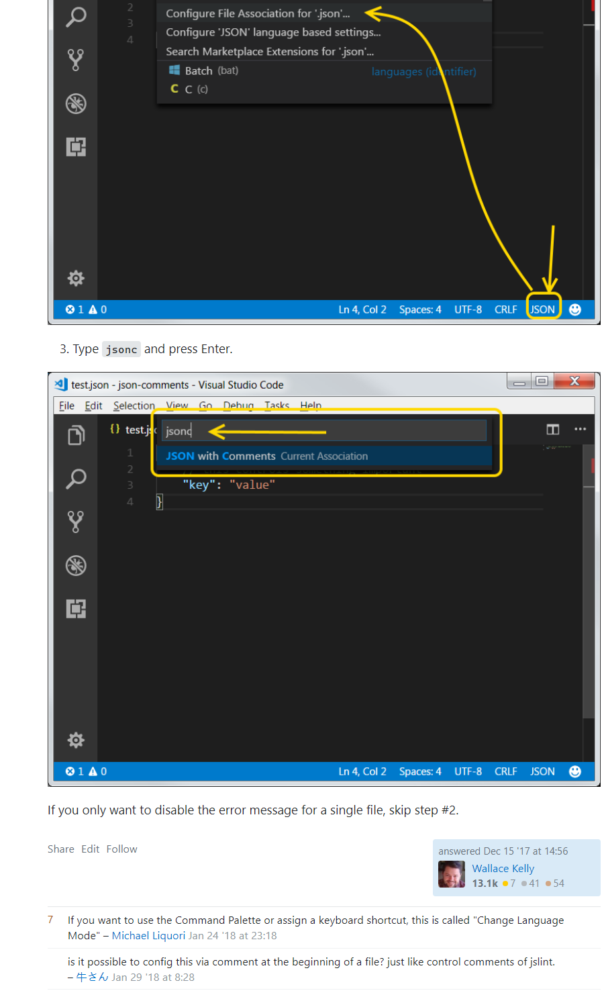
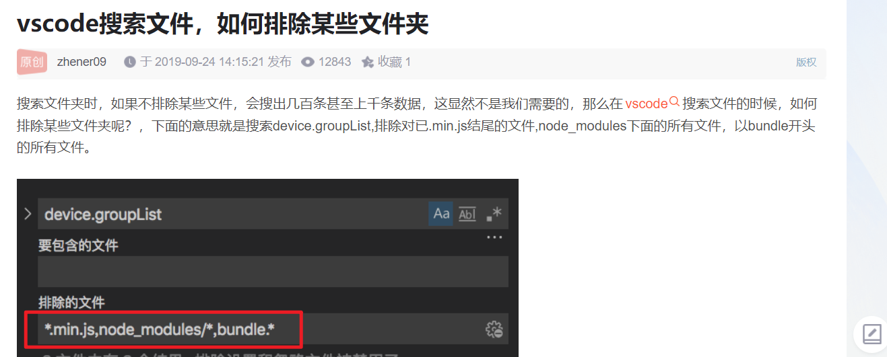
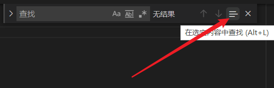
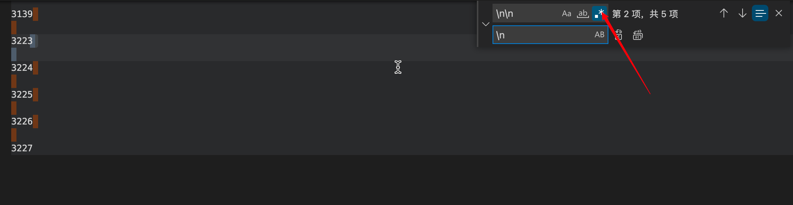
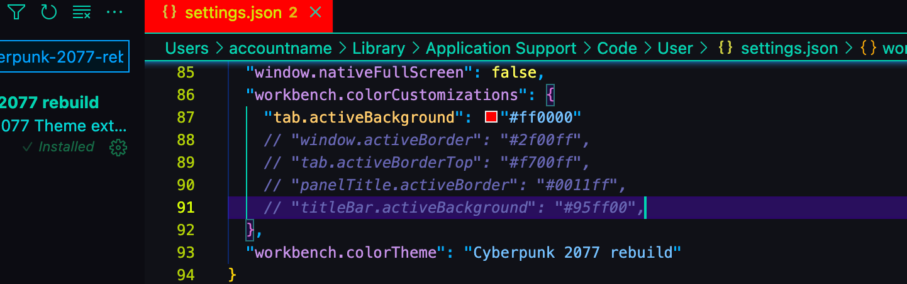
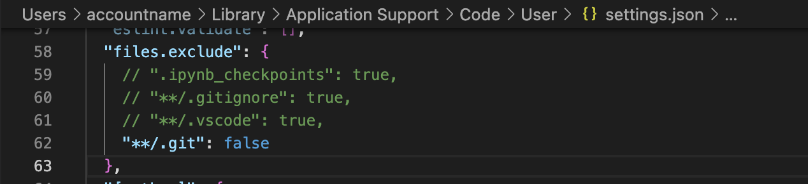

## vscode 预览 markdown，按 ctrl k 后放下 ctrl 再按 v。

## vscode 解决 windows 换行 crlf 与 lf 冲突 ^M 问题

https://blog.csdn.net/glorydx/article/details/110958739  
一劳永逸的解决方法  
如果你所有的同事都是使用 windows 系统，  
vscode 点击文件 --》首选项 --》 设置 --》 搜索 eol，改变 eol 为\n(指 lf)或者改为(\r\n)，有一个统一的标准就好了。  
git 在维护版本库的时候统一使用的是 LF，这样就可以保证文件跨平台的时候保持一致。  
在 Linux 下默认的换行符也是 LF，那也就不存在什么问题。  
在 Windows 下默认的换行符是 CRLF，那么我们需要保证在文件提交到版本库的时候文件的换行符是 LF，通常来说有两种方法：  
如果你同事中有使用其它系统开发的  
你需要先执行上面的操作，再行 以下代码才能解决  
git config --global core.autocrlf false

---

## 避免 json 注释报错



sol 文件里出现 import 报错，将 solidity 插件降到 0.0135。直接降可能失败，下载单独的文件，再将其拖入 vscode 的插件栏来安装。

VSCode 关闭右侧预览功能 缩略图  
关闭方法：点击文件-首选项-设置,搜索"editor.minimap.enabled",默认值为打钩,我们只需要把钩去掉即可；

---

## 使用搜索功能时排除指定的文件或文件夹



---

## 在指定位置查找指定内容

  
add，需要先输入内容，再框选指定区域，再点击此处。

## 设置用户代码片段，参照 markdown.md

## 切换中英文

ctrl shift p，display language

## vscode 显示/设置隐藏文件夹

设置里搜 exclude，修改对应后缀。

## 不同系统下找到 settings.json

You can change the settings.json from your user preferences. This changes are global. Therefore it will affect all of your projects. Here are 2 ways to reach that global settings.json file.

File -> Preferences -> Settings -> Extensions -> Scroll down and find "Edit in settings.json"  
Or in these paths in your OS  
Windows %APPDATA%\Code\User\settings.json  
macOS $HOME/Library/Application Support/Code/User/settings.json  
Linux $HOME/.config/Code/User/settings.json

https://supunkavinda.blog/vscode-editing-settings-json

## 搜索文件名而不是搜索文件里的内容，cmd p，ctrl p。cmd shift p 则是搜索命令。

## 批量替换空格，需开启正则表达式



## 无鼠标 mac vscode，cmd option 上下可批量增加光标

## 不回退代码，但让代码自动更新到跟以前某次提交完全一样，即可以保留中间所有的提交。

各种方法似乎都有问题，最好是复制当前的代码到另一个文件夹，并将该文件夹回退到指定版本，再用该文件夹到文件复制到原文件夹，但.git 不复制，最后再原文件夹新增提交即可。

## 多项目或文件夹运行

1，Project Manager 插件  
很多项目时才需要，暂时不用

2，ctrl r 切换

3，window.nativeTabs  
似乎只有 mac 才行，设置里搜索 window.nativeTabs 开启，之后窗口，新建标签页即可。

## 删除所有注释

安装 Remove Comments 插件 按住 CTRL + SHIFT + P 选中 Remove All Comments 就可以删除代码中所有注释了。

## 在特定工作区禁用某插件

找到该插件，点击 disable 下拉框，disable（workspace）

## 对比文件夹内容插件 Compare Folders

命令行：COMPARE_FOLDERS=DIFF code ./folder1 ./folder2  
settings.json 设置

```
  "compareFolders.excludeFilter": [
    "**/node_modules",
    "**/.svn",
    "**/.git",
    "**/target"
  ],
  "compareFolders.ignoreAllWhiteSpaces": true,
  "compareFolders.ignoreEmptyLines": true,
  "compareFolders.ignoreLineEnding": true
```

## 搜索文件夹

cmd p，foldname/，注意最后加了/

## 221002

## 合并 windows 为 tabs

window =》merge all window

## code -all/-a . 在当前 tab 添加文件夹的形式，而不是新增 window 的形式

## 221003

## 修改 tab 颜色



```
  "workbench.colorCustomizations": {
    "tab.activeBackground": "#ff0000"
    // "window.activeBorder": "#2f00ff",
    // "tab.activeBorderTop": "#f700ff",
    // "panelTitle.activeBorder": "#0011ff",
    // "titleBar.activeBackground": "#95ff00",
  },
```

输入任意字母会自动联想选项  
只能修改当前工作区 tab 颜色，不同工作区 tab 颜色可能是 mac 系统决定，vscode 无法改变，可以在 mac 设置，通用，外观设置深色加强 tab 对比度

## 修改 pasteimage 插件的图片显示方式，并设置图片高度为 333px

```
  "pasteImage.path": "${currentFileDir}/img",
  "pasteImage.basePath": "${currentFileDir}",
  "pasteImage.forceUnixStyleSeparator": true,
  "pasteImage.prefix": "/",
  // "pasteImage.insertPattern": "${imageSyntaxPrefix}./img/${imageFileName}${imageSyntaxSuffix}</img>",
  "pasteImage.insertPattern": " </img>",
```

需写 </img>，不然可能图片后的文字不换行

## 重要快捷键

ctrl -，go back  
ctrl shift -， forward  
cmd option 左右切换文件 tab

## 快捷键修改

打开 vscode 自带终端，cmd t，原命令变为 ctl cmd t(原命令 go to symbol in workspace，大概是搜索工作区 md 文件带#的标题部分)  
将 merge all window 设置为了 cmd option e  
将 next window tab 设置为了 cmd 2, previous window tab cmd 1

切换侧边栏，默认为 ctrl b，换为 ctrl b 加 ctrl b （add，mac 里叫主侧栏）  
切换活动栏，默认未设置，换位 ctrl b 加 ctrl v

add，关闭右侧缩略图，预览功能。设置，搜索 editor.minimap.enabled。取消勾选。

## 221005

## 显示/隐藏指定文件/文件夹

</img>  
似乎只有.git 需要指定 true 才会显示，其它无需指定都是默认显示

```
  "files.exclude": {
    // ".ipynb_checkpoints": true,
    // "**/.gitignore": true,
    // "**/.vscode": true,
    "**/.git": false
  },
```
