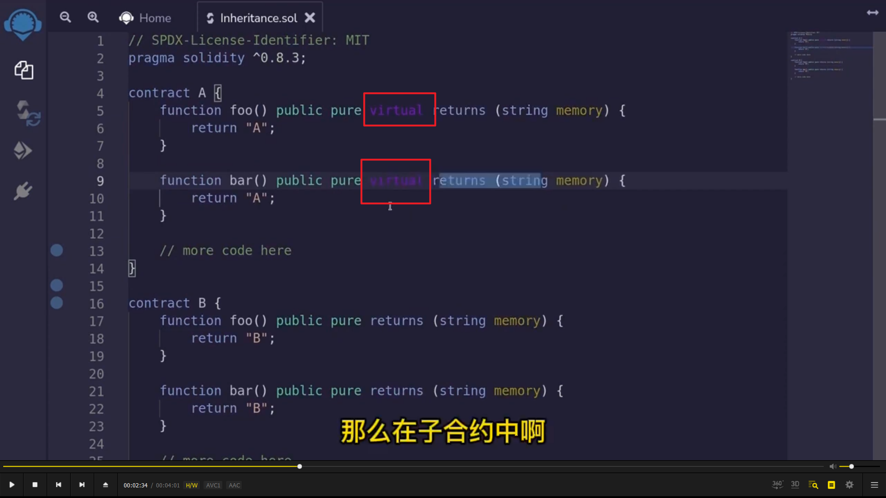
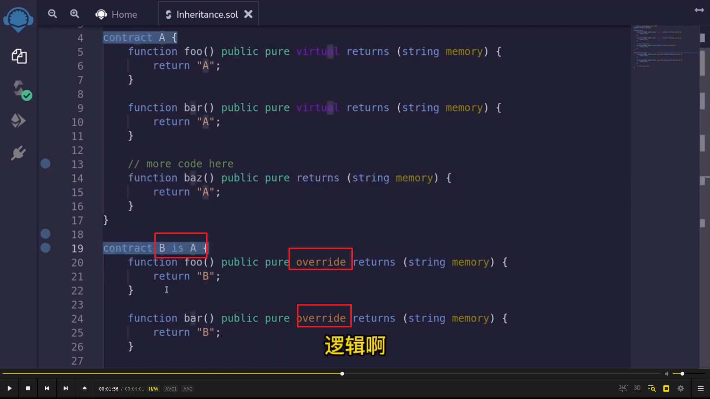
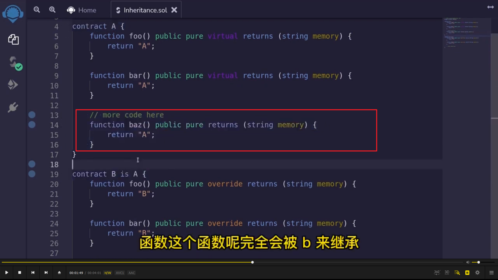
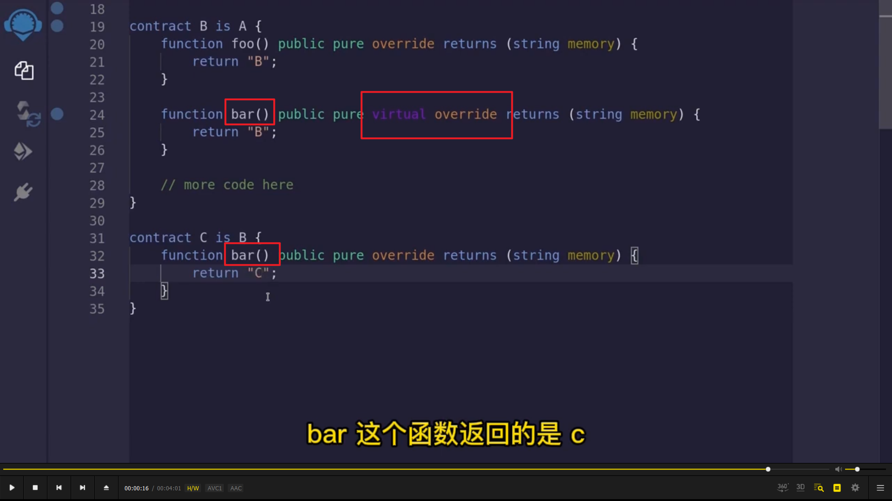

</img>      
继承合约可以简化代码量，使一个合约使用另一个合约的 function。继承并不一定完全一样，可以修改代码，但需要 virtual 修饰才可修改。  
  
</img>      
B is A 代表 B 是 A 的子合约。override 代表覆盖父合约的 function。  
  
</img>      
baz 函数没有 virtual，则完全被 B 合约继承（而不是不能用 baz）  
  
</img>      
可以多级继承  
