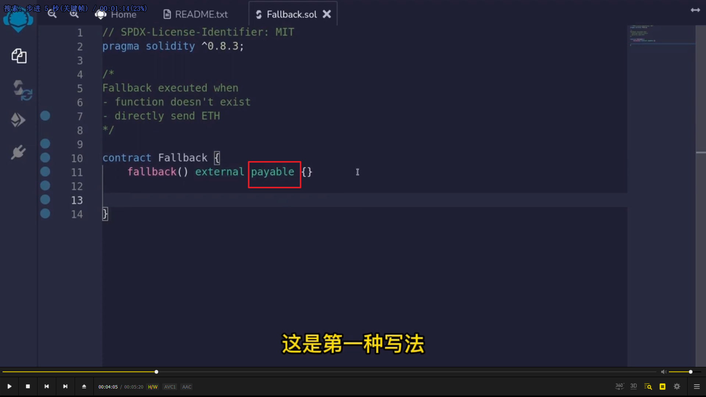
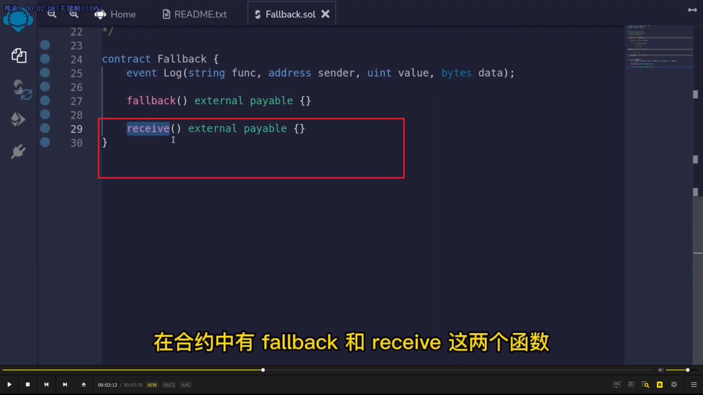
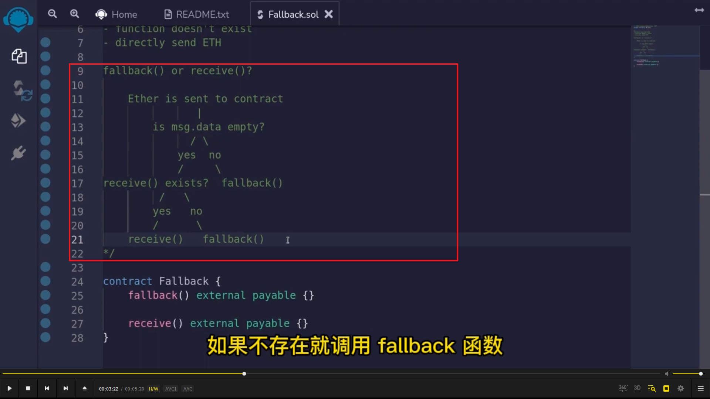
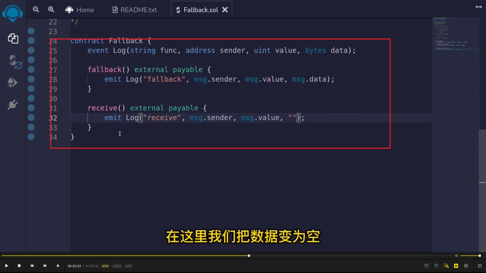
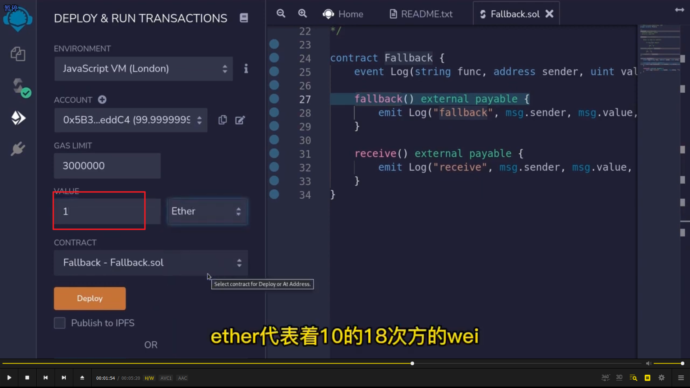
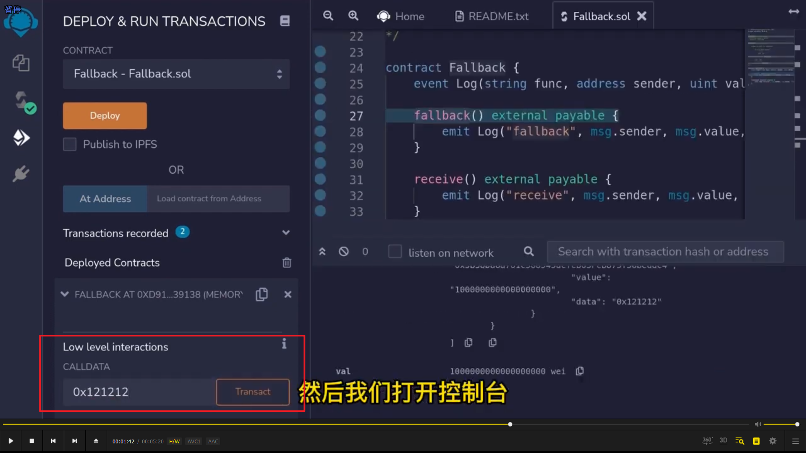

</img>      
回退函数 fallback 有两个功能，当调用的函数在合约中不存在或向合约发送以太坊主币时调用。    
8.0 中有两种写法    
写法一，图中没写 payable 可以接受合约中不存在函数的调用，但不能接受主币直接发送，加了就可以了。  
  
</img>      
写法二，为了只接受主币。 receive 必须加上 payable。  
  
</img>      
实际过程是调用 receive 还是 fallback 的规则。fallback 是后备函数，receive 只负责接收主币。  
  
</img>      
测试代码  
  
</img>      
部署后发现没有任何对外可见函数。因为回退函数不可见。只能采用下面的 calldata 调用。  
  
</img>      
</img>      
图一 msg.value 图二 msg.data。因为有 calldata，所以 fallback 触发，receive 没触发。删掉 calldata 后则触发 receive。  
