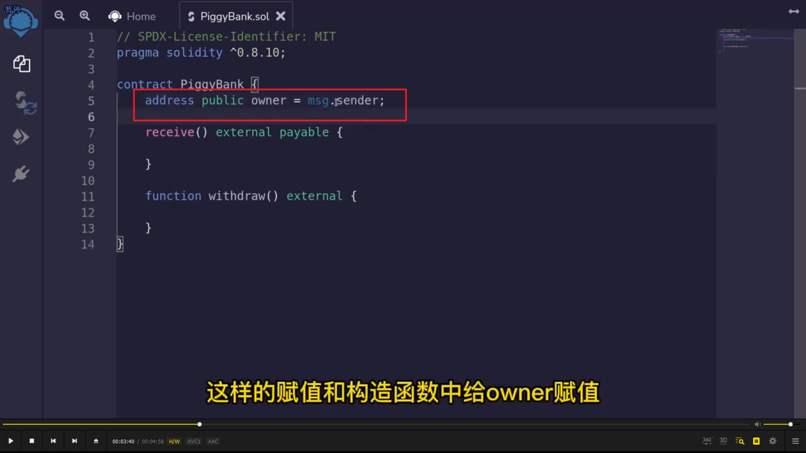
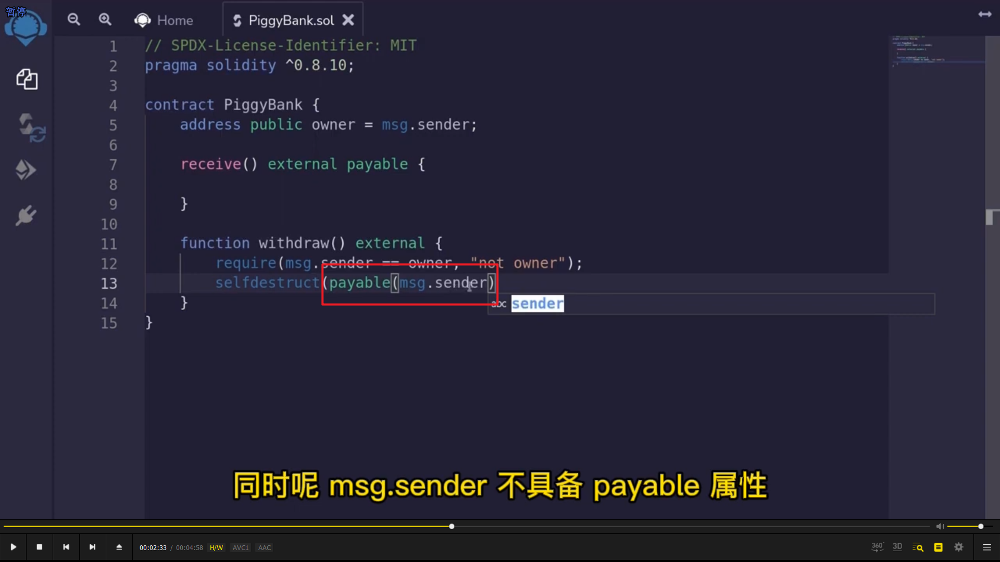
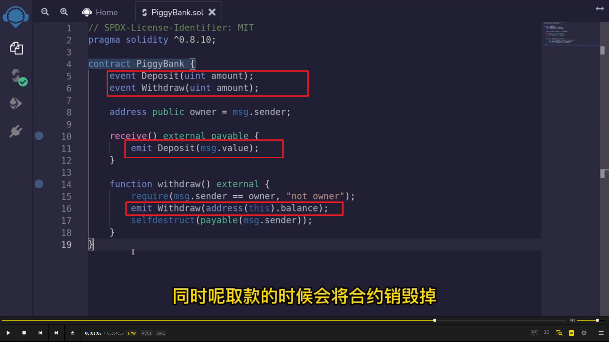
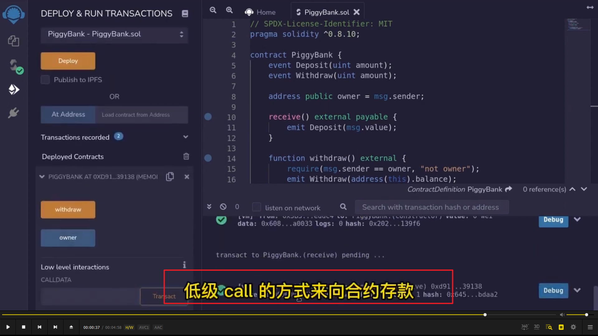

</img>      
不需要写构造函数，因为只有一个变量？  
  
</img>      
使用 msg.sender 而不是 owner 是因为使用状态变量会增加 gas 消耗。  
  
</img>      
事件写法。address(this).balance 获取当前地址余额。  
  
</img>      
低级 call，回退函数要用低级 call 调用。  
