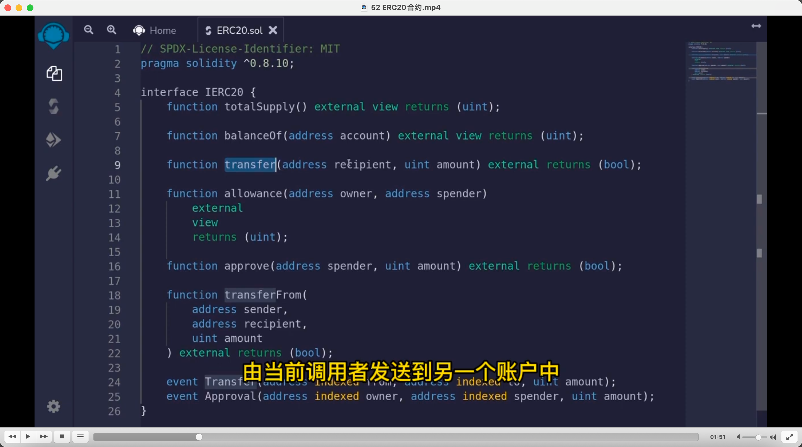
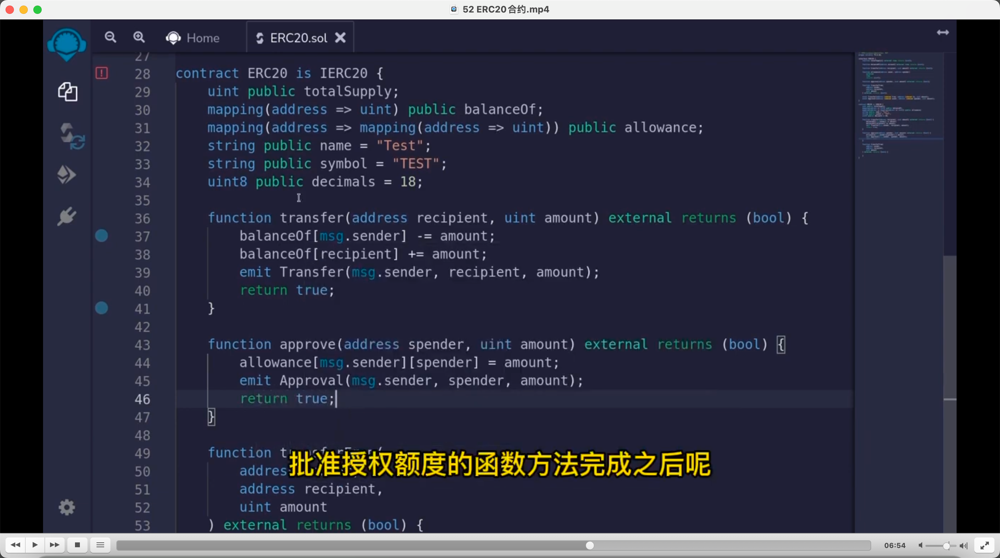
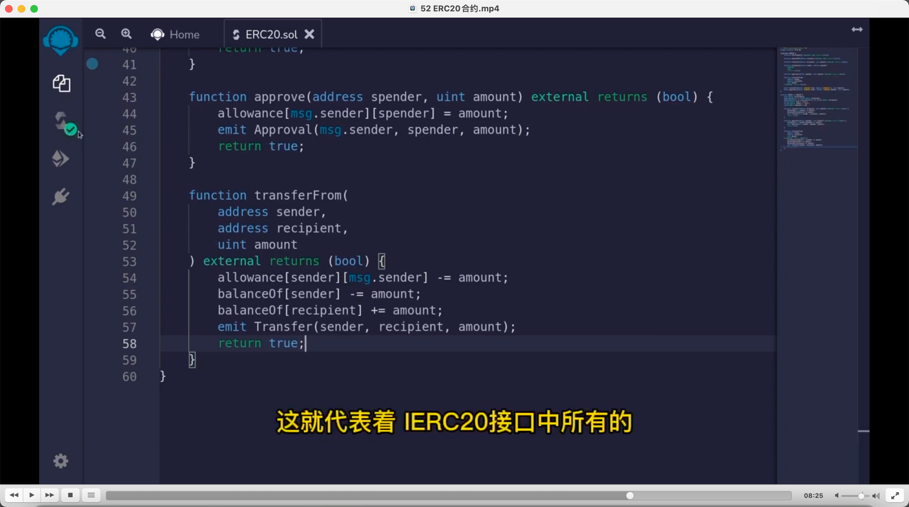
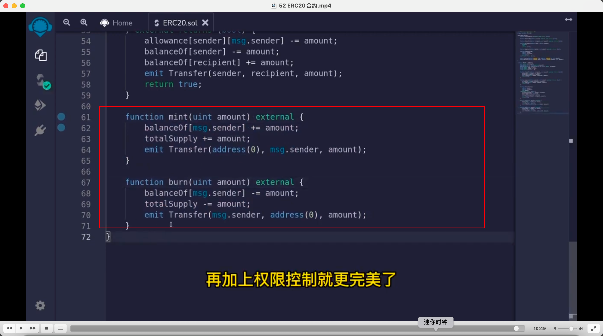

### 误区，有一个合约代码代表 erc20，是错的。erc20 标准只包括接口。所以并没有标准代码，只要满足了 IERC20 接口，合约对外包含 IERC20 所列的所有接口，就代表满足了 IERC20 标准。比如 transfer 方法并不代表发送者一定减少数量，收获者一定增加数量。      

     
各接口介绍。transfer是写入方法，所以会向链外发送transfer事件。通过这事件，就能查询token流转。

approve批准我账户的数量给另一个账户。之后通过allowance方法查询某账户对另一个账户的批准额度。

向另一合约存款时，另一个合约必须调用transferFrom才能把我们账户的token拿到该合约中。     
     
     
实现IERC20接口，注意所有接口都需实现，不然就会报错。        

     
铸造，销毁。实际中铸造需要权限控制。
