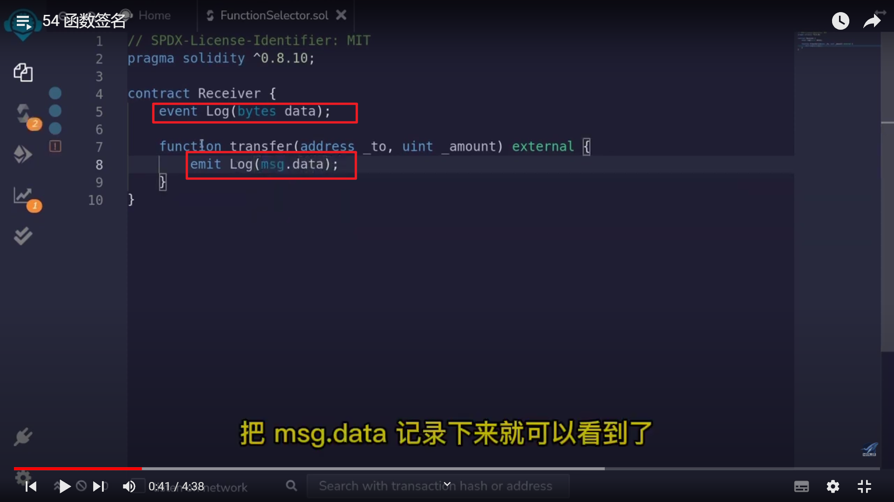

</img>    
  
https://www.youtube.com/watch?v=ZBE9gq91bW8&list=PLV16oVzL15MS-Zw8a3eEOADwbHhm8GrMp&index=54  
  
函数签名也叫函数选择器，用来代表一个智能合约中虚拟机是如何找到一个函数的。  
  
这里有 transfer 函数，之后通过 msg.data 来看到底什么数据被发到了虚拟机中。  
  
---  
  
---  
</img>          
创建一个事件，用它向链外反应当前合约的函数收到了什么呼叫数据。这里把 msg.data 记录下来就行。  
