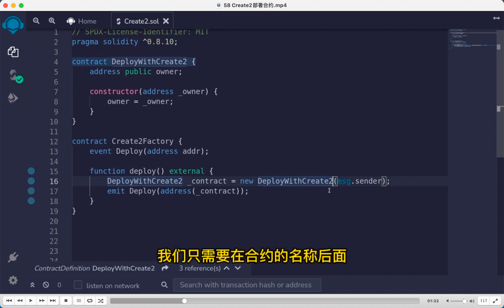
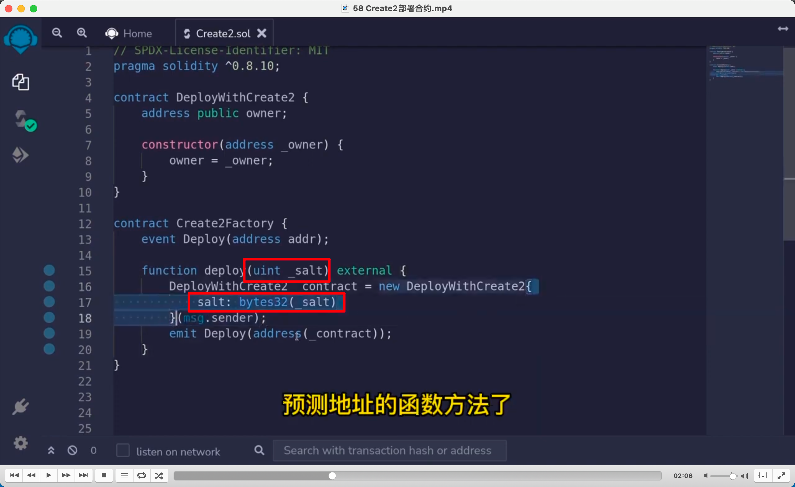
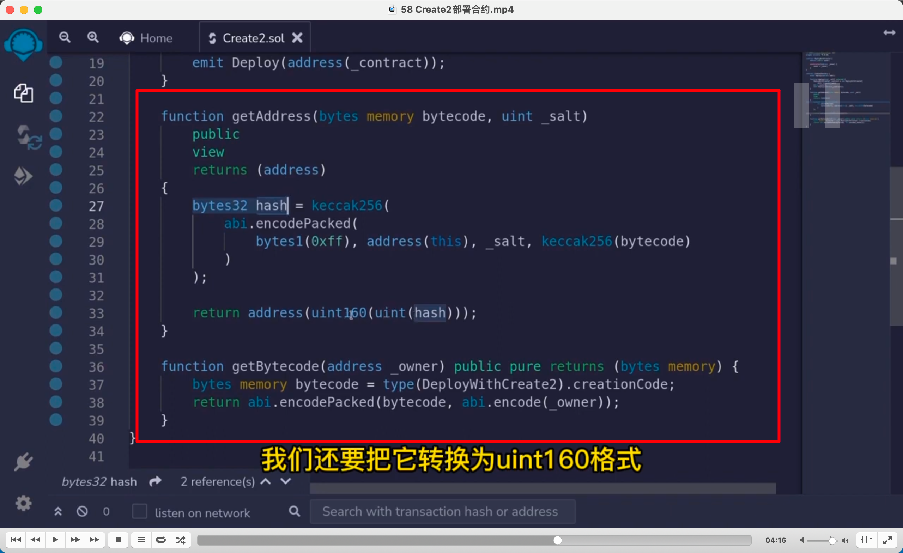

  

通过合约部署合约，之前是 new 方法，这里讲 create2 方法。new 方法在工厂合约里部署合约，部署的新合约地址是通过工厂合约的地址和工厂合约对外发出交易的 nounce 值计算出来的新合约地址。create2 方法是工厂合约地址加上盐去计算未来新部署合约的地址。所以新合约地址在部署前就能被预测出来。  
此图中有两个合约，第一个是被部署的合约，第二个就是工厂合约。用第二个部署第一个。  
图一是传统部署方法，图二是 create2 方法。

  
获取新部署合约地址的方法，能改变的参数只有盐，所以盐不变，生成的地址就不会变。

