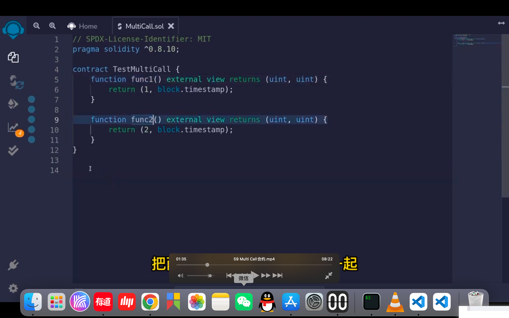
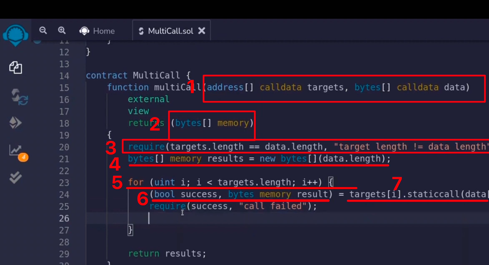
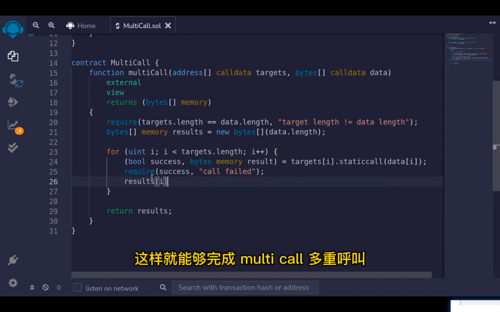
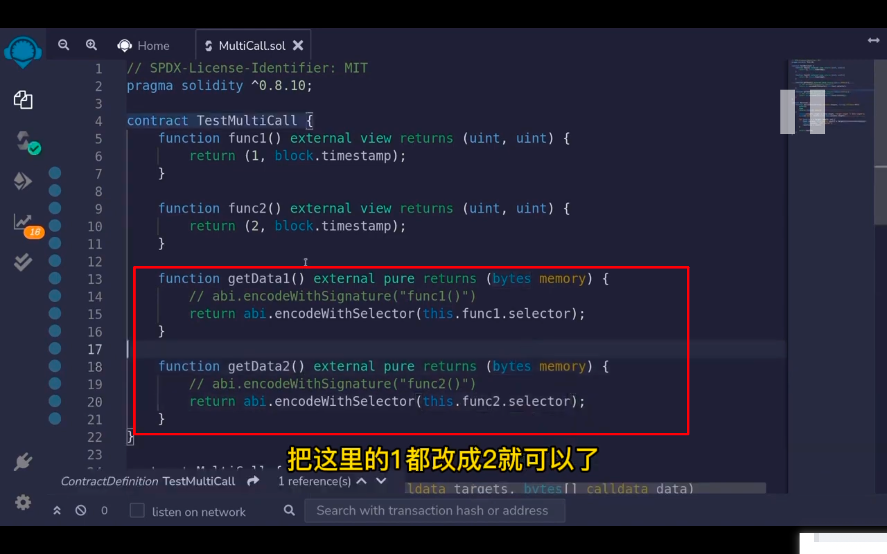

      
multi call是把一个或多个合约的多次函数调用打包整合在一个交易中再进行调用。有时需要在同一个网站前端中对合约进行几十次调用。而链的rpc节点每一个客户端对链的调用在20秒内只能有一次。所以需要多个调用打包成一次调用。       
如图，如果分开调用时间戳就不一样了。所以打包成一次调用。

      

1，需要有两个参数，第一个是两次调用分别调用的哪个合约地址。第二个是两次调用对合约发出的data数据     
2，返回调用的结果数据，是bytes类型的数组。      
3，开始位置确认下输入参数的两个数组长度是否一致。       
4，定义一个返回值，也是数组     
5，做循环遍历。用目标地址的staticcall（静态调用方法，而不是直接用底层call，底层call可能产生动态写入，因为前面是view，所以用静态）。     
6，静态调用有两个返回值，第一个是布尔值，标记是否成功，第二个是这次调用读取出的数据并以abi编码的形式进行返回。      
7，把返回的数据装入到返回值的数组中。       

传入的参数该怎么编写？传入的变量中有一个data数据。这data就是在调用第一个和第二个函数对于区块链上真实发送的交易的input数据。怎样得到呢？可以通过编写一个函数的方法。也可以链外ethers或web3这样的sdk工具编写脚本获取它。这里演示编写函数的方法。注释的方法效果一样。