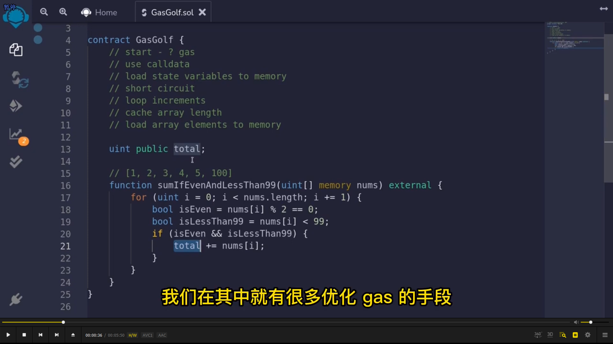
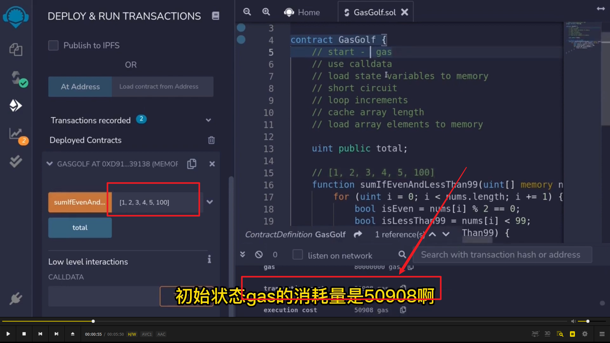
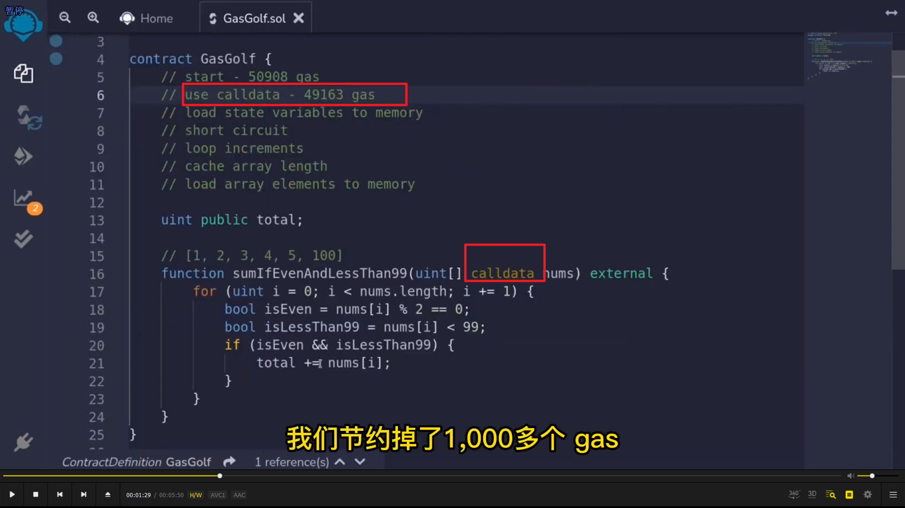
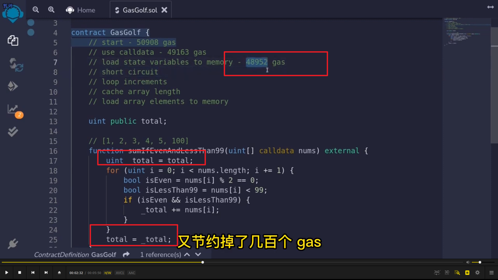
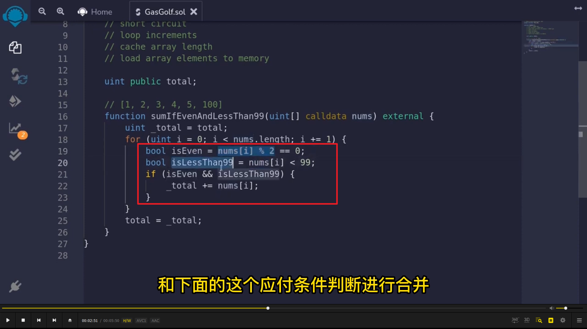
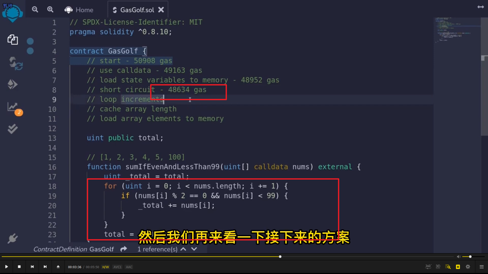
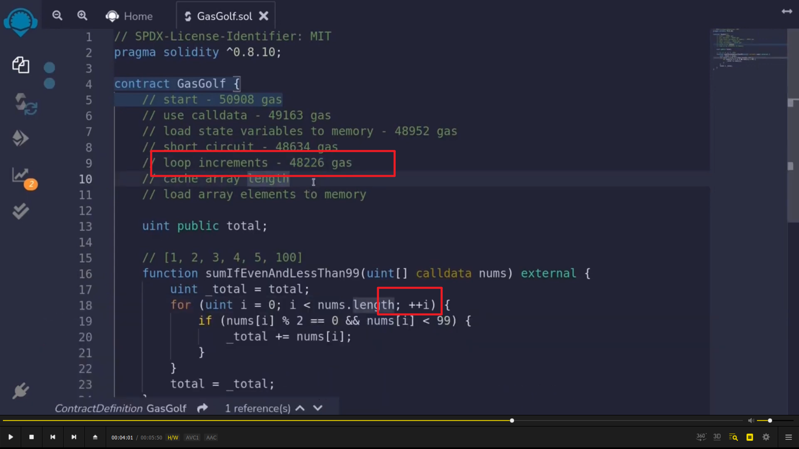
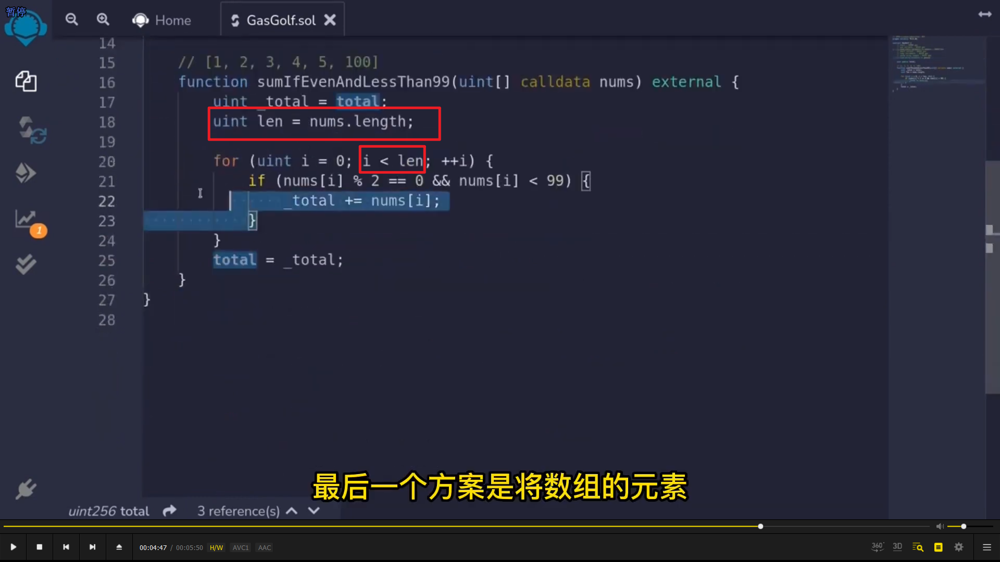
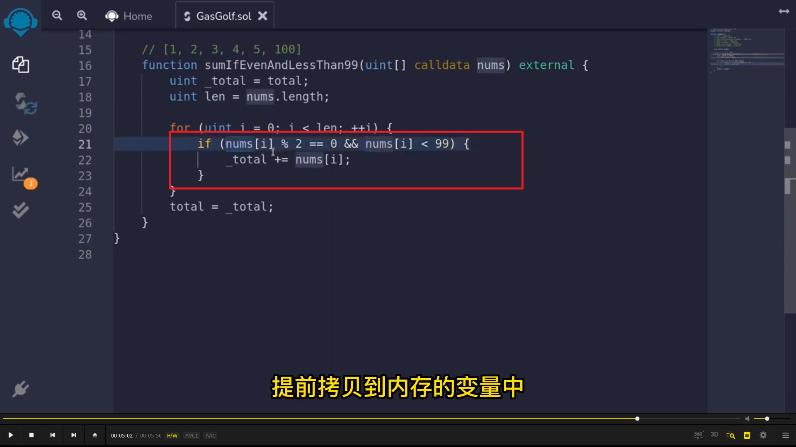
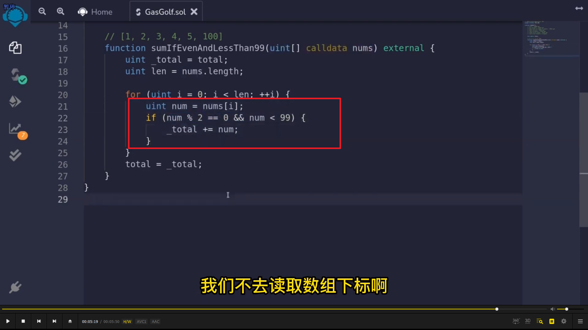

</img>      
gas 优化的原始方法。  
  
</img>      
这里可以看到 gas 消耗  
  
</img>      
memory 变成 calldata，节约 gas。  
  
</img>      
循环中的状态变量变为局部变量，节约。  
  
</img>      
</img>      
短路，将布尔值判断和 if 合并。  
  
</img>      
 i++ 换成 ++i；  
  
</img>      
循环长度存储为局部变量  
  
</img>      
</img>          
数组元素提前拷贝到内存变量中。就不用多次读取数组下标为 i 的数组元素了。  
