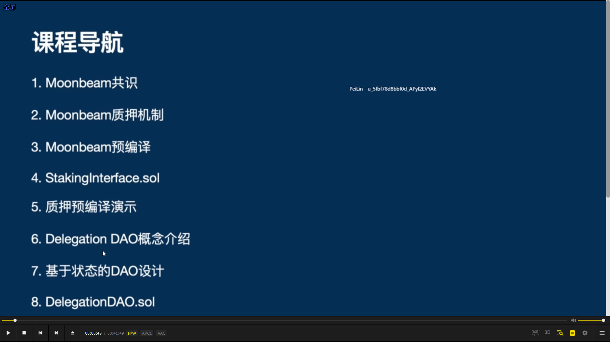  
导航

---

---

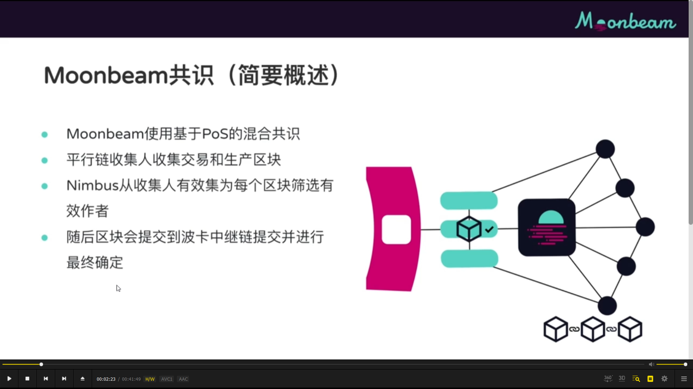  
moonbeam 共识

---

---

  
moonbeam staking

---

---

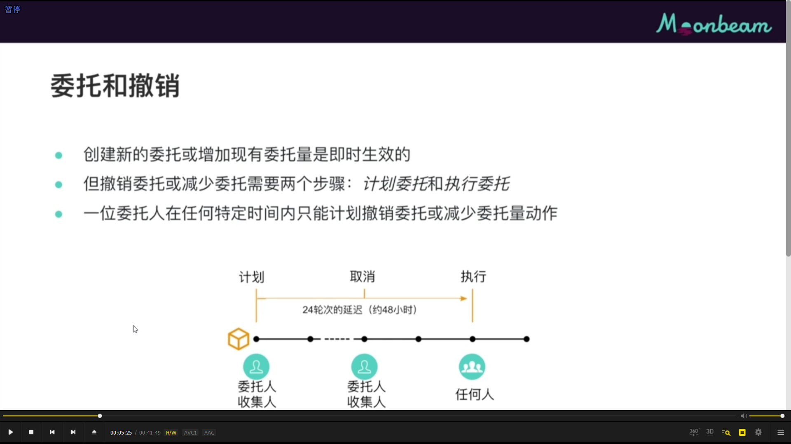  
委托和撤销

---

---

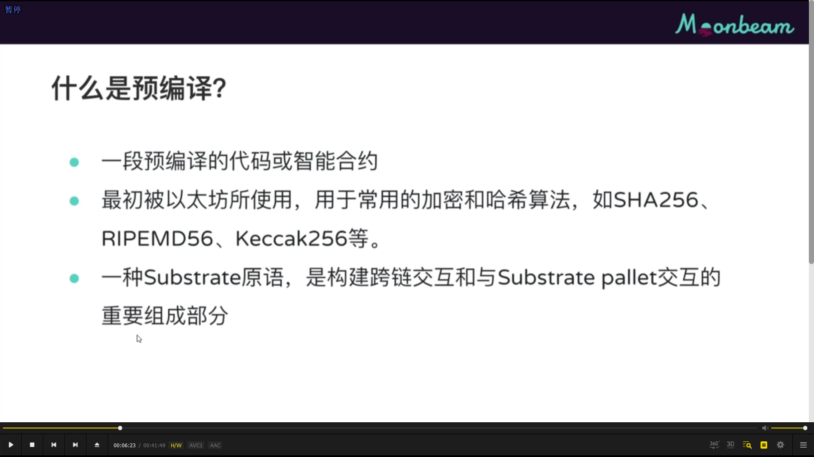
预编译，它跳过 evm，在 substrate runtime 中执行

---

---

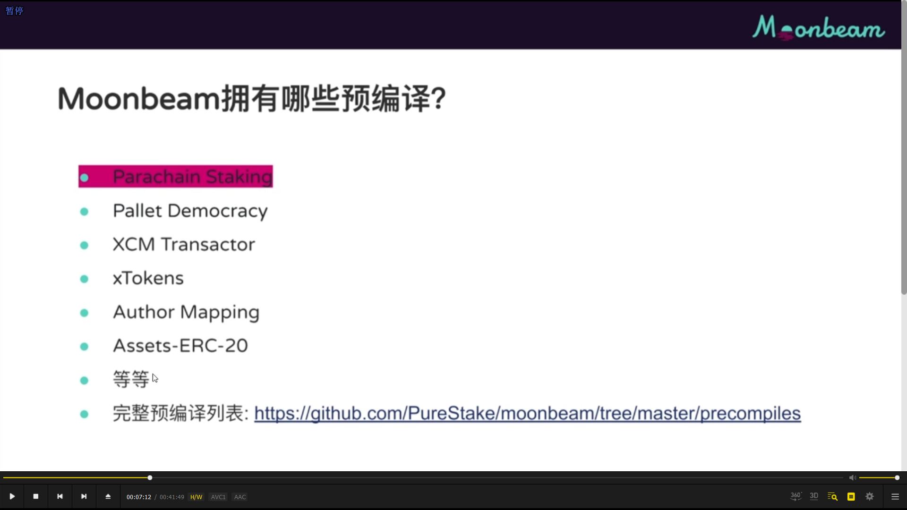  
moonbeam 拥有的预编译

---

---

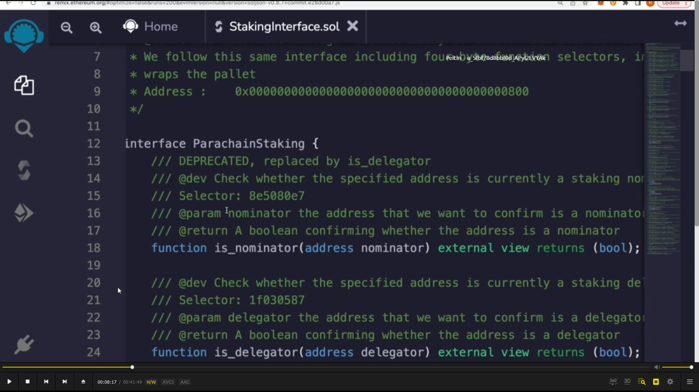  
stakingInterface.sol，质押预编译的智能合约的接口。定义我们如何通过 solidity 来与质押的 pallet 进行交互。  
既包含委托人方法，又包含收集人节点方法，今天课程主要使用委托人方法。

---

---

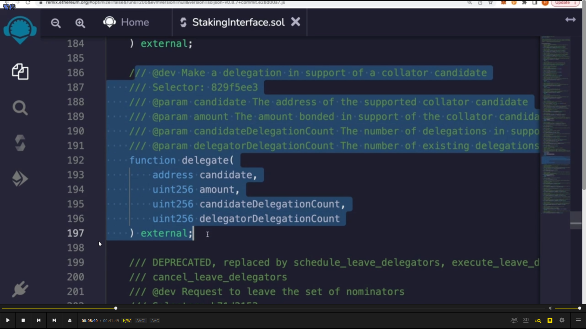  
delegate，呆会 dao 智能合约里会遇到的方法。它会创建一个新的委托，有 4 个参数，candidate 是要委托的收集人节点的地址。amount，委托代币的数量。第三个，要委托的候选人有多少个现有的委托。第四个，我们作为委托人，现在有多少个委托。  
（add，这里说的委托，大概就是类似投票验证人一样。只是这里不是验证人，而是收集人）

---

---

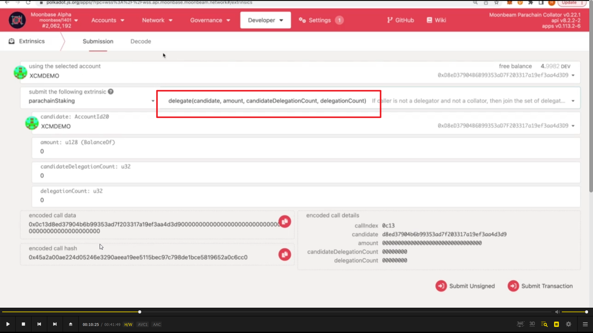  
developer，extrinsic，找到一样的方法。预编译的工作原理就是这样。它会把 substrate pallet 的方法一对一的方式映射到以太坊 solidity 接口里。但此方法不会在 evm 里运行，它在本地 substrate runtime 里运行。 结果反馈到调用方法的智能合约？。

---

---

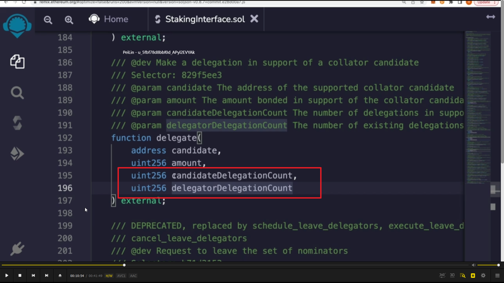  
为什么委托时需要填入这两个方法，较复杂，需要时看视频。

---

---

  
remix 质押预编译交互示范

---

---

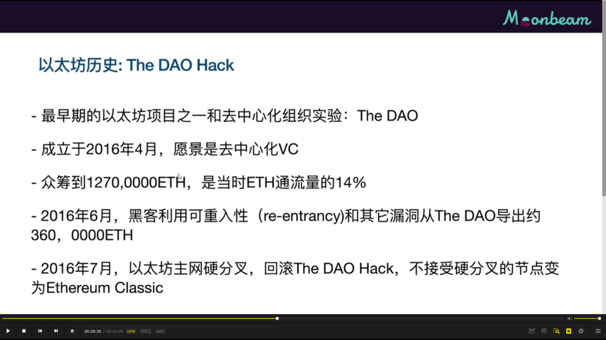  
。dao hack 历史，以太坊分叉。

---

---

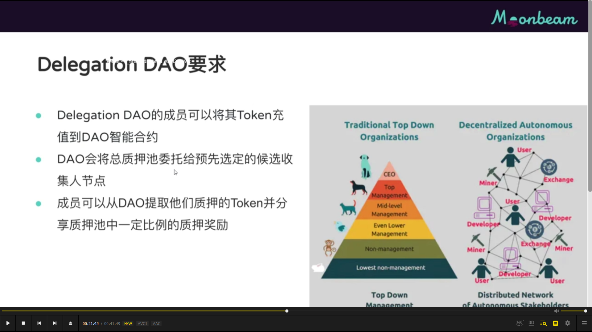  
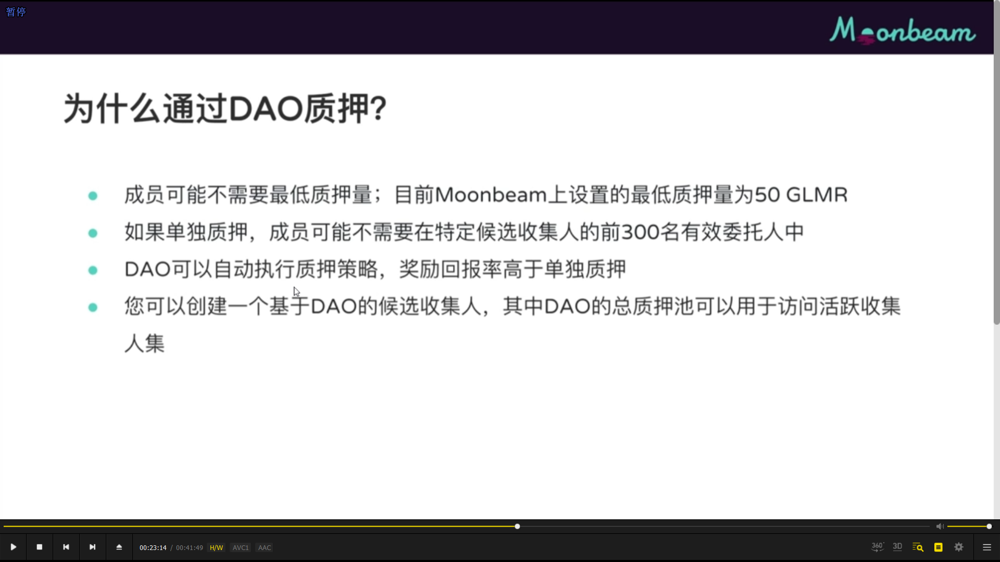

delegation DAO 要求，以及为什么需要。

---

---

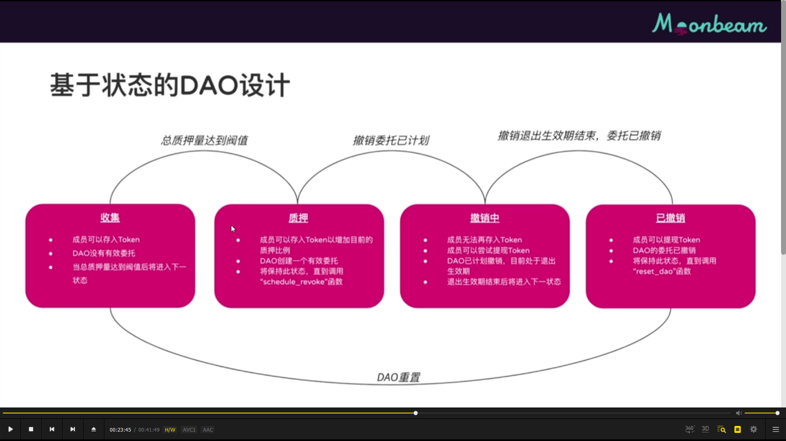  
有多种实现方法，但这里是基于状态的实现方法。delegation dao 会追踪其？当前的状态，并根据其所处的状态限制或允许 dao 的会员执行某些操作。共有四种状态，如图所示。

---

---

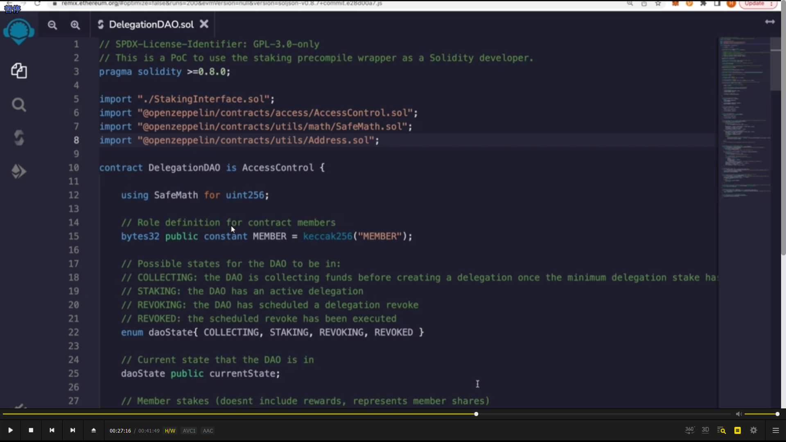  
DelegationDAO.sol 内容。具体看视频
