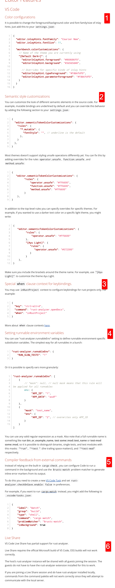

### links

github  
https://rust-analyzer.github.io/

mannual  
https://rust-analyzer.github.io/manual.html#vs-code-2

forum  
https://users.rust-lang.org/c/ide/14

### 配置相关

https://rust-analyzer.github.io/manual.html#vs-code-2
1，颜色设置  
2，语义风格定制 Semantic style customizations  
您可以在源代码中定制不同语义元素的外观。例如，可变绑定默认是带下划线的，你可以通过在 settings.json 中添加以下部分来覆盖这个行为  
3，Special when clause context for keybindings  
大意是使用了这个就相当于只能在 rust 项目中使用这个插件的 key 绑定？？？？
4，设置可运行环境变量 Setting runnable environment variables  
dddf  
5，Compiler feedback from external commands 来自外部命令的编译器反馈  
不使用 cargo check，而使用其它外部的东西？？？？  
6，live share  
似乎多人协作才会用到
