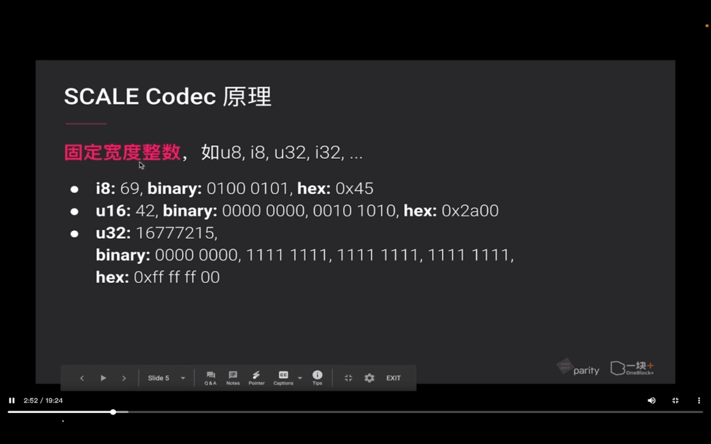
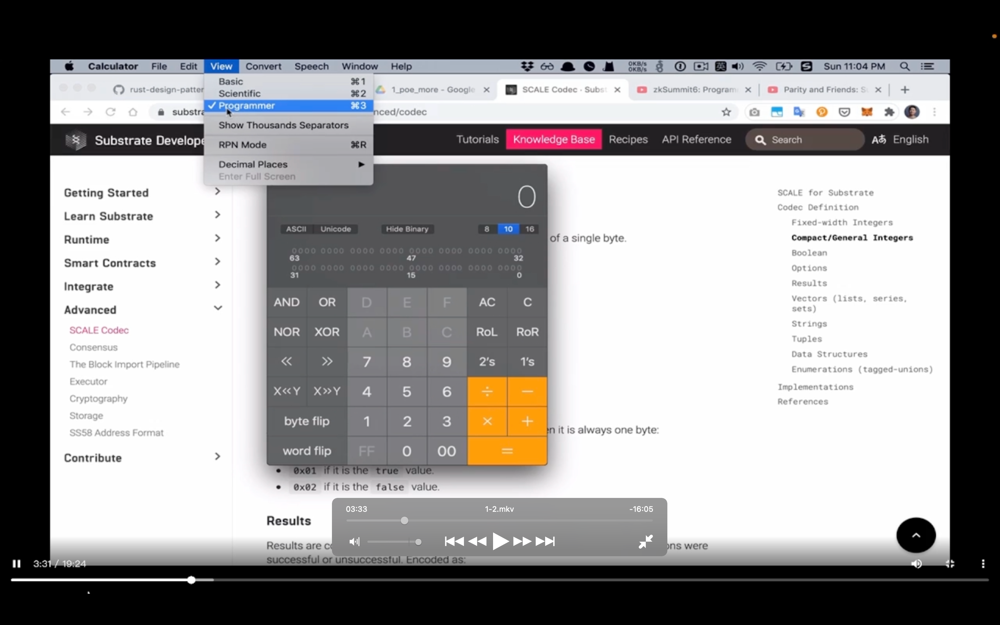
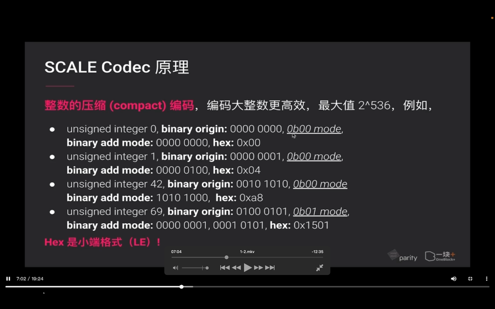
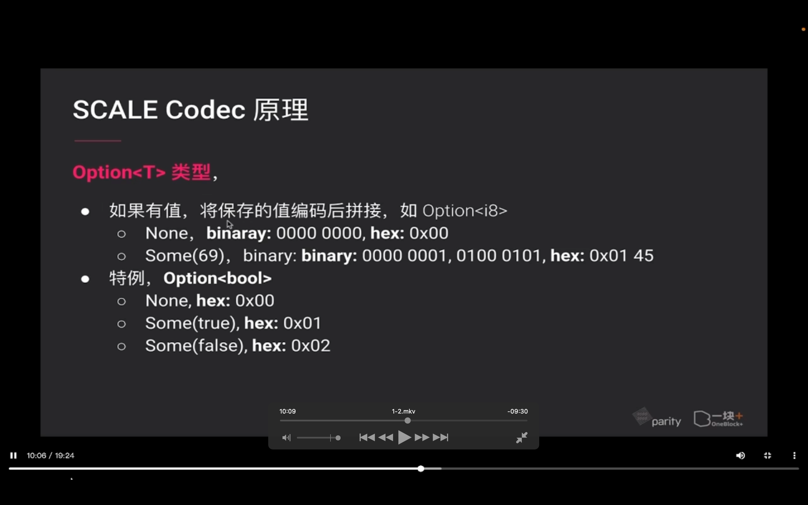
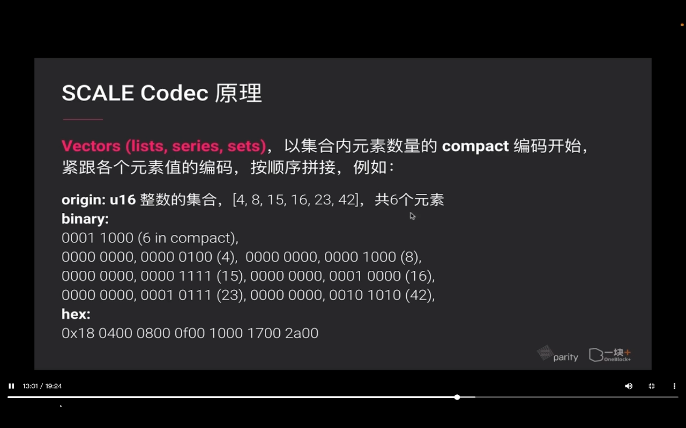
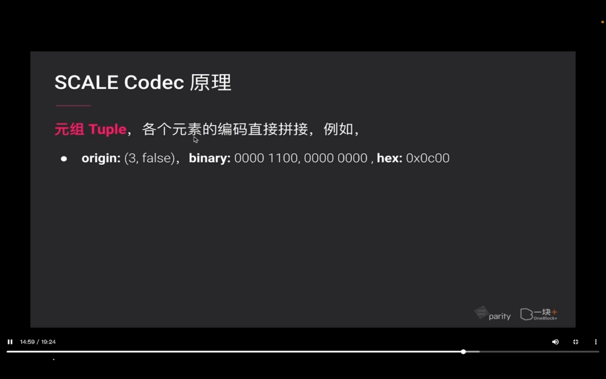
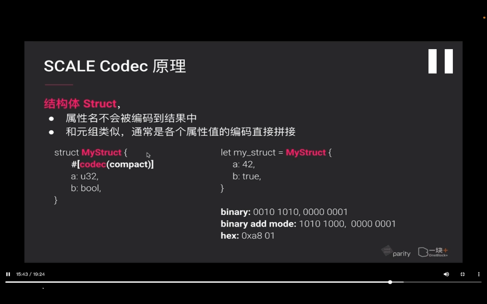
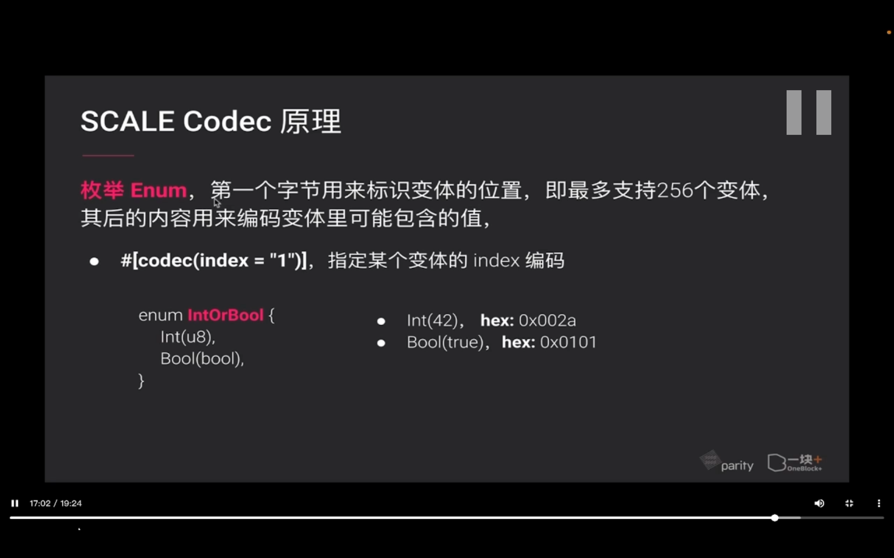
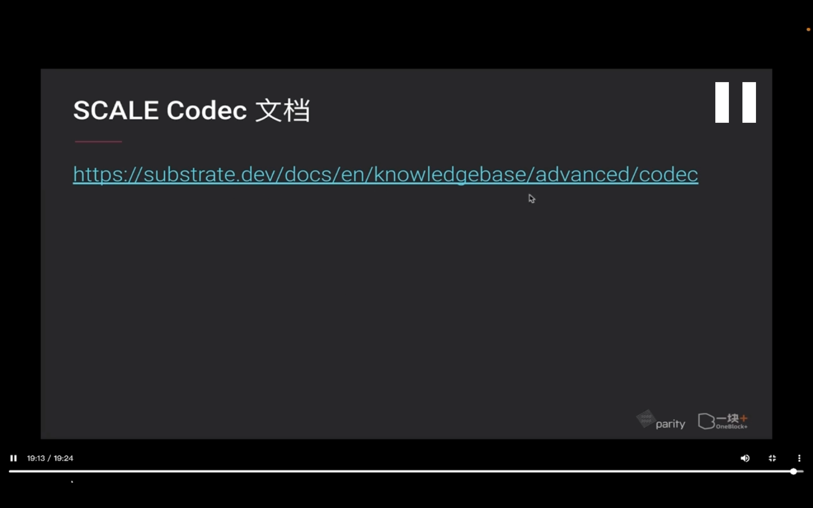

## 220831

</img>  
内容

</img>  
数据序列化  
序列化大意是将数据对象二进制化，相反，就是二进制解码，获得原始数据  
substrate 用的序列化方式叫做 scale

</img>  
scale codec 介绍

</img>  
--=  
</img>  
scale codec 原理  
calculator，显示，程序员型，能方便转换

</img>  
--=  
</img>  
整数的压缩 compact 编码以及举例

</img>  
布尔值

</img>  
Option T 类型

</img>  
result 类型

</img>  
vectors 类型

</img>  
字符串 String

</img>  
元组 tuple

</img>  
结构体 struct

</img>  
枚举 enum

</img>  
scale 编解码的实现

</img>  
scale codec 文档
