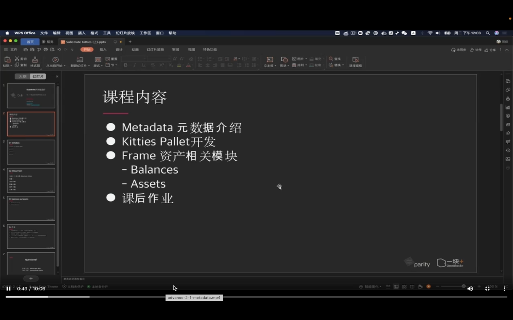
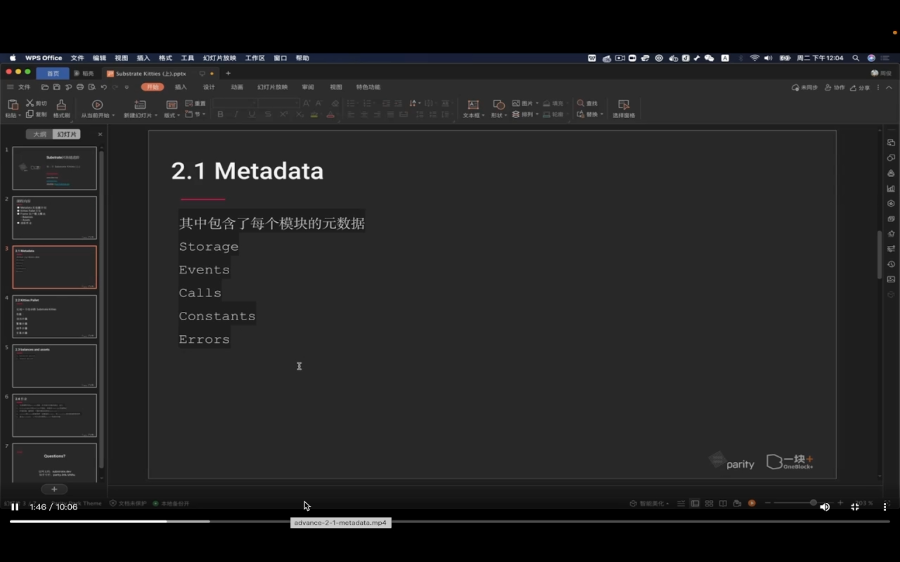
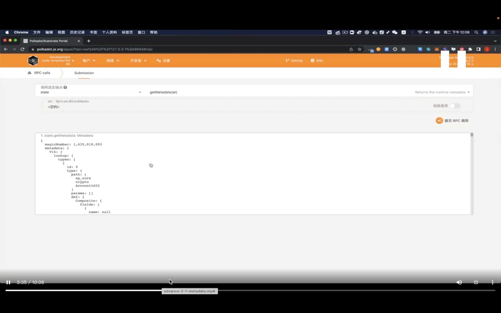
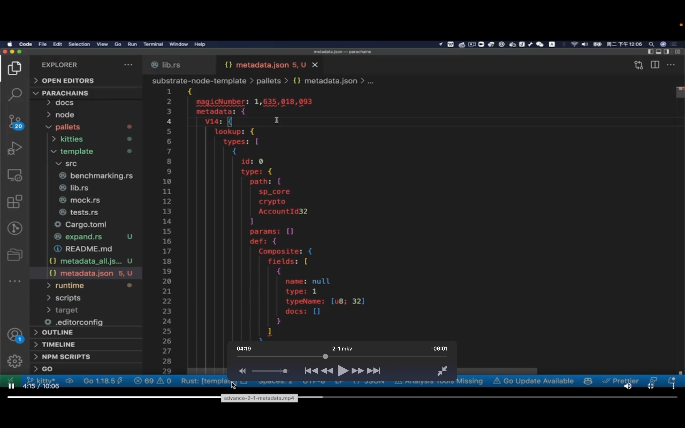
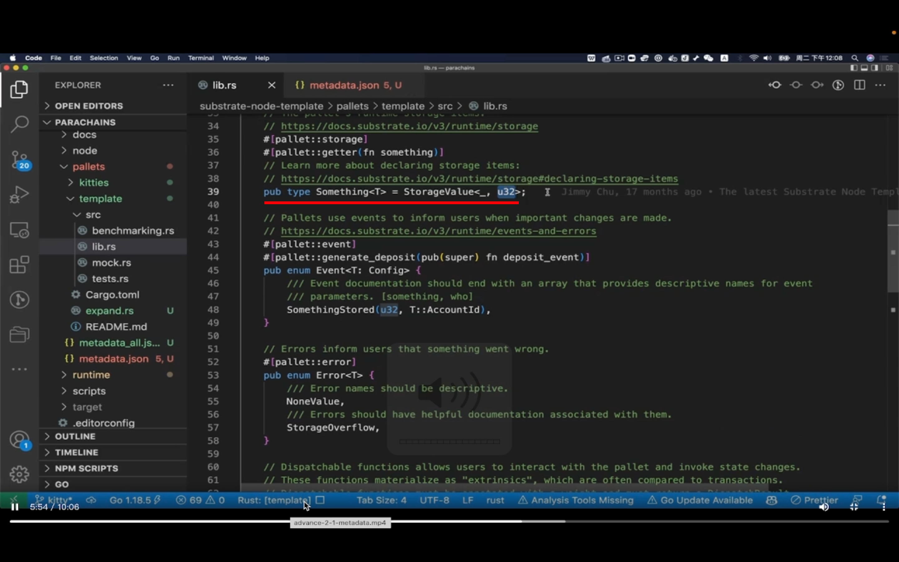
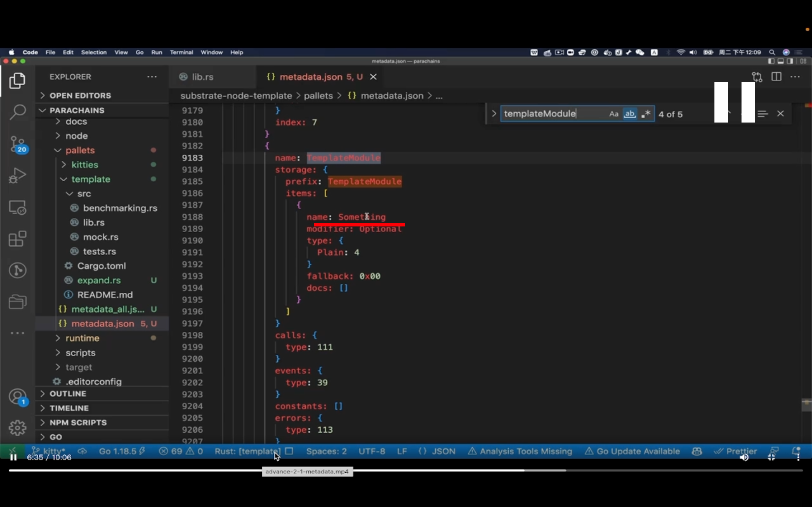

## 220903

</img>  
内容

</img>  
metadata  
描述一个系统基础的属性，特征等

</img>  
--=  
</img>  
启动节点后在前端得到 metadata  
developer->rpc calls->state->getmetadata

</img>  
具体讲解 0352-0530

</img>  
--=  
</img>  
template 中 something 对应在 metadata 中的部分,  
之后主要是在讲 metadata 对应源码中的方法之类的信息，较复杂，以后再学 dddf
