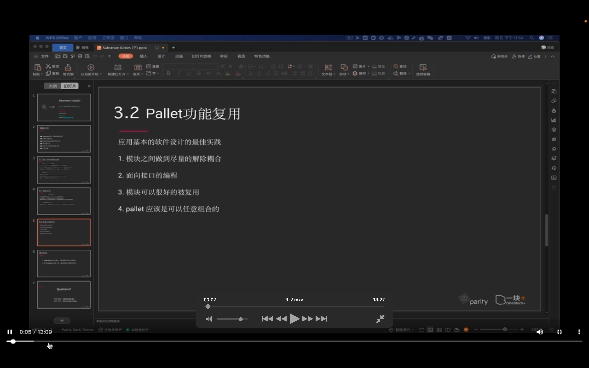
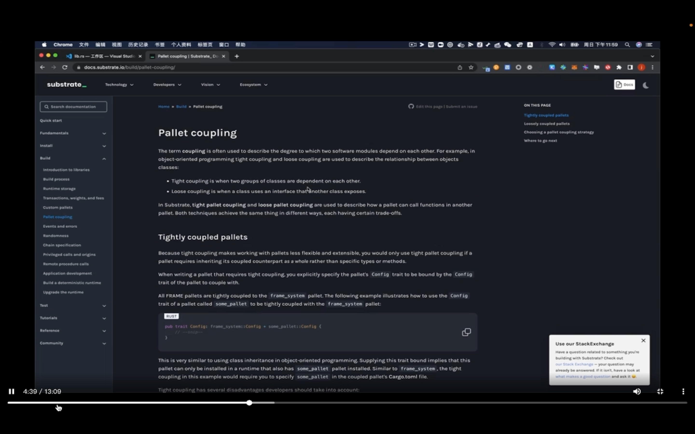
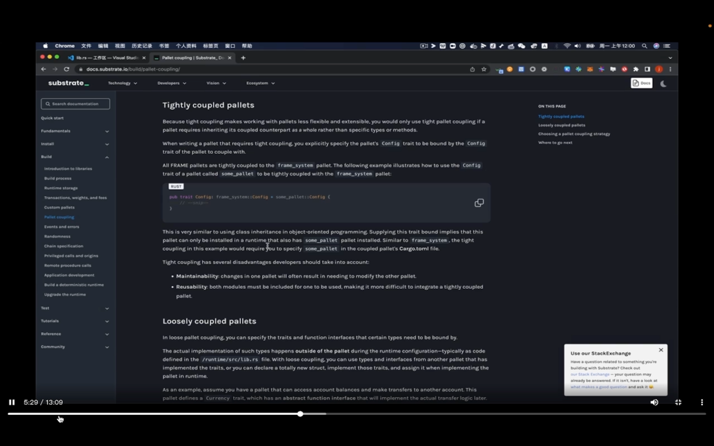
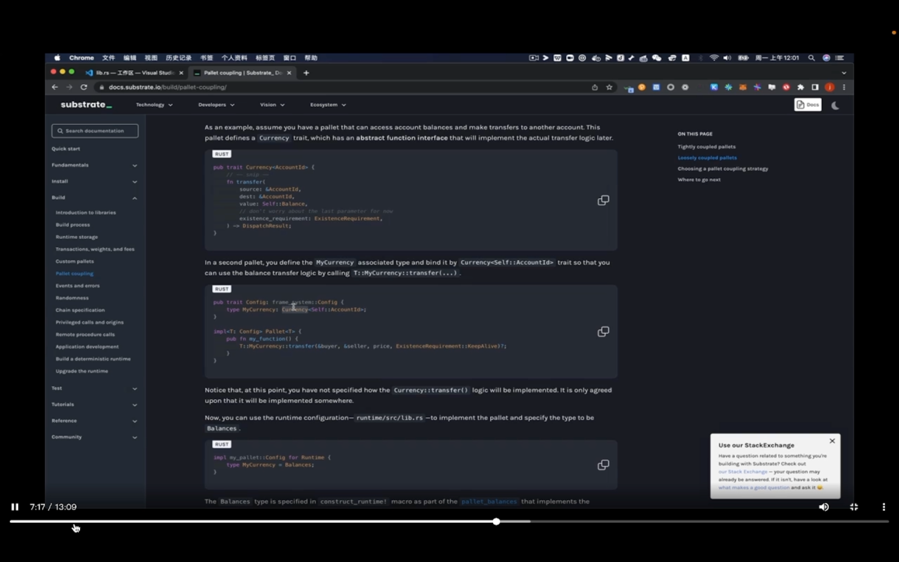
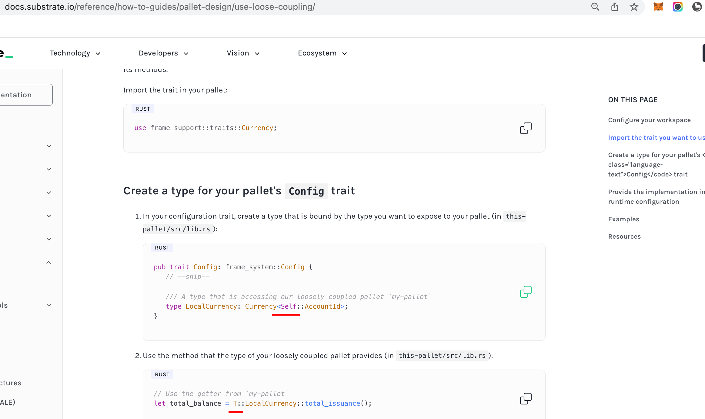
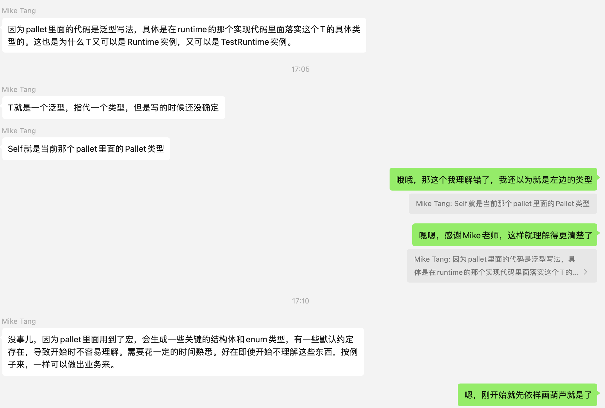
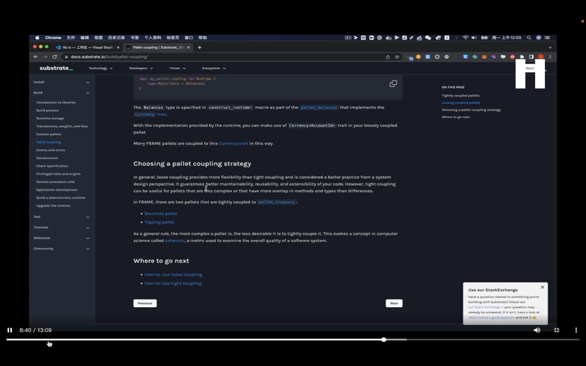
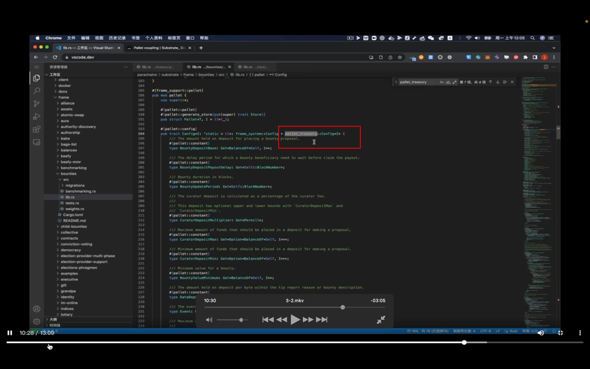
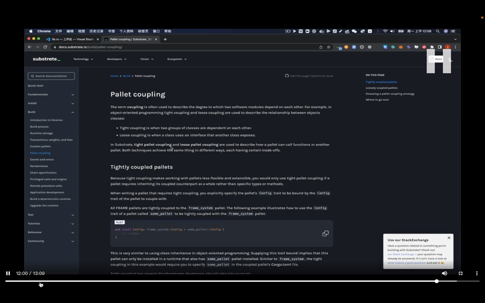

## 220911

</img>  
简介  
1，尽量解除耦合意思是一个 pallet 尽量别依赖另一个 pallet。  
2，如每个 pallet 在使用 balance 时，并不使用所有 trait 或接口。只使用一部分。

</img>  
官方文档介绍了 substrate？pallet 在设计时的一些原则

</img>  
紧密耦合，tightly coupled 的情景  
如图，当前 pallet 继承 frame_system 的所有功能。

</img>  
松散耦合  
比如 currency 这 trait，定义了如 transfer 方法。但其它 pallet 在使用 native token 时，不一定需要和 balance pallet 绑定在一起（可能 Currency trait 定义在的 balance pallet 里？？？？），它也可以使用其它实现了 transfer 的 pallet。这样就可以在其它 pallet 里定义一个动态的类型（这里是 type mycurrency），此 mycurrency type 实现了 Currency trait。但实现 trait 的模块不一定是 balances，要看 runtime 勾结时绑定的是哪个。这样就实现了松散的耦合。dfdda

</img>  
--=  
</img>  
add220912，接上节，视频没太看明白，所以搜了官网教程。在群里得到了解答。对于不太明白的代码先依样画葫芦，以后再更深的理解。

</img>  
实际中如果需要，也可以使用强关联，紧密耦合。  
比如 bounties pallet tipping palet 就和 pallet_treasury 强关联。  
tip 比 bounties 更随意，金额更小。但它们都依赖国库 pallet_treasury 提供的资金和方法。所以用强关联。

</img>  
如图，bounties 直接继承自 treasury。

</img>  
图文无关，上节课作业中要求把 kittyindex 不直接写在 pallet 里。如有些项目希望用 u8 而不是 u32，就仍可以直接使用 kt pallet。
