## 220925

### 忽略 rs 部分，只看前端 js 部分

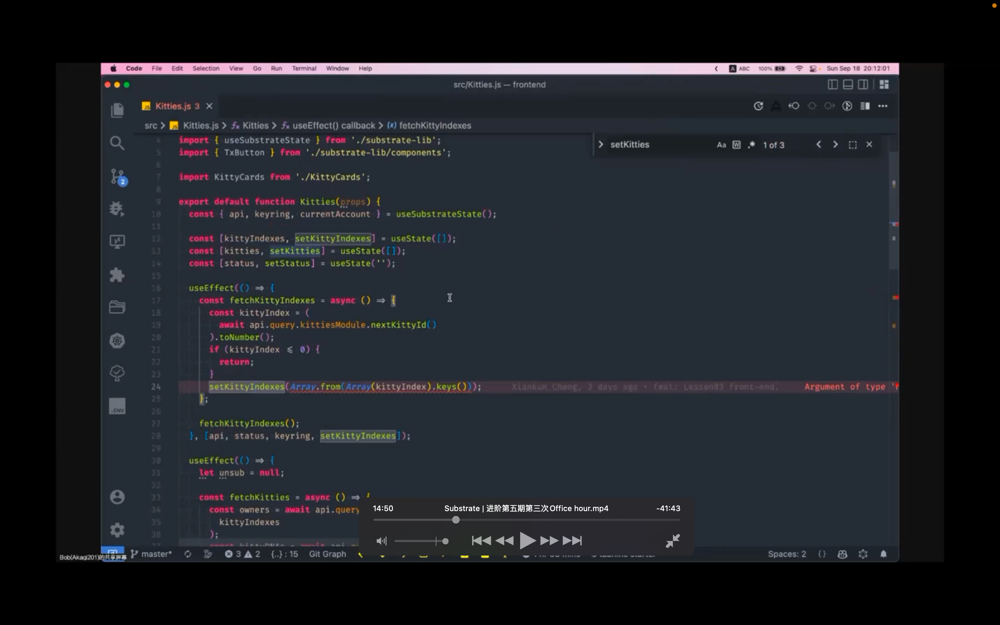</img>  
ooon  
要做的 1 是从链上查数据，如链上 kt 和所有者数据。2 是 mint 方法

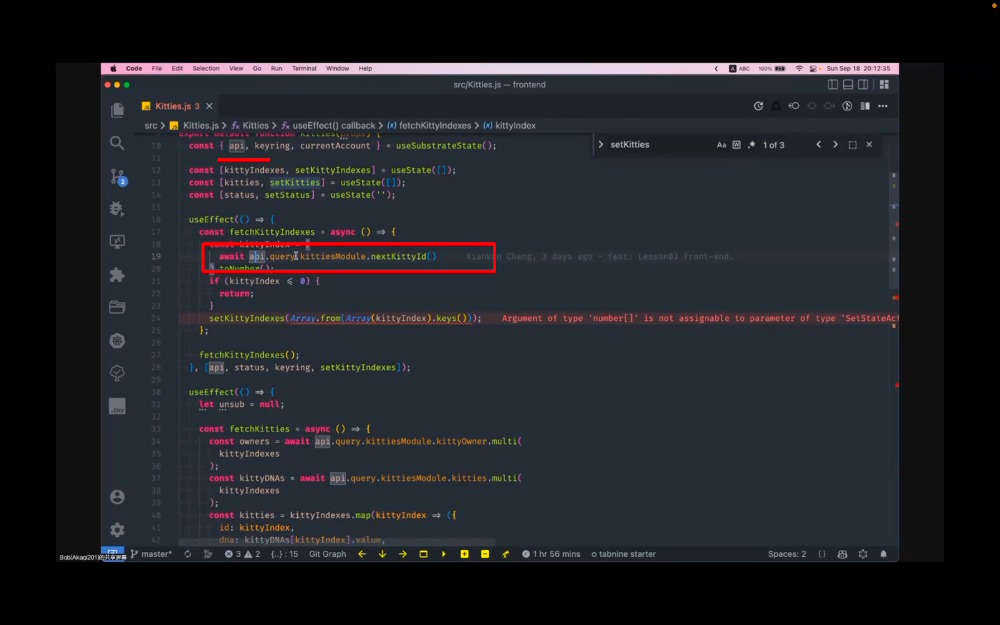</img>  
--=  
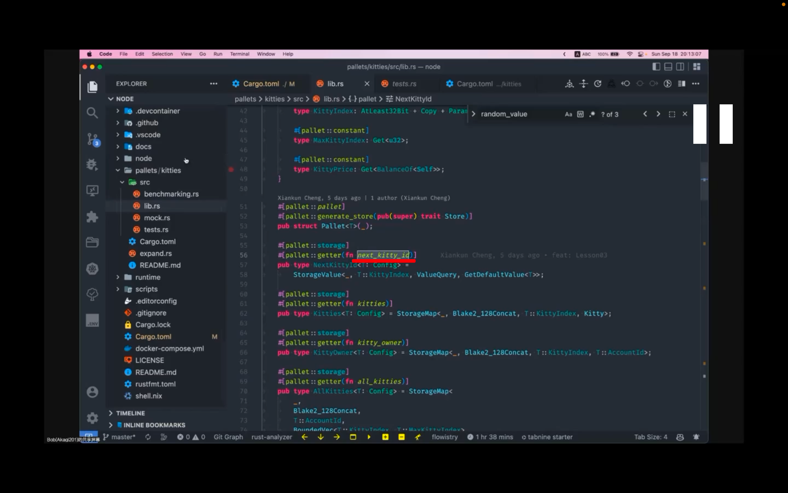</img>  
前端怎么调用 rs 里的方法，注意下划线命名变驼峰命名

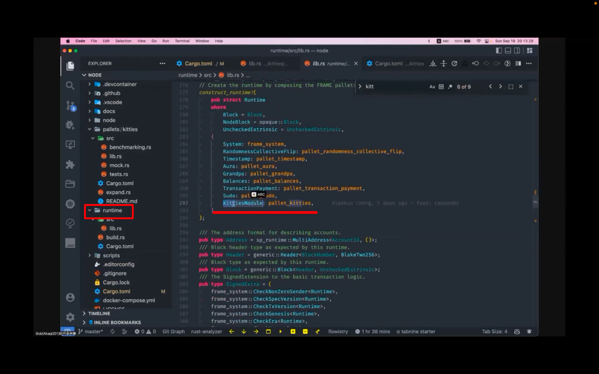</img>  
模块名称定义在 runtime 里

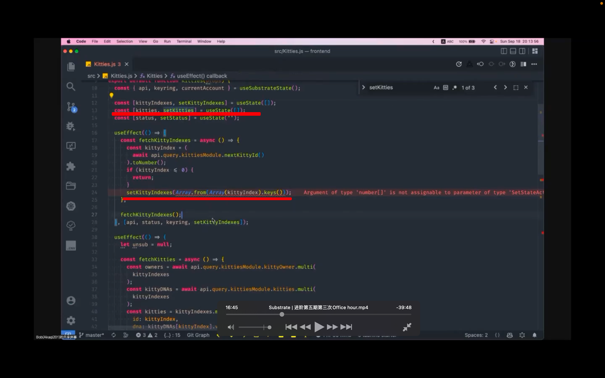</img>  
拿到所有的 ktindex dddn

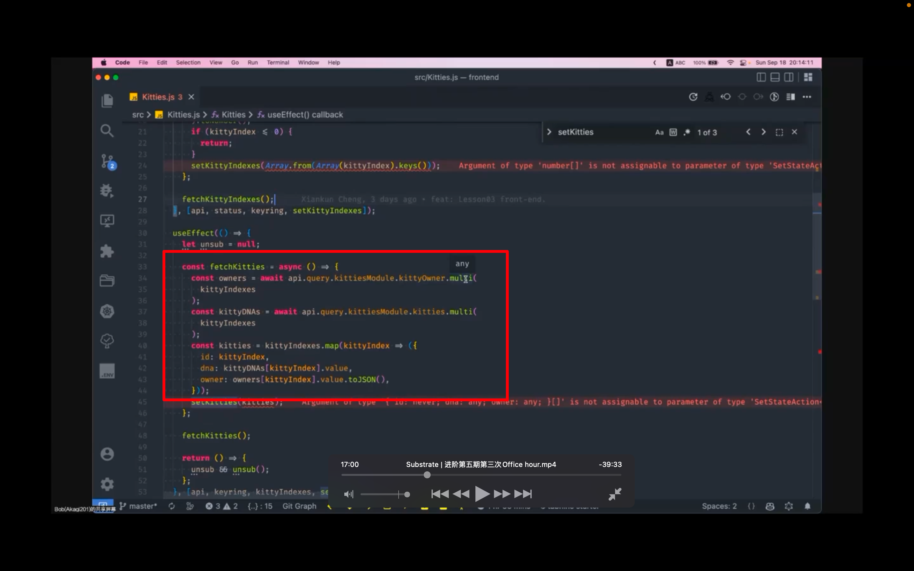</img>  
--=  
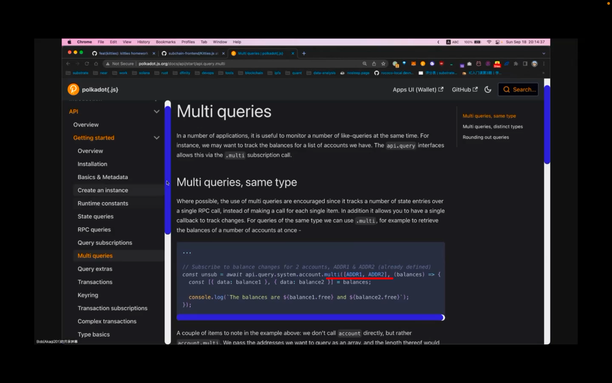</img>  
拿到所有 kt 信息，用了 multi 方法，此方法传数组，进行批量查询

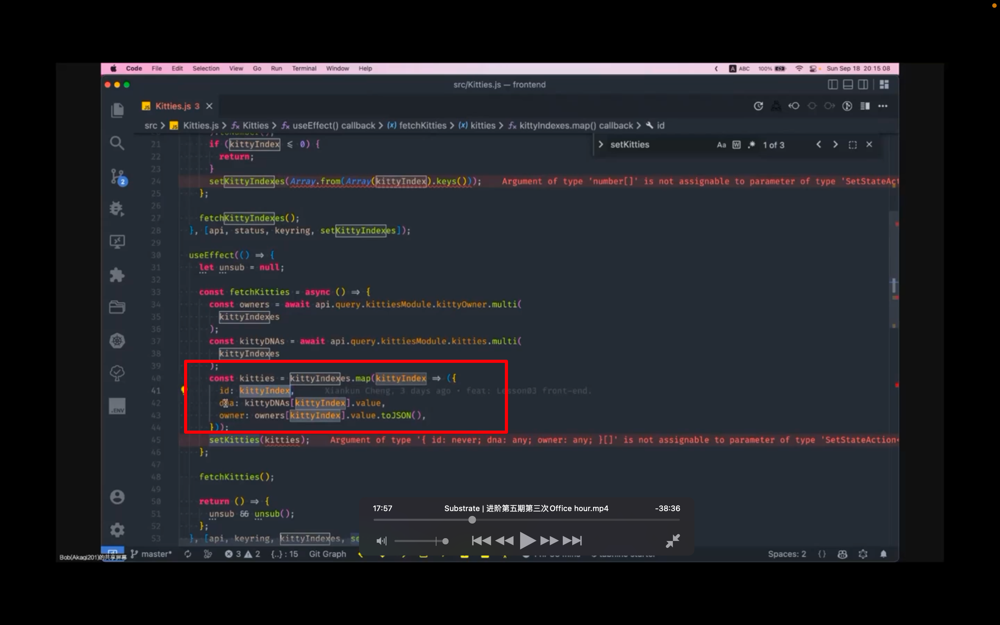</img>  
拿到每个 index 对应的信息

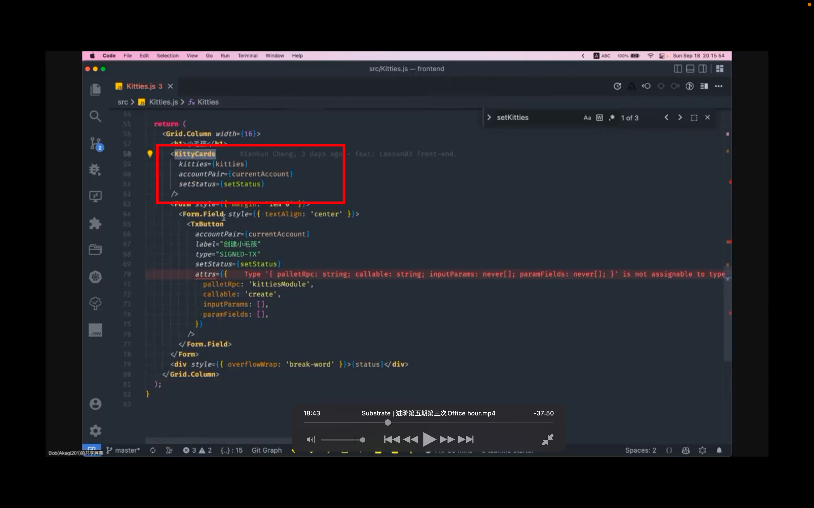</img>  
把之前拿到的数据传给 kittycards 模块

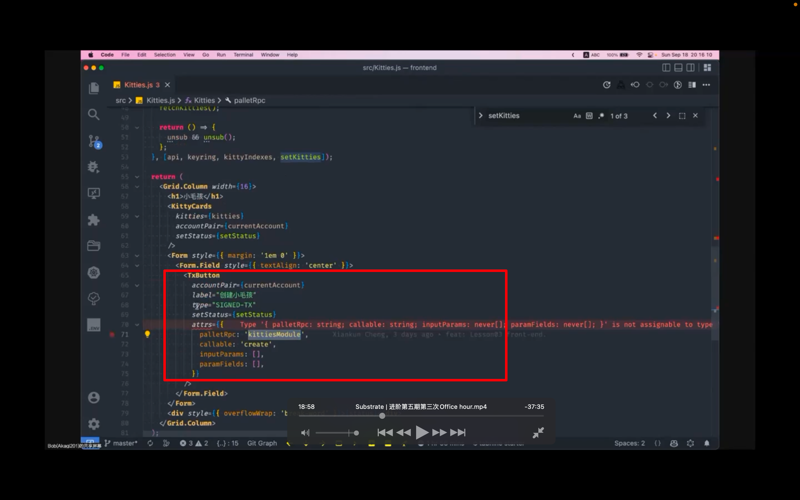</img>  
mint 的方法，固定写法，没说的太清楚

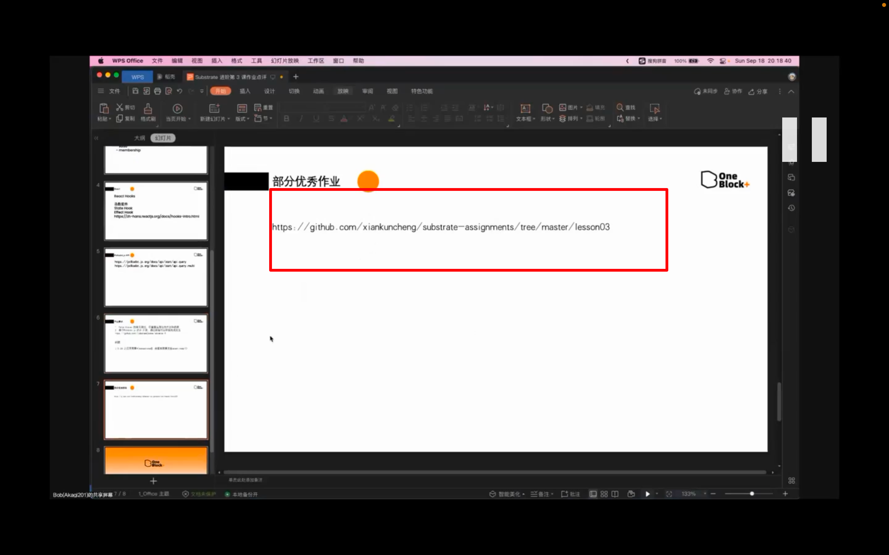</img>  
参考优秀作业
