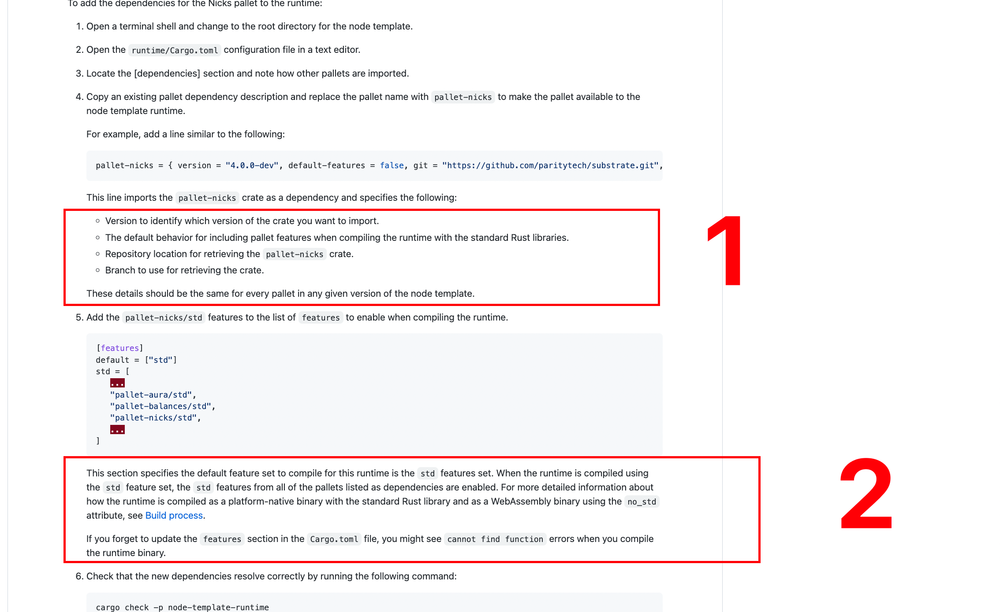
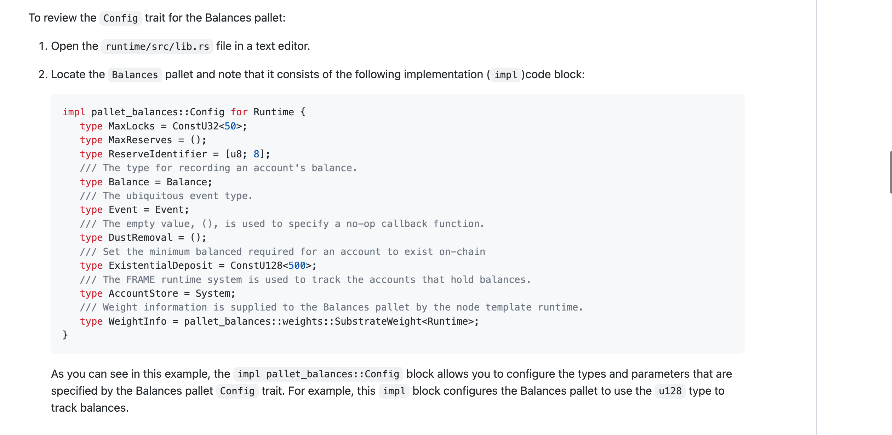
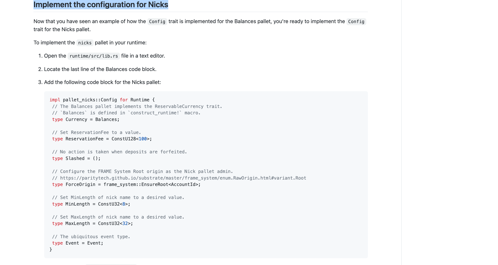
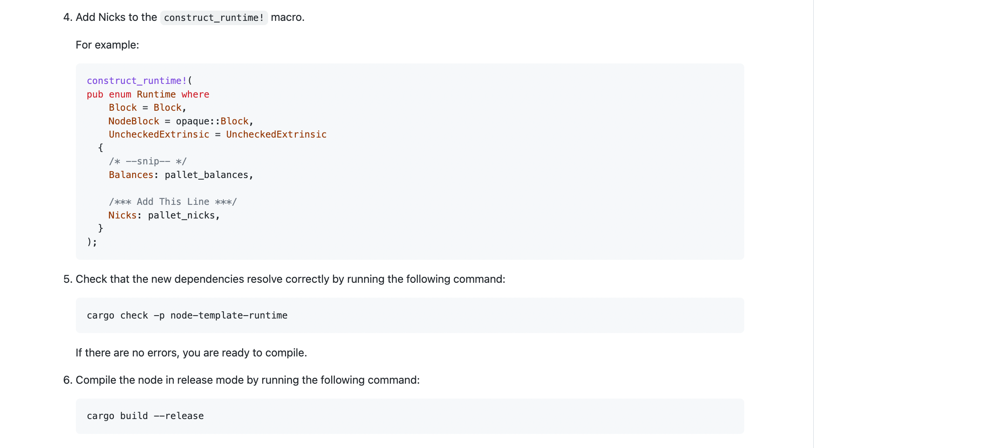
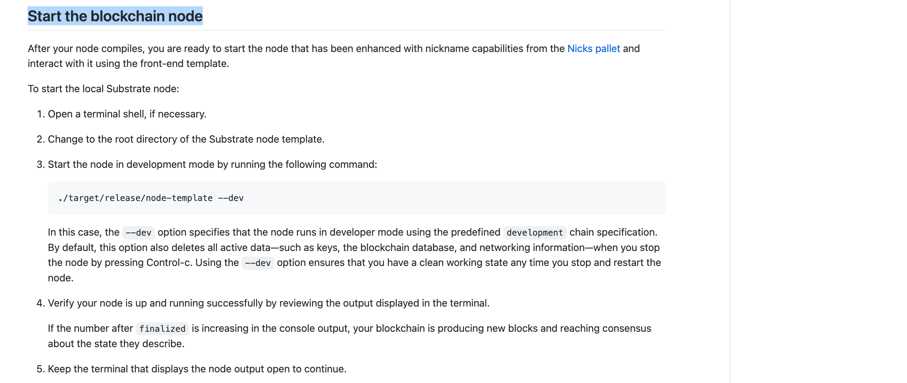
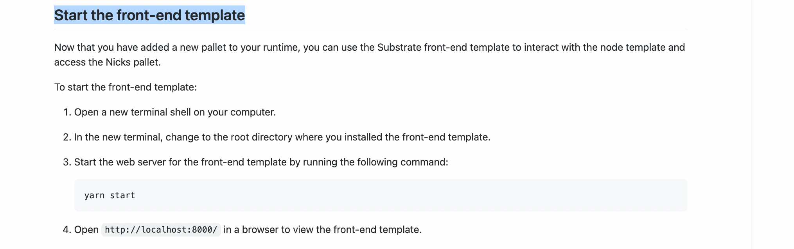

https://docs.substrate.io/tutorials/work-with-pallets/add-a-pallet/

https://github.com/substrate-developer-hub/substrate-docs/blob/665a30bfd4718b7fbfaa707f057548372a599016/content/md/en/docs/tutorials/work-with-pallets/add-a-pallet.md

## Add the Nicks pallet dependencies 增加 nicks pallet 依赖

（此节以上还有很多内容，省略。）

新增 pallet 需要在配置文件 cargo.toml 中添加一些信息。  
Substrate runtime 编译为 native platform binary 和 WebAssembly (Wasm) binary 两种形式。所以 Cargo.toml 拥有两种重要信息。

- The pallets to be imported as dependencies for the runtime, including the location and version of the pallets to import.
- The features in each pallet that should be enabled when compiling the native Rust binary. By enabling the standard (std) feature set from each pallet, you can compile the runtime to include functions, types, and primitives that would otherwise be missing when you build the WebAssembly binary.

- 1，pallets 作为 runtime 的依赖项被引入，包括要导入的 pallet 的位置和版本。
- 2，在编译原生 Rust 二进制文件时，每个 pallet 中应该启用的特性 features。通过从每个托盘启用 standard (std) feature set, you can compile the runtime to include functions, types, and primitives , 否则在创建 WebAssembly binary 时 会缺失。

相关资料 oooe

把 nicks pallets 所需的依赖加入 runtime：  
  
1，依赖信息的各种含义，且每个 pallet 的依赖版本需一致  
2，此部分设置默认特性 to compile for this runtime 为 std 特性组（还有 no_std 组），这样编译时所有作为依赖项并来自于 pallets 的 std 特性被启用？？？mmmi

用以下命令检查新依赖是否有冲突。
cargo check -p node-template-runtime

## Review the configuration for Balances 学习下 Balaces pallet 的配置

每个 pallet 有个 rust trait 叫 config。此 config trait 被用来识别 pallet 执行其功能所需的参数和类型。

Most of the pallet-specific code required to add a pallet is implemented using the Config trait. You can review what you to need to implement for any pallet by referring to its Rust documentation or the source code for the pallet. For example, to see what you need to implement for the nicks pallet, you can refer to the Rust documentation for pallet_nicks::Config or the trait definition in the Nicks pallet source code.

添加托盘所需的大多数 pallet-specific code 都是使用 Config 特征实现的。您可以通过参考托盘的 Rust 文档或托盘的源代码来检查您需要为任何托盘实现什么。例如，要查看您需要为尼克斯托盘实现什么，您可以参考关于 pallet_nicks::Config 的 Rust 文档或尼克斯托盘源代码中的特征定义。

For this tutorial, you can see that the Config trait in the nicks pallet declares the following types:

在本教程中，你可以看到 nicks 托盘中的 Config 特征声明了以下类型:

```
pub trait Config: Config {
    type Event: From<Event<Self>> + IsType<<Self as Config>::Event>;
    type Currency: ReservableCurrency<Self::AccountId>;
    type ReservationFee: Get<<<Self as Config>::Currency as Currency<<Self as Config>::AccountId>>::Balance>;
    type Slashed: OnUnbalanced<<<Self as Config>::Currency as Currency<<Self as Config>::AccountId>>::NegativeImbalance>;
    type ForceOrigin: EnsureOrigin<Self::Origin>;
    type MinLength: Get<u32>;
    type MaxLength: Get<u32>;
}
//Config: Config 可能为 Config: frame_system::Config 的缩写，功能模块继承自系统模块。见视频课5-1.

//type event为关联类型，之后的From<Event<Self>> + IsType<<Self as Config>::Event>为两个类型约束。

//还有些不懂的暂省略oooh。
```

After you identify the types your pallet requires, you need to add code to the runtime to implement the Config trait. To see how to implement the Config trait for a pallet, let's use the Balances pallet as an example.

确定托盘需要的类型之后，您需要向运行时添加代码来实现 Config 特征。为了了解如何实现托盘的 Config 特征，让我们以 Balances 托盘为例。

  
As you can see in this example, the impl pallet_balances::Config block allows you to configure the types and parameters that are specified by the Balances pallet Config trait. For example, this impl block configures the Balances pallet to use the u128 type to track balances.  
正如你在这个例子中看到的，impl pallet_balances::Config 块允许你配置由 Balances pallet Config trait（类似上面说的 pub trait Config: Config ？？？）指定的类型和参数。例如，这个 impl 块配置 balance 托盘使用 u128 类型来跟踪 balance。

## Implement the configuration for Nicks 为 Nicks 实施配置

  
在上节的 balance 配置后增加如图 nicks 配置。  
  
把 nicks 增加到如图 macro 宏中。  
检查依赖是否冲突  
编译

## Start the blockchain node 启动节点



## Start the front-end template 启动前端



### 之后内容较简单，省略
