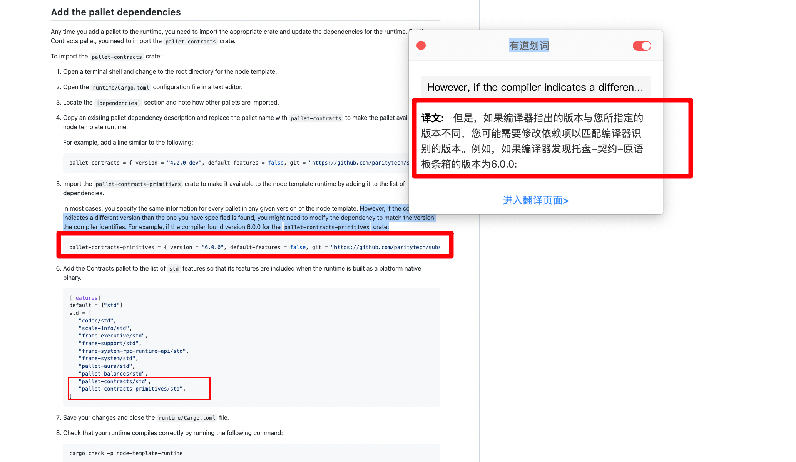

https://docs.substrate.io/tutorials/work-with-pallets/contracts-pallet/  
https://github.com/substrate-developer-hub/substrate-docs/blob/main/content/md/en/docs/tutorials/work-with-pallets/contracts-pallet.md

If you completed the Build a local blockchain tutorial, you already know that the Substrate node template provides a working runtime that includes some pallets to get you started. In Add a pallet to the runtime, you learned the basic common steps for adding a new pallet to the runtime. However, each pallet requires you to configure specific parameters and types. To see what that entails, this tutorial demonstrates adding a more complex pallet to the runtime. In this tutorial, you'll add the Contracts pallet so that you can support smart contract development for your blockchain.

如果您已经完成了构建本地区块链教程，那么您已经知道，Substrate 节点模板提供了一个工作运行时，其中包括一些托盘，可以帮助您入门。在向运行时添加托盘中，您学习了向运行时添加新托盘的基本常见步骤。但是，每个托盘都需要您配置特定的参数和类型。为了了解这意味着什么，本教程将演示如何向运行时添加更复杂的托盘。在本教程中，您将添加 contract 托盘，以便为您的区块链支持智能合约开发。

If you completed the Add a pallet to the runtime tutorial, you'll notice some familiar patterns when adding the Contracts pallet. This tutorial focuses less on those common patterns and more on the the settings that are specifically required to add the Contracts pallet.

如果您完成了向运行时教程添加托盘，那么在添加 contract 托盘时，您将注意到一些熟悉的模式。本教程不太关注那些常见的模式，而是更多地关注添加契约面板所需的特定设置。

## Before you begin

Before starting this tutorial, verify the following:

- You have downloaded and compiled the polkadot-v0.9.26 version of the Substrate node template.

- You have downloaded and installed the Substrate front-end template as described in Build a local blockchain.

## Add the pallet dependencies

  
类似上一节的 Add the Nicks pallet dependencies。只是要多增加一个 pallet-contracts-primitives 依赖。且此依赖的版本与其它的不一样。但未说明为什么要多增加此依赖，以及为什么此依赖版本需要跟其它 pallet 的依赖版本不一样，以及怎么知道需要不一样 lll。

## Implement the contracts configuration trait

https://github.com/substrate-developer-hub/substrate-docs/blob/main/content/md/en/docs/tutorials/work-with-pallets/contracts-pallet.md#implement-the-contracts-configuration-trait

与上一节类似，但增加了一些内容，lllf。

## Expose the Contracts API

https://github.com/substrate-developer-hub/substrate-docs/blob/main/content/md/en/docs/tutorials/work-with-pallets/contracts-pallet.md#expose-the-contracts-api

Some pallets, including the Contracts pallet, expose custom runtime APIs and RPC endpoints. You are not required to enable the RPC calls on the Contracts pallet to use it on chain. However, it is useful to expose the APIs and endpoints for the Contracts pallet because doing so enables you to perform the following tasks:

- Read contract state from off chain.
- Make calls to node storage without making a transaction.

大意是有些 pallets，包括此例的 contracts pallet，可以公开自定义运行时 api 和 RPC 端点。不是必须的，但如果公开了，可以获得以下好处：
1，从链下读取合约状态。
2，不做 transaction 就能调用 node storage。

## Update the outer node

At this point, you have finished adding the Contracts pallet to the runtime. Now, you need to consider whether the outer node requires any corresponding updates. Substrate provides an RPC server to interact with the node. However, the default RPC server does not provide access to the Contracts pallet. To interact with the Contracts pallet, you must extend the existing RPC server to include the Contracts pallet and the Contracts RPC API. For the Contracts pallet to take advantage of the RPC endpoint API, you need to add the custom RPC endpoint to the outer node configuration.

此时，您已经完成了将 contract 托盘添加到运行时中。现在，您需要考虑外部节点是否需要任何相应的更新。substrate 提供一个 RPC 服务器来与节点交互。但是，默认 RPC 服务器不提供对 contract pallet 的访问。要与 contract pallet 交互，您必须扩展现有的 RPC 服务器，以包括 contract pallet 和 contract RPC API。要使 contract pallet 利用 RPC 端点 API，您需要将自定义 RPC 端点添加到外部节点配置。

## Start the local Substrate node

oooe
