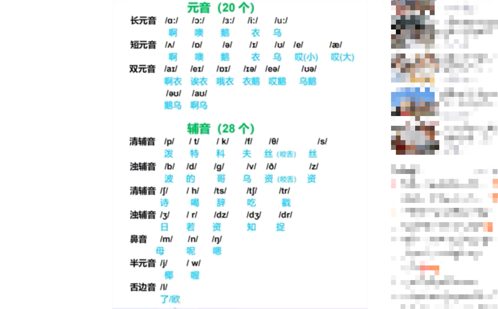
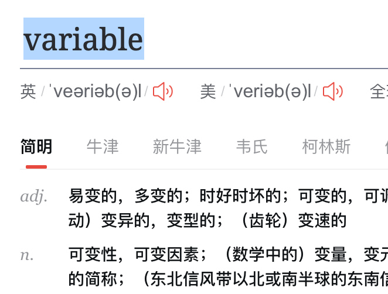

## 音标读法

</img>

https://baijiahao.baidu.com/s?id=1747439324819545438&wfr=spider&for=pc

以上读音似乎有不准的地方，标准读音见此：

https://www.bilibili.com/video/BV1hC4y1H7pU

## 英语国际音标表（48 个）

### 元音（20 个）

长元音 /ɑ:/ /ɔ:/ / ɜ:/ /i:/ /U:/

短元音 / ʌ/ / ɒ/ / ə/ / ɪ/ / ʊ/ /æ/ /e/ （ / ə/ 读额，而/e/更类似/æ/音把下巴收小点，类似四川话答应人的声音）

双元音 /aɪ/ /eɪ/ /ɔɪ/ /ɪə/ /eə/ /ʊə/ /əʊ/ /aʊ/ (/ɔɪ/ 虽然很多注释为哦一，但听上去更像哦 e，可能是 I 音要很轻声的读，几乎听不到。或者说双元音的后一个音都是不发声而是从前一个音变换口型到跟后一个音一样的位置)

### 辅音（28 个）

轻辅音 /p/ / t/ / k/ /f/ /θ/ /s/

浊辅音 /b/ /d/ /g/ /v/ /ð/ /z/

轻辅音 /ʃ/ / h/ /ts/ /tʃ/ /tr/

浊辅音 /ʒ/ / r/ /dz/ /dʒ/ /dr/

鼻音 /m/ /n/ /ŋ/

半元音 / j/ / w/

边音 / ǀ/

## 元音，辅音是什么意思

```
从发音语音学的层面上讲，元音就是发声时声腔不受阻碍发出的音，而辅音就是发声时声腔受阻碍发出的音。从声学语音学的层面上讲，元音就是声波图谱上有共振峰的音，而辅音是在声波图谱上没有共振峰的音。从音系学的角度来讲，元音就是一个音节中音高和音强处于顶点 (peak) 的那个音，其余的音均为辅音。不要元音或者不要辅音我们都能够发出独立的、清晰可辨的、可传达简单信息的音节，但是元音和辅音的结合及其变换才能够形成满足多样化表意的人类语言。我们见到的绝大部分音节之所以采取声母- 韵头韵中- 韵尾 (Onset- Rhyme- Coda)的结构，主要是因为这样中间高、两边低的音阶，在发音过程中相对省力。

作者：安时
链接：https://www.zhihu.com/question/21881798/answer/40119081
来源：知乎
著作权归作者所有。商业转载请联系作者获得授权，非商业转载请注明出处。
```

```
在语音学中，有几种不同的音素类型，包括单元音、双元音、清辅音和浊辅音。它们之间的区别主要在于发音的特点和方式。

单元音：也称为元音，是指发音时口腔中没有阻塞，空气可以自由通过的音。在发音过程中，口腔形状会改变，从而产生不同的元音音色。例如，英语中的 /i/（如“eat”中的发音）、/e/（如“bed”中的发音）和/a/（如“cat”中的发音）。

双元音：也称为复元音或联合元音，是由两个元音音色组合而成的音。在发音过程中，口腔形状会从一个元音的位置过渡到另一个元音的位置，产生连续的音色变化。例如，英语中的 /aɪ/（如“time”中的发音）、/eɪ/（如“say”中的发音）和 /ɔɪ/（如“coin”中的发音）。

清辅音：在发音时，口腔中有一些阻塞，但不产生明显的声音振动。清辅音的特点是声带不震动，空气在口腔中受到阻碍，然后突然释放，产生清脆的音。例如，英语中的 /p/（如“pen”中的发音）、/t/（如“top”中的发音）和 /k/（如“cat”中的发音）。

浊辅音：与清辅音相反，发音时声带震动，产生声音振动。这些音的发音也涉及到口腔中的阻塞和释放，但与清辅音不同，声带的振动赋予这些音更加浑厚的音色。例如，英语中的 /b/（如“bat”中的发音）、/d/（如“dog”中的发音）和 /g/（如“go”中的发音）。

总结：

单元音 是口腔中没有阻塞，声音由声带振动产生的音。
双元音 是由两个元音音色组合而成，产生连续的音色变化。
清辅音 是口腔中有阻塞但声带不振动的音。
浊辅音 是口腔中有阻塞且声带振动的音。
这些不同的音素类型在不同的语言中可能会有变化，但这些基本概念适用于大多数语言的发音特点。
```

## 一些例子

</img>
d3 读知  
gi 更类似葛而不是拼音 gi

</img>  
类似 very 而不是 vary
