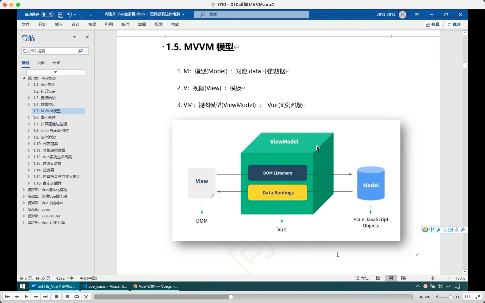
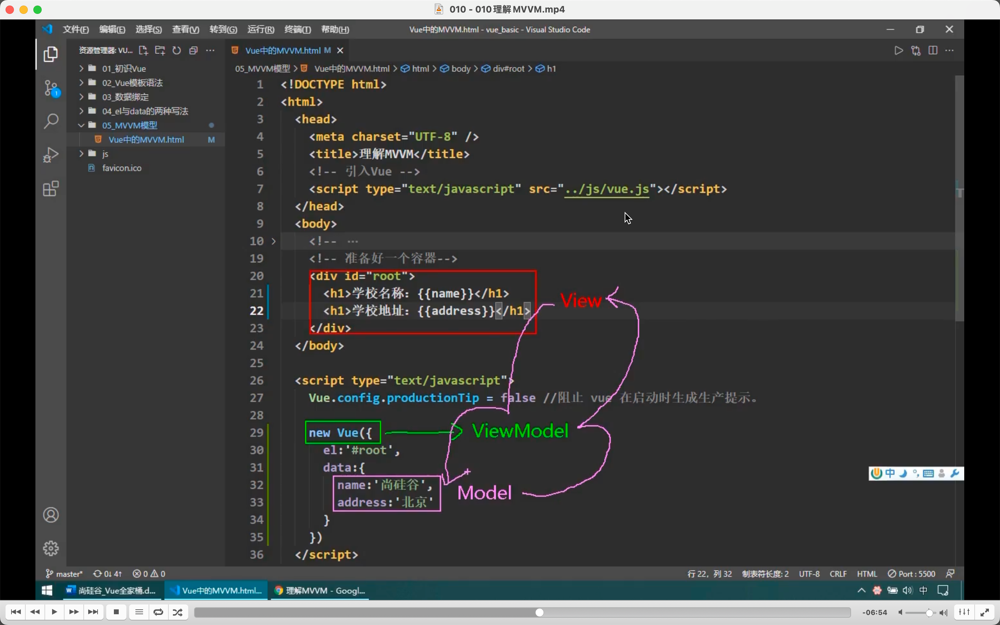
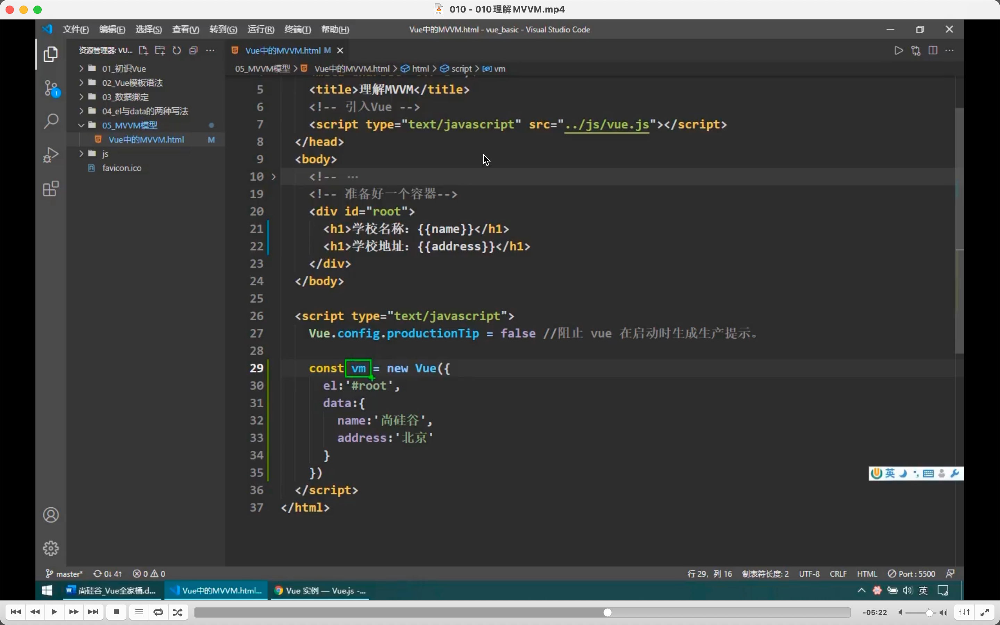
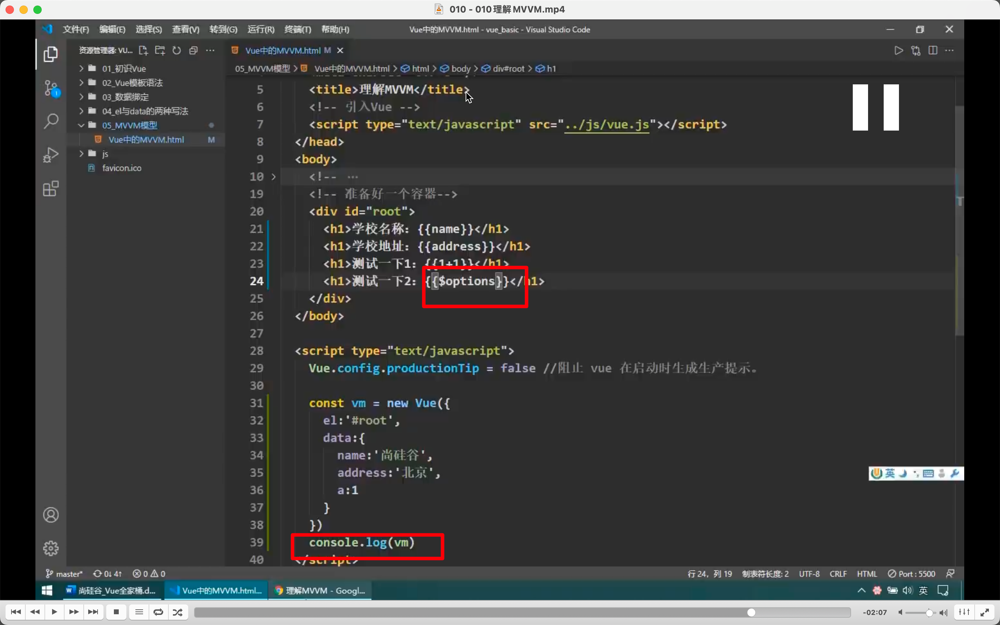
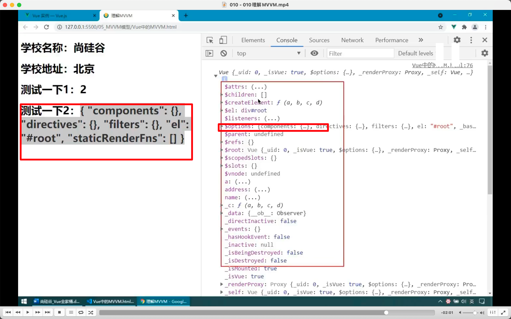
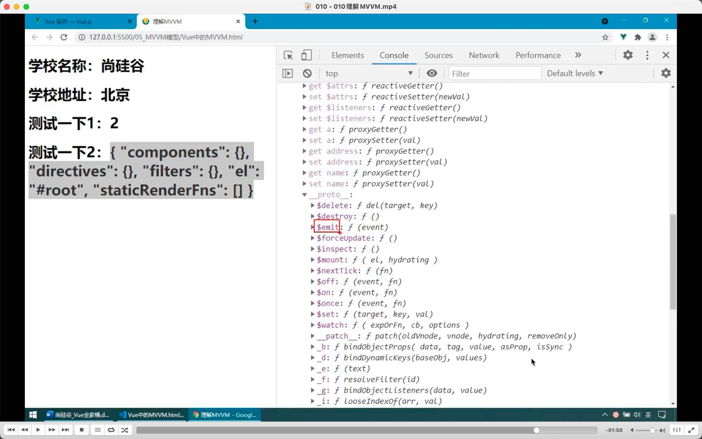

  
  
mvvm。  
m，model，对应 data 里的数据。  
v，view，视图，对应 dom。  
vm，对应 vue 实例

  
所以一般用 vm 代表 vue 实例。

  
  
只要 vm 里有的东西，包括自己在 data 里填入的数据，和 vm 本身就有的东西，都能通过{{}}引用。

  
不仅 vm 有的能用，甚至 vue 原型有的也能用。  
所以不是 data 有才能看见，而是 data 里的东西会出现在 vm 里。而 vm 有的东西都能在模板里用。

reviewed 2022/07/29
