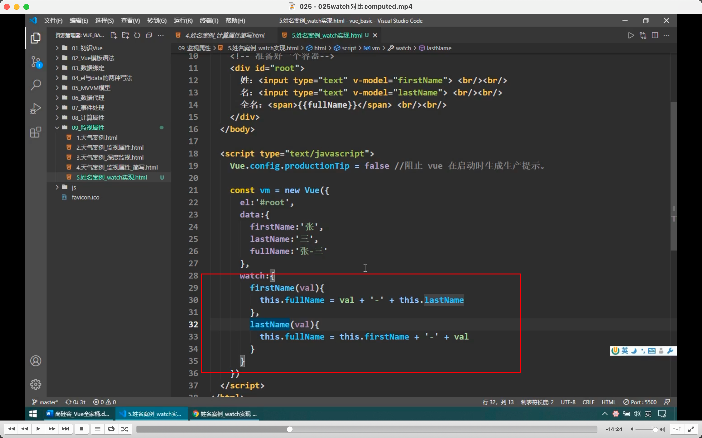
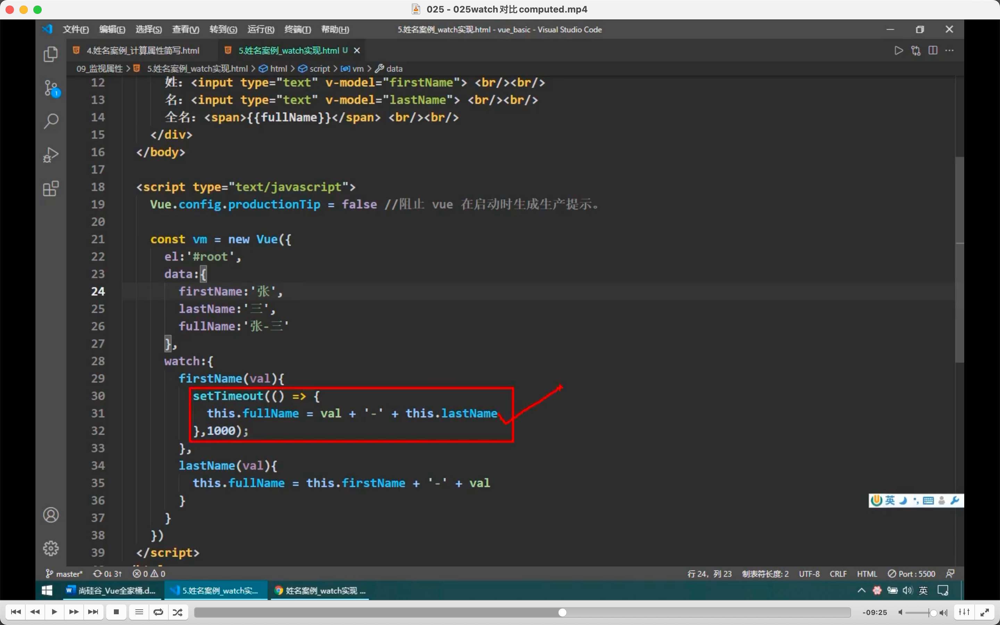
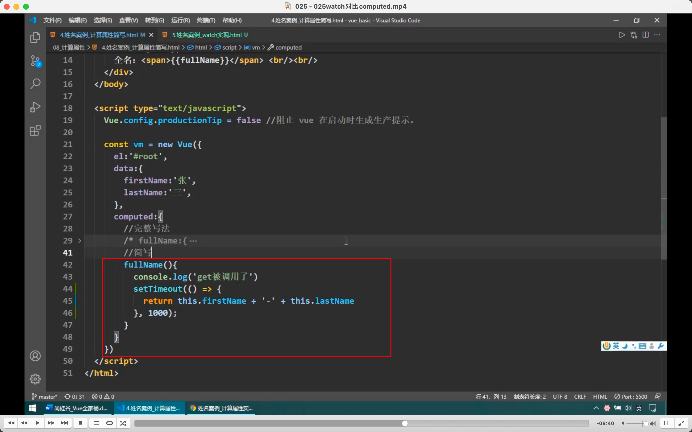

  

watch 和 computed 实现相同需求的对比，明显 computed 更好

  
  
需求，修改姓名后，延迟一秒才显示全名的 watch 和 computed 写法，computed 这样写无效，因为此时 return 返回的值是给的 settimeout 而不是 fullname。

计算属性是靠返回值，而目前做不到延迟返回值。

所以结论是当两者都能实现时用 computed，当有异步等 computed 无法实现的功能时，用 watch。
