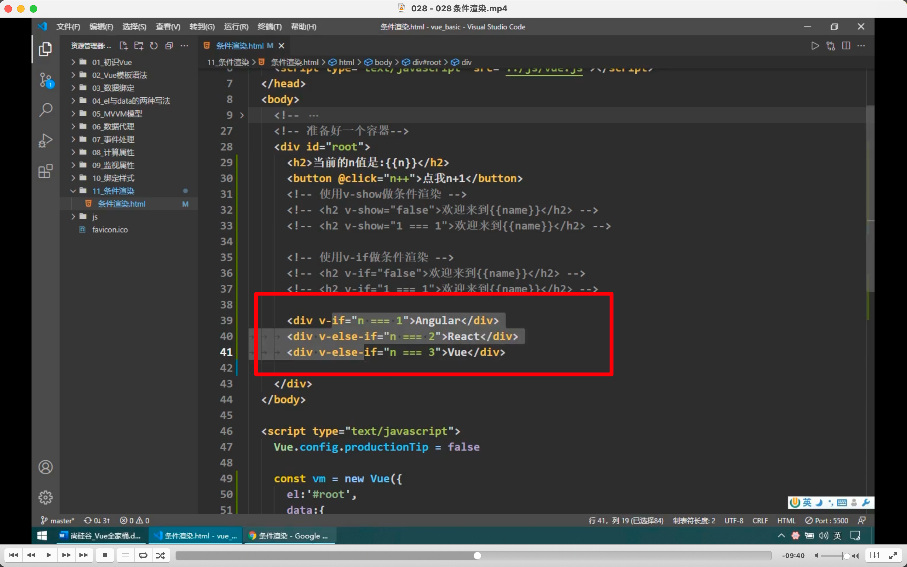
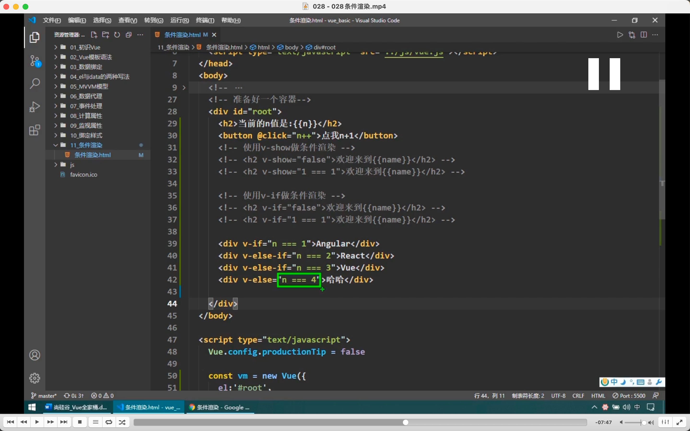
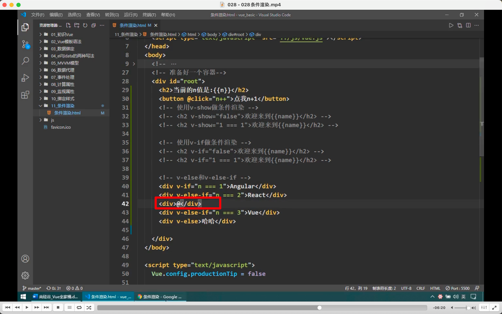
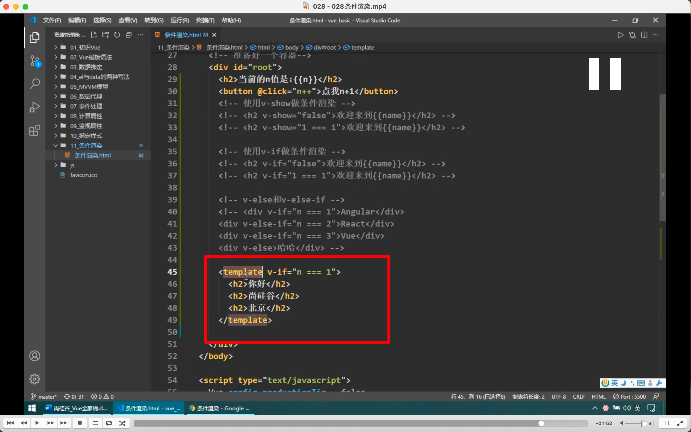

  
此节就是讲 v-if，v-show 相关，大多知识点已掌握  
如图所示，可以使用 v-else-if，节约资源

  
v-else 后不要跟条件，跟了没用。如图，即使 n 不等于 4，也会显示哈哈。

  
中间如果加入了不相关的东西，则后面的就无效了。

  
利用 template 而不是 div，最终渲染时不会破坏结构。  
但 template 只能配合 v-if，不能配合 v-show。
