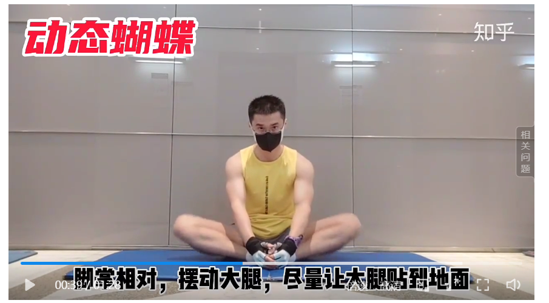
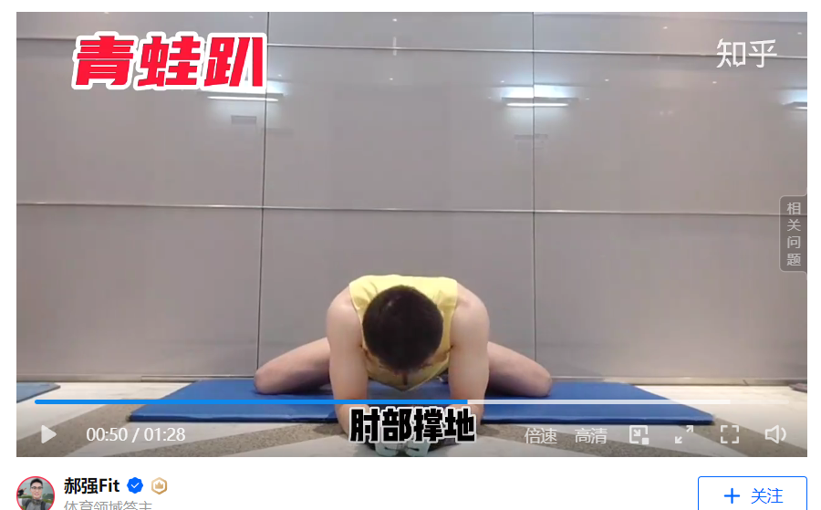

https://www.zhihu.com/zvideo/1429064985583022080

  

1，单侧开胯，最大程度一条腿伸向侧边，双手撑地保持。目标是腿完全伸直，臀部坐到地上。      

      
2，动态蝴蝶，脚掌相对，摆动大腿，大腿尽量贴近地面。目标是完全贴地       

      
3，青蛙趴，目标大腿内侧完全贴地。       

      
4，半程一字马，双手撑地，双腿往两侧滑。

