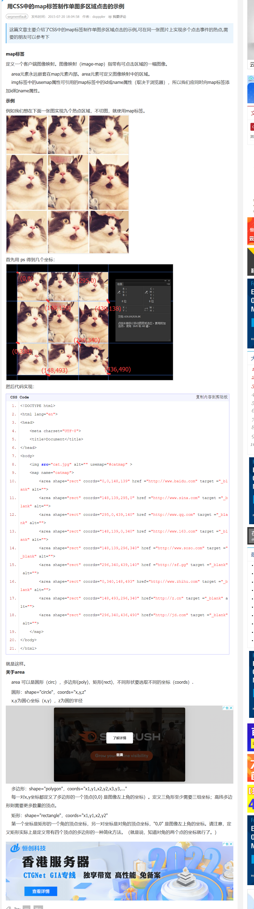

## 背景图设置方式

background-size: cover 可能背景图片部分看不见  
background-size: contain 缩放背景图片以完全装入背景区，可能背景区部分空白。  
background-size: width-value,height-value; 分为固定大小和百分比和 auto，固定大小就是写死；auto 就是以背景图片的比例缩放背景图片。。  
background-size: 100%, 100%; 自动伸缩至容器大小

## 让 border 不占用 width

-webkit-box-sizing: border-box;
-moz-box-sizing: border-box;
box-sizing: border-box;

## 理解前端尺寸 vw、vh、rem、em

https://zhuanlan.zhihu.com/p/96721026

em 代表字体比例，相对于父元素；rem 类似，但只相对于根元素 html。最好用 rem。

vw（Viewport Width）、vh(Viewport Height)是基于视图窗口的单位，是 css3 的一部分，基于视图窗口的单位，除了 vw、vh 还有 vmin、vmax。

vw:1vw 等于视口宽度的 1%  
Vh:1vh 等于视口高度的 1%  
vmin: 选取 vw 和 vh 中最小的那个,即在手机竖屏时，1vmin=1vw  
vmax:选取 vw 和 vh 中最大的那个 ,即在手机竖屏时，1vmax=1vh

## flex 布局和 grid 布局

https://www.runoob.com/w3cnote/flex-grammar.html  
布局的传统解决方案，基于盒状模型，依赖 display 属性 + position 属性 + float 属性。它对于那些特殊布局非常不方便，比如，垂直居中就不容易实现。

2009 年，W3C 提出了一种新的方案—-Flex 布局，可以简便、完整、响应式地实现各种页面布局。目前，它已经得到了所有浏览器的支持，这意味着，现在就能很安全地使用这项功能。

https://www.ruanyifeng.com/blog/2019/03/grid-layout-tutorial.html  
网格布局（Grid）是最强大的 CSS 布局方案。比 flex 更好。

## map 标签和 area 元素单图多区域点击

https://www.jb51.net/css/359062.html  

## 图片，链接标签各元素的意思

href：要转到的链接  
target：转过去的方式  
alt：当图片无法显示时显示的文字  
titile：鼠标在图片上时显示的文字

### target

target="\_blank":在新窗口中浏览新的页面。
target="\_self":在同一个窗口打开新的页面。
target="\_parent":在父窗口中打开新的页面。（页面中使用框架才有用）
target="\_top" :以整个浏览器作为窗口显示新页面。（突破了页面框架的限制）

没有指定<a>的 target 属性值时，默认是"\_blank"
