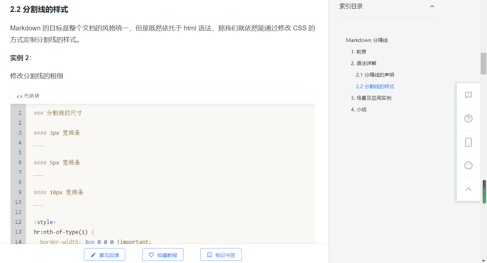

## 分隔线样式

https://www.imooc.com/wiki/markdownlesson/markdownhorizontalrules.html  


## vscode 设置用户代码片段，以及单独为 markdown 设置代码片段

https://zhuanlan.zhihu.com/p/357377511  
https://www.php.cn/tool/vscode/481117.html

Ctrl+Shift+P 打开命令面板，输入>Preferences: Configure User Snippets，选择首选项：配置用户代码片段，然后会弹出面板：用户已经创建的代码片段（针对特定语言的（.json），或者是全局的（.code-snippets）），然后照例子添加即可。


如果是 markdown 语法，还需在 settings.json（文件，首选项，设置，点击如图）里设置:

```
"[markdown]":{

    "editor.quickSuggestions": true

}
```
